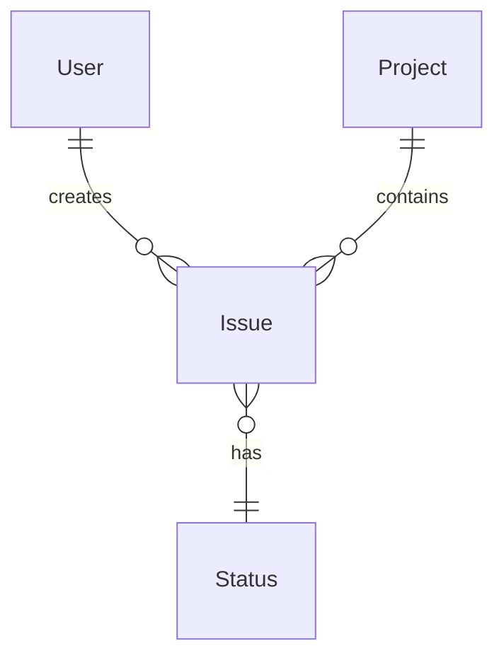
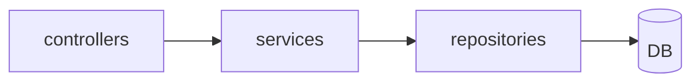
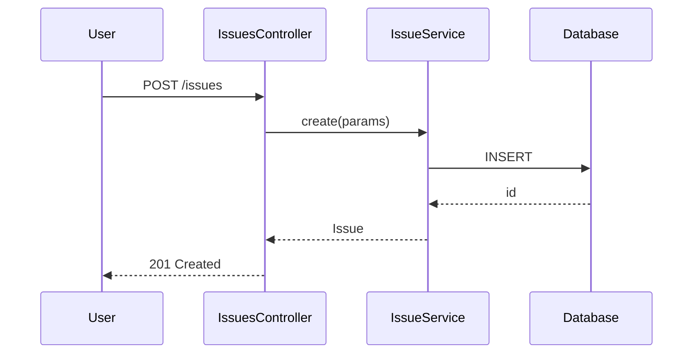
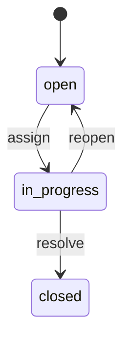
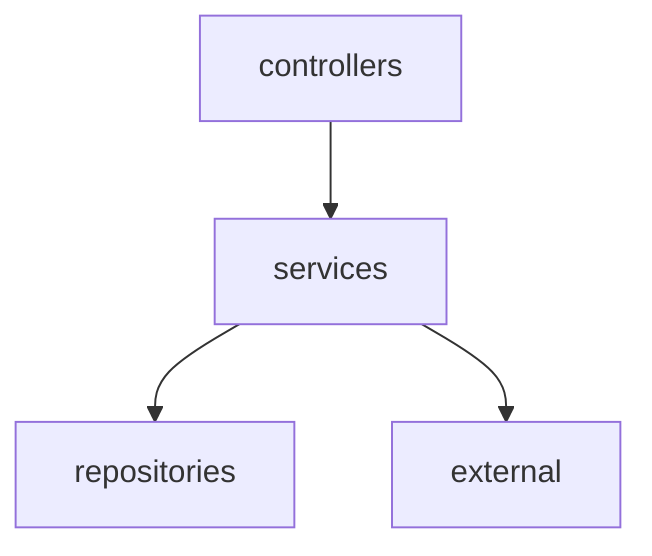

# Outline-mode "overview table" mapping per language

A catalogue of Layer 1 (always-fully-enumerated tables) used by specback's **outline mode**. For each language / framework, this document defines which abstractions to list as tables and which ripgrep patterns enumerate them exhaustively.

## Common policy

### 5 universal tables generated for every language

| Table | What goes in it | Language-independent meaning |
|---|---|---|
| **Modules** | Top-level responsibility partitions | Directories / packages |
| **Entities** | Types that represent "things" | Model / struct / type / class / interface |
| **Actions** | Boundaries that produce "behaviour" | Controllers / handlers / view functions / endpoints |
| **Data** | Persisted schema | DB schema / migrations / collections |
| **Dependencies** | External dependencies | Gems / pip / npm / inter-service integration |

These 5 tables exist as **abstractions in every language and framework** and form the backbone of the outline-mode spec.

### Confidence labels are mandatory (per table cell)

| Marker | Meaning | Grounding evidence | Doubt-pass behaviour |
|--------|---------|-------------------|---------------------|
| 🟢 **VERIFIED** | Confirmed the real code by reading it with the Read tool | The file appears in the read history | May still trigger if comment/claim conflict detected |
| 🟡 **INFERRED** | **Mechanically extracted** via ripgrep / imports / naming convention | The `rg` hit line can be cited as `<!-- REF: SRC-NNNN -->` (or `<!-- REF: path:Lstart-Lend -->`) | Triggers if chain length ≥ 3 (configurable via `goal.json.doubt.inferred_chain_min`) |
| 🔴 **ASSUMED** | Inferred from framework "typical behaviour" (code unread) | Needs SME confirmation; pair with `<!-- ASK SME -->` marker | **Always triggers** — highest priority in doubt-pass |

**🟢 and 🟡 are source-derived (trustworthy). 🔴 is from the agent's knowledge base only (needs confirmation).**

**Doubt-pass effect:** After doubt-pass runs, 🔴 markers may be upgraded to 🟡 or 🟢 (if the code re-read confirms the assumption), or downgraded to `<!-- BLOCKED: see Q-NNN -->` (if re-read contradicts the assumption). The final confidence score from doubt-pass is recorded in `doubt-report.json`. See `docs/doubt-pass.md`.

### MECE-verification criteria (outline mode)

`scripts/coverage-check.py` mechanically checks:

1. **Full file enumeration**: every source file in the file tree appears **exactly once** in some row / cell / section of some table.
2. **VERIFIED ratio**: the percentage of entity rows with a 🟢 label (displayed as a KPI).
3. **🔴 ASSUMED ratio**: warning if it exceeds 60%.

---

## Ruby / Rails

### Modules table

| Directory | Role | How to confirm |
|---|---|---|
| `app/models/` | ActiveRecord models | `glob 'app/models/**/*.rb'` |
| `app/controllers/` | Controllers | `glob 'app/controllers/**/*.rb'` |
| `app/views/` | Templates | `glob 'app/views/**/*'` |
| `app/helpers/` | View helpers | `glob 'app/helpers/**/*.rb'` |
| `app/jobs/` | Background jobs | `glob 'app/jobs/**/*.rb'` |
| `app/mailers/` | Mailers | `glob 'app/mailers/**/*.rb'` |
| `lib/` | Project-specific library code | `glob 'lib/**/*.rb'` |
| `config/` | Configuration | `glob 'config/**/*.{rb,yml}'` |
| `db/migrate/` | Migrations | `glob 'db/migrate/*.rb'` |
| `plugins/` or `engines/` | Plugins / engines | `glob 'plugins/**/*' or 'engines/**/*'` |

### Entities table (Models)

Extraction pattern:
```
rg "^class (\w+)" --type ruby app/models/ -o
```

Columns:

| Class | File | Parent class | Main has_many / belongs_to | One-line summary | 🟢/🟡/🔴 |
|---|---|---|---|---|---|

Association extraction:
```
rg "^\s+(has_many|belongs_to|has_one|has_and_belongs_to_many)\s+:(\w+)" --type ruby
```

### Actions table (Controllers × Actions)

```
rg "^class (\w+Controller)" --type ruby app/controllers/ -o
rg "^\s+def (\w+)" app/controllers/specific_controller.rb
```

Routing:
```
view config/routes.rb
```

Columns:

| Controller#action | HTTP method | path | callback / before_action | One-line summary | 🟢/🟡/🔴 |
|---|---|---|---|---|---|

### Data table (DB schema)

```
view db/schema.rb  (or check config/database.yml)
view db/migrate/   (only the key migrations)
```

Columns:

| Table | Main columns | FK | Indexes | One-line summary | 🟢/🟡/🔴 |
|---|---|---|---|---|---|

### Dependencies table

```
view Gemfile
view Gemfile.lock (for the full list)
```

| Gem | Version | Purpose category | Touch points (file / line) | 🟢/🟡/🔴 |
|---|---|---|---|---|

---

## Python / Django

### Modules table

| Directory | Role |
|---|---|
| `<app>/models.py` or `<app>/models/` | Django models |
| `<app>/views.py` or `<app>/views/` | Views |
| `<app>/urls.py` | URL routing |
| `<app>/serializers.py` | DRF serializers |
| `<app>/admin.py` | Admin pages |
| `<app>/management/commands/` | Custom management commands |
| `<project>/settings.py` | Settings |
| `<app>/migrations/` | Schema migrations |

### Entities table (Models)

```
rg "^class (\w+)\(.*models\.Model.*\):" --type py
rg "^class (\w+)\(.*\):" --type py <app>/models/
```

Columns: Class / File / Parent class / Main ForeignKey / Manager / Summary / Confidence

### Actions table

Both class-based views and function views:
```
rg "^class (\w+)\(.*View.*\):" --type py
rg "^def (\w+)\(request" --type py
```

URLconf:
```
view <app>/urls.py
```

### Data table

For Django, follow the auto-generated migrations under `migrations/` chronologically to reconstruct the schema:
- Reverse-engineer the model state from the latest migration, or
- Reference an example output equivalent to `python manage.py dbshell` inside the skill (no execution needed).

---

## JavaScript / TypeScript / React

### Modules table

| Directory | Role |
|---|---|
| `src/pages/` or `src/app/` (Next.js) | Routes / pages |
| `src/components/` | UI components |
| `src/hooks/` | Custom hooks |
| `src/store/` or `src/state/` | State management |
| `src/lib/` or `src/utils/` | Utilities |
| `src/api/` or `src/services/` | API client calls |
| `public/` | Static assets |

### Entities table (React components / classes)

```
rg "^(?:export )?(?:default )?function (\w+)\s*\(" --type tsx
rg "^(?:export )?const (\w+)\s*=" --type tsx
rg "^(?:export )?class (\w+)" --type tsx
```

Columns: Component / File / Main props / Main state / Hooks used / Summary / Confidence

### Actions table (Routes / API endpoints)

Next.js App Router:
```
glob 'src/app/api/**/route.ts'
```

Express / Hono:
```
rg "(get|post|put|delete|patch)\(['\"]/" src/
```

### Data table

When using an ORM (e.g. Prisma):
```
view prisma/schema.prisma
```

State stores (Zustand / Redux) are also enumerated as a separate entities table:
```
rg "create<.*>\(\(" src/store/
```

---

## Go

### Modules table

| Directory | Role |
|---|---|
| `cmd/` | Entry points |
| `internal/` | Internal-only packages |
| `pkg/` | Public packages |
| `api/` | API definitions (OpenAPI / protobuf) |

### Entities table (Types)

```
rg "^type (\w+) struct" --type go
rg "^type (\w+) interface" --type go
```

Columns: Type / Kind (struct/interface) / File / Fields / Methods / Summary / Confidence

### Actions table (Handlers)

```
rg "^func.*\((?:c|ctx|r|req).*\)\s*\{" --type go
```

Routing:
```
rg "(GET|POST|PUT|DELETE|PATCH)\(['\"]/" --type go
```

---

## Java / Kotlin (Spring Boot)

### Modules table

| Directory | Role |
|---|---|
| `src/main/java/**/controller/` | Controllers |
| `src/main/java/**/service/` | Service layer |
| `src/main/java/**/repository/` | Repositories |
| `src/main/java/**/entity/` or `**/model/` | Entities |
| `src/main/resources/` | Configuration / migrations |

### Entities table

```
rg "@Entity" -A1 --type java
rg "^(public )?class (\w+)" --type java
```

### Actions table

```
rg "@(RestController|Controller|RequestMapping|GetMapping|PostMapping)" --type java
```

---

## Mermaid diagram templates

In outline mode, generate at least one of each as Layer 2:

### ER diagram (auto-derived from Entities + Data table)



### Module dependency diagram



### Sequence diagram (1-3 representative use cases)



### State-transition diagram (1-2 typical entities)



---

## Deep-dive candidate (Layer 3) selection criteria

In outline mode, every table ends with a **"Deep-dive candidates" section**. The agent prioritises these candidates in this order:

1. **Rows with high 🔴 ASSUMED ratio** (the agent could not confirm — may be important).
2. **High-complexity rows** (many methods, many associations, large files).
3. **Rows with unusual implementation patterns** (meta-programming, heavy callbacks, complex queries).
4. **Business-critical rows** (containing keywords like payment / auth / permission / audit log).

Candidate-list format (with IDs):

```markdown
### Deep-dive candidates (refer to them by ID)

- **D-001**: M-013 `Issue` class — authorisation guard logic [🔴 ASSUMED, complex]
- **D-002**: C-018 `ProjectsController#index` — visibility decision [🟡 INFERRED, business-critical]
- **D-003**: Sequence "Issue notification delivery" — subscribers resolution [unverified, complex]
- **D-004**: State transition "Issue#status` — transition validation [🔴 ASSUMED]
- **D-005**: Dependency "acts_as_searchable" — search backend [🟡 INFERRED]
```

When the user says `Deep-dive D-001` or `Tell me more about Issue authorisation`, the main agent recognises the ID and launches `chapter-investigator` (see Phase 6.5).

---

## Feature grouping patterns (for Chapter 2: Feature specifications)

Code is organised by layer (Controller / Service / Model), not by feature. The following strategies infer feature-level groupings to populate the Feature specifications chapter. Each strategy has an expected confidence level.

### Strategy 1: Comment-based grouping (🟢 VERIFIED or 🟡 INFERRED)

Look for explicit feature markers in source code comments:

```
# Feature: User Registration
# @feature payment-processing
/** @feature report-generation */
```

When a function / class / method has an explicit feature comment, the feature-to-code mapping is confirmed.

| Pattern | Language | Confidence |
|---------|----------|-----------|
| `# Feature:` / `# @feature` | Python, Ruby, Shell, YAML | 🟢 when read |
| `// @feature` / `/* @feature */` | JavaScript, TypeScript, Java, C#, C++, Go, Kotlin | 🟢 when read |
| `-- @feature` | SQL, Lua | 🟢 when read |
| docstring / JSDoc `@feature` tag | Python, TypeScript, Java | 🟢 when read |

### Strategy 2: Naming-convention grouping (🟡 INFERRED)

Class / module names that follow a `{Noun}{Verb}` pattern typically represent a feature:

| Pattern | Example | Likely feature name |
|---------|---------|-------------------|
| `*Service`, `*UseCase`, `*Handler`, `*Manager` | `UserRegistrationService` | User registration |
| `*Controller` (singular resource) | `PaymentController` | Payment management |
| `*Job` | `DailySalesAggregationJob` | Daily sales aggregation |
| URL path prefix in routes | `/api/users/*` | User management |
| Module / package name | `app/payments/` | Payment processing |

**Extraction commands** (adjust for target language):

```bash
# Java / Kotlin: Services
rg "class (\w+Service)" --type java -o
rg "class (\w+UseCase)" --type java -o

# Python: Services / Handlers
rg "class (\w+Service):" --type py -o
rg "class (\w+Handler):" --type py -o

# TypeScript / JavaScript: Services / Hooks
rg "^(export )?(default )?(function|const) (\w+Service)" --type ts -o

# Ruby: Services / Interactors
rg "class (\w+(?:Service|UseCase|Interactor))" --type ruby -o
```

[🟡 INFERRED] — naming conventions may have false positives (some `*Service` classes are infrastructure, not features).

### Strategy 3: Screen / endpoint aggregation (🟡 INFERRED)

Group code units that serve the same screen or resource:

- **Web app**: Each screen (SC-NNN) defines a feature. Collect all endpoints, models, and domain rules referenced by that screen.
- **API service**: Each resource (User / Issue / Payment / Project) defines a feature. Collect all endpoints and service methods for that resource.
- **Batch system**: Each job group (aggregation / transfer / integrity) defines a feature.
- **Library / SDK**: Each major export category (parsing / transformation / I/O) defines a feature.

**Extraction approach**:

```bash
# Group endpoints by URL path prefix
rg "(GET|POST|PUT|DELETE|PATCH)\s+'/api/(\w+)" --type py -o

# Group controllers by module
rg "^class (\w+)Controller" --type ruby app/controllers/ -o
```

[🟡 INFERRED] — screen/resource boundaries are structural, not necessarily feature boundaries.

### Strategy 4: Use-case mapping (🔴 ASSUMED)

Map the use cases defined in Chapter 1 (Overview) to candidate features:

1. Extract the 3–5 use cases from Ch1.
2. For each use case, search for related classes/functions (by keyword match in file names, class names, comments).
3. If a code path can be identified, upgrade to 🟡 or 🟢.

Example:

```
Use case: "A user creates an issue"
→ Candidate feature: "Issue creation" (F-003)
→ Evidence: IssuesController#create <!-- REF: SRC-NNNN -->, IssueService::create <!-- REF: SRC-NNNN -->
→ Confidence: 🟡 (code path confirmed)
```

[🔴 ASSUMED] — use cases are high-level and may not map 1:1 to code features. Only upgrade when specific code paths are identified.

### Strategy 5: Question Bank integration

When a feature cannot be determined from code:

1. Add a `spec_missing` category question to `questions.json`:
   ```json
   {
     "id": "Q-NNN",
     "category": "spec_missing",
     "severity": "important",
     "body": "Does the system have a dedicated 'user deactivation' feature, or is it handled as part of 'user management'?",
     "status": "open"
   }
   ```
2. Mark the feature row as 🔴 ASSUMED and add `<!-- ASK SME -->`.
3. In Phase 5 dialogue, present these to the SME for confirmation.

### Chapter-investigator procedure for Feature specifications

When a chapter-investigator sub-agent is assigned to the Feature specifications chapter:

1. **Read the Overview chapter first** — understand the use cases and system purpose.
2. **Apply Strategies 1–4** to extract candidate features.
3. **Build the Feature catalogue table** — one row per candidate feature with confidence labels.
4. **For the top-5 most critical or complex features**, write the full Per-feature processing definition.
5. **For remaining features**, keep only the catalogue table row.
6. **Cross-reference** each feature to related chapters (screen details, endpoint catalogue, data model).
7. **Populate questions.json** with `spec_missing` questions for uncertain feature boundaries.
8. **Output**: `{output_dir}/.specback/drafts/02-feature-specifications.md`

## Module architecture (overview) extraction patterns (for Chapter 3: Module architecture / Architecture overview)

Overview-level structure chapter: WHAT the modules are and how they relate at a glance. Keep it short — detailed internals belong to Internal structure, deep rationale to Design decisions.

### Module composition (directory structure)

Mechanically extractable with `glob` / `ls` of the top-level source layout:

| Signal | Command | Confidence |
|--------|---------|-----------|
| Source root layout | `glob src/*`, `glob lib/*`, top-level package dirs | 🟢 |
| Package entry point | manifest `main` / `module` / `exports` field | 🟢 |
| Distribution layout | `dist/`, `build/`, `lib/` (compiled output) vs source | 🟢 |

One row per module/package: `Module / package | Responsibility | Key files | Confidence`. Responsibility may need reading the module's main file or README — mark 🟡 when inferred from naming alone.

### Tech stack (manifest)

| Signal | Command | Confidence |
|--------|---------|-----------|
| Language / runtime | `package.json` (`engines`), `pyproject.toml` (`requires-python`), `*.gemspec`, `composer.json` | 🟢 |
| Major dependencies | manifest dependency lists; `pip freeze` / `npm ls --depth=0` output | 🟢 |
| Build tooling | `devDependencies` / build scripts / Makefile targets | 🟢 |

### Module dependency overview (top-level only)

Same `rg` import patterns as Design decisions (see below) — but **group at package / top-level-directory granularity**, not per file. Render one `graph TD` with ≤ 15 nodes (SKILL.md Split rule); flag circular dependencies; defer the detailed graph to Design decisions.

### Chapter-investigator procedure for Module architecture (overview)

When a chapter-investigator sub-agent is assigned to the Module architecture (overview) chapter:

1. **Read the Overview chapter** for library purpose and features.
2. **Glob the directory structure**; list top-level modules/packages and their responsibilities.
3. **Read the package manifest** for language/runtime/major dependencies.
4. **Run import analysis** at top-level granularity; build a `graph TD` dependency overview.
5. **Cross-reference** detailed internals → Internal structure, detailed dependency analysis → Design decisions.
6. **Populate questions.json** with `spec_missing` questions for unclear module responsibilities.
7. **Output**: `{output_dir}/.specback/drafts/03-module-architecture.md`

## Design decisions extraction patterns (for Chapter N: Design decisions)

### Module / component dependency extraction

Import/require/include graphs are mechanically extractable. Per-language ripgrep patterns:

| Language | ripgrep pattern | Filtering |
|----------|----------------|-----------|
| Python | `rg "^import " --type py`, `rg "^from " --type py` | Keep only own-project paths; strip stdlib |
| TypeScript/JS | `rg "^(import |const .* = require\\()" --type ts` | Keep only relative (`./` or `../`) imports |
| Java/Kotlin | `rg "^import " --type java --type kotlin` | Keep only `com.yourproject.*` |
| Ruby | `rg "^(require |require_relative )" --type ruby` | `require_relative` is always internal |
| Go | `rg '\\"(github\\.com/yourorg)' --type go -o` | Strip to package name |
| PHP | `rg "^use " --type php` | Keep only `App\\*` |
| C# | `rg "^using " --type cs` | Keep only `YourProject.*` |

**Output format** — group by layer/directory:

```
Layer: controllers
  depends_on: [services, auth]
Layer: services
  depends_on: [repositories, external]
...
```

Then render as a Mermaid `graph TD` or `graph LR`:



Note circular dependencies with `x-->x` style: `repositories -.->|circular| services`.

### Cross-cutting pattern detection

| Pattern | Detection command |
|---------|-----------------|
| Error handling | `rg "\\b(try|catch|except|raise|throw|reraise)\\b"` — also search for custom exception classes |
| Logging | `rg "\\b(logger|logging|console\\.log|print|warn|error)\\b"` |
| Validation | `rg "\\b(validate|validator|assert|sanitize|sanitise)\\b"` |
| Retry/resilience | `rg "\\b(retry|backoff|timeout|circuit_breaker|fallback)\\b"` |
| Caching | `rg "\\b(cache|redis|memcache|memoize|lru_cache)\\b"` |
| Async | `rg "\\b(async|await|thread|worker|queue|celery|sidekiq|job)\\b"` |
| Batch/bulk | `rg "\\b(batch|chunk|bulk)\\b"` (class/method names) |
| Secrets | `rg "\\b(SECRET|API_KEY|PASSWORD|TOKEN|CREDENTIAL)\\b"` in config files, env reads |
| Encryption | `rg "\\b(encrypt|decrypt|hash|bcrypt|argon2|aes|rsa)\\b"` |
| TODO markers | `rg "(TODO|FIXME|HACK|WORKAROUND|XXX|OPTIMIZE|DEPRECATED)"` with 2 lines context |

For each pattern, count occurrences across modules. High occurrence counts indicate a systematic pattern; low counts in unexpected places indicate inconsistencies.

### Chapter-investigator procedure for Design decisions

When a chapter-investigator sub-agent is assigned to the Design decisions chapter:

1. **Read the Overview chapter** to understand the system type and purpose.
2. **Read the Architecture overview chapter** to understand the tech stack.
3. **Run extraction commands** for each of the 7 sections (ADR, dependencies, patterns, security, performance, integration, trade-offs).
4. **Build ADR table** from code comments, README, and design docs. Mark most entries 🔴 ASSUMED.
5. **Generate module dependency graph** from import analysis. Flag circular dependencies.
6. **Enumerate cross-cutting patterns** with counts and consistency notes.
7. **Cross-reference** security/performance/integration sections to their detailed chapters.
8. **Extract TODO/FIXME/HACK markers** with surrounding context.
9. **Populate questions.json** with `spec_missing` and `architecture_decision` questions for 🔴 entries.
10. **Output**: `{output_dir}/.specback/drafts/NN-system-design.md`
