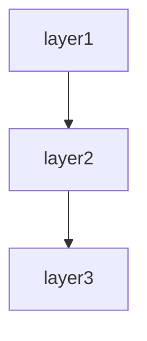

# API service spec template

This template defines the chapter outline for the spec of a service whose endpoints are called by other systems.

Designed for API services, microservices, and public APIs over REST, GraphQL, gRPC, WebSocket, etc.

---

## Chapter outline

### Chapter 1: Overview

<!-- meta: purpose and scope of the API as a whole. -->

#### 1.1 API purpose
- The value the API provides
- Intended consumers (internal systems / partners / public)
- Position in the business

#### 1.2 Main use cases
- 3-5 representative scenarios

#### 1.3 Service composition diagram
- API Gateway / Load Balancer / Backend structure
- Dependencies on related services

---
---

### Chapter 2: Feature specifications

<!-- meta: consolidated feature-level view of the system. Maps features to screens, routes, and data. -->

#### 2.1 Feature catalogue table

| Feature ID | Feature name | Category | Related items (screens/endpoints/jobs/APIs) | Auth required | Summary | Confidence |
|------------|-------------|----------|-------------------------------------------|-------------|---------|-----------|
| F-001 | (feature) | (category) | (related items) | yes/no | 1-line summary | 🟢/🟡/🔴 |
| F-002 | (feature) | (category) | (related items) | yes/no | 1-line summary | 🟢/🟡/🔴 |
| ... | ... | ... | ... | ... | ... | ... |

The catalogue table exhaustively lists every feature. Confidence labels:
- 🟢 **VERIFIED**: Feature purpose confirmed by reading the actual code (screen, controller, or service file).
- 🟡 **INFERRED**: Feature mechanically grouped from endpoint path prefix or class naming convention.
- 🔴 **ASSUMED**: Feature inferred from use-case description; code evidence is indirect.

#### 2.2 Per-feature processing definitions

For each feature listed above, describe the processing flow structured as below. Generate at minimum the top-5 features by complexity or business criticality; list the remainder in the catalogue table only.

##### F-001: {Feature name}

**Overview**
- Business value this feature provides
- Which user / system role uses it

**Priority**
- P1 / P2 / P3 — importance for the product (P1 = core value proposition, P3 = auxiliary). Determined from code evidence. <!-- REF: SRC-NNNN -->

**Trigger**
- User action / system event / external call that initiates this feature

**Pre-conditions**
- Conditions that must hold before execution

**Main flow**
1. Step 1 <!-- REF: SRC-NNNN -->
2. Step 2 <!-- REF: SRC-NNNN -->
3. ...

**Alternative flows**
- Alt-1: When [condition] → [behaviour] <!-- REF: SRC-NNNN -->

**Error handling**
- Error type → system behaviour <!-- REF: SRC-NNNN -->

**Edge cases**
- Boundary conditions / exceptional inputs (kept separate from Error handling: Error handling = behaviour on failure, Edge cases = boundary values / unusual inputs) <!-- REF: SRC-NNNN -->
- e.g. empty input, max length, duplicate submission, concurrent access

**Acceptance scenarios**
- Scenario 1: Given [precondition] When [action] Then [observable result] <!-- REF: SRC-NNNN -->
- Scenario 2: Given [precondition] When [action] Then [observable result] <!-- REF: SRC-NNNN -->

**Independent test**
- How to verify this feature in isolation:
  - Automated: test file reference (e.g. `tests/test_<feature>.py`) <!-- REF: SRC-NNNN -->
  - Manual: [manual verification steps]

**Post-conditions**
- State of the system after successful execution

**Related business rules**
- → Ch? (Domain rules section) cross-reference

**Related chapters**
- → Ch? (Screen details / Routes / Data model) cross-reference

**Confidence**: 🟢/🟡/🔴

---


### Chapter 3: Architecture overview

<!-- meta: technology choices and overall structure. -->

#### 3.1 Technology stack
- Language / framework (Spring Boot / Express / FastAPI / .NET, etc.)
- API style (REST / GraphQL / gRPC / WebSocket)
- API spec format (OpenAPI / GraphQL SDL / .proto)

#### 3.2 Internal architecture
- Layering (Controller / Service / Repository, etc.)
- Data stores (RDB / NoSQL / Cache)
- Messaging infrastructure

#### 3.3 Deployment topology
- Runtime (Kubernetes / ECS / Lambda, etc.)
- Scaling strategy

---

### Chapter 4: Class / Module Design

<!-- meta: internal structure — classes, modules, and their relationships. -->

#### 4.1 Module overview

| Module / package | Responsibility | Key classes | Dependencies |
|:----------------|:-------------|:-----------|:------------|
| ... | ... | ... | ... |

#### 4.2 Class catalogue

| Class | Kind | Module | Responsibility | Depends on | Source |
|:------|:----|:-------|:-------------|:----------|:-------|
| ... | ... | ... | ... | ... | <!-- REF: SRC-NNNN --> |

#### 4.3 Class diagram (Mermaid)
Include a `classDiagram` for key subsystems. Split per module if >15 classes (see SKILL.md Split rule).

#### 4.4 Module dependency diagram (Mermaid)
Show the direction of dependencies between top-level modules using `graph TD` or `flowchart TD`.

---

### Chapter 5: Endpoint catalogue

<!-- meta: inventory of all endpoints. The pillar of verification. -->

#### 4.1 Endpoint catalogue
| Endpoint ID | Method | Path | Summary | Auth | Version |
|---------------|---------|------|------|------|----------|
| EP-001 | GET | /v1/users/{id} | Get user | required | v1 |
| EP-002 | POST | /v1/users | Create user | required | v1 |
| ... | ... | ... | ... | ... | ... |

#### 4.2 Grouping by resource
- Organise endpoints by resource
- Relationships between resources

---

### Chapter 6: Request / response specifications

<!-- meta: per-endpoint details. If they can be generated from OpenAPI, reference only is acceptable. -->

For each endpoint, describe:

#### {Endpoint name}

##### Overview
- Purpose
- Use scenario

##### Request
- HTTP method + path
- Path parameters
- Query parameters
- Headers (required / optional)
- Request body (schema + example)

##### Response
- Success (2xx)
  - Status code
  - Response body (schema + example)
  - Response headers
- Error (4xx, 5xx)
  - Expected error codes
  - Error response body

##### Side effects
- Database updates
- Calls to external systems
- Events published

##### Idempotency
- Whether the endpoint is idempotent
- Idempotency-key mechanism (if supported)

---

### Chapter 7: Data Model

<!-- meta: persistent data structures and entity relationships. -->

#### 7.1 Data stores

| Store | Type | Purpose | Connection config | ORM / client |
|:------|:----|:-------|:----------------|:------------|
| Main DB | PostgreSQL | Primary persistence | config/database.yml | ActiveRecord |
| Cache | Redis | Session / rate-limit store | config/cache.yml | RedisClient |
| ... | ... | ... | ... | ... |

#### 7.2 Entity definitions

Per entity (one table per row):

| Entity | Table / collection | Key fields | Relations | Corresponding model | Source |
|:-------|:-----------------|:----------|:---------|:------------------|:-------|
| User | users | id, name, email, role | 1:N→Issue | User model | app/models/user.rb |
| Issue | issues | id, title, status, user_id | N:1→User | Issue model | app/models/issue.rb |
| ... | ... | ... | ... | ... | ... |

Full field definitions per entity (expand in the chapter body):

| Field | Type | Required | Default | Index | FK | Business meaning |
|:------|:----|:--------:|:-------|:----:|:--|:----------------|
| id | bigint | ✅ | auto | PK | - | Primary key |
| name | string | ✅ | - | unique | - | Display name |
| email | string | ✅ | - | unique | - | Login identifier |
| role | enum | ✅ | 'user' | - | - | 'user' / 'admin' |
| ... | ... | ... | ... | ... | ... | ... |

#### 7.3 Key domain rules
- Invariants (e.g. "issue status cannot transition from closed to open")
- State transitions (Mermaid stateDiagram-v2)
- Business rules (e.g. "withdrawn users are excluded from search results")

---

### Chapter 8: Error codes / error responses

<!-- meta: full error-code list and semantics. -->

#### 8.1 Common error-response
```json
{
  "error": {
    "code": "USER_NOT_FOUND",
    "message": "The specified user was not found",
    "details": {},
    "trace_id": "..."
  }
}
```

#### 8.2 Error-code list
| Code | HTTP status | Category | Meaning | Consumer action |
|-------|--------------|---------|------|----------|
| USER_NOT_FOUND | 404 | client error | User does not exist | Check the ID |
| RATE_LIMIT_EXCEEDED | 429 | client error | Rate-limited | Retry |
| INTERNAL_ERROR | 500 | server error | Internal failure | Contact support |
| ... | ... | ... | ... | ... |

#### 8.3 HTTP status-code policy
- When to use 200 vs 201 vs 204
- When to use 400 vs 401 vs 403 vs 404 vs 409 vs 422
- When to use 500 vs 502 vs 503 vs 504

---

### Chapter 9: External interfaces

<!-- meta: all system boundaries — external APIs, databases, queues, file transfers. -->

#### 9.1 External interface inventory

| IF-ID | Name | Type | Protocol | Direction | Consumer / provider | Failure behaviour |
|:------|:-----|:----|:---------|:--------:|:------------------|:-----------------|
| IF-001 | Payment API | REST API | HTTPS | Outbound | Payment gateway | Retry 3x, notify |
| IF-002 | Main DB | Database | PostgreSQL | Bidirectional | Primary RDS | Pool reconnect |
| ... | ... | ... | ... | ... | ... | ... |

#### 9.2 External API integrations

##### 9.2.1 Integration partners

| Partner | Protocol | Purpose | Authentication | Timeout | Behaviour on failure |
|---------|----------|------|--------------|:-------|-------------------|
| ... | ... | ... | ... | ... | ... |

##### 9.2.2 Details per integration
- Authentication method (API key, OAuth, etc.)
- Request / response example
- Timeout / retry policy
- Idempotency (or lack thereof)
- Fallback behaviour on failure

#### 9.3 Database connections

| Database | Type | Host / connection | Auth | Pool | TLS | Usage |
|:---------|:-----|:-----------------|:----|:----:|:---|:------|
| Main DB | PostgreSQL | db.example.com:5432 | SCRAM-SHA-256 | max: 10 | required | Primary persistence |

#### 9.4 Message queues / event streams

| Queue / topic | Type | Broker | Direction | Routing | Retry / DLQ | Consumers |
|:-------------|:----|:------|:--------:|:--------|:-----------|:----------|
| ... | ... | ... | ... | ... | ... | ... |

#### 9.5 File transfers

| Transfer | Source | Destination | Protocol | Schedule | File pattern | Encryption |
|:---------|:-------|:-----------|:---------|:--------|:------------|:----------|
| ... | ... | ... | ... | ... | ... | ... |

---

### Chapter 10: Authentication

<!-- meta: authentication-method details. -->

#### 10.1 Authentication method
- API key / OAuth 2.0 / JWT / mTLS / Basic auth
- Reason for the choice

#### 10.2 Authentication flow
- Token-acquisition steps
- Token lifetime
- Refresh procedure

#### 10.3 Authorisation
- Scopes / permissions
- Role-based access control (RBAC)

#### 10.4 Credential management
- Where keys / secrets are stored
- Rotation procedure

---

### Chapter 11: Rate limiting / quotas

<!-- meta: usage caps and behaviour. -->

#### 11.1 Rate-limit policy
| Tier | Limit | Unit | Scope |
|------|-------|---------|---------|
| Free plan | 100 req/min | per minute | per API key |
| Paid plan | 10000 req/min | per minute | per API key |
| ... | ... | ... | ... |

#### 11.2 Behaviour on exceeding the limit
- HTTP status (429 Too Many Requests)
- Retry-After header
- When the limit resets

#### 11.3 Quotas
- Monthly / daily total-call ceilings
- Behaviour when exceeded

---

### Chapter 12: Versioning

<!-- meta: API evolution and compatibility. -->

#### 12.1 Versioning strategy
- URL-path style (/v1/, /v2/)
- Header style
- Media-type style

#### 12.2 Supported versions
| Version | Released | Sunset planned | Status |
|----------|----------|---------------|------|
| v1 | 2024-01 | 2026-12 | active |
| v2 | 2026-03 | - | active (recommended) |

#### 12.3 Breaking-change policy
- What counts as a breaking change
- Advance-notice period
- Migration-guide commitment

#### 12.4 Backward compatibility
- Change patterns that preserve compatibility
- Deprecation process

---

### Chapter 13: SLA / performance requirements

<!-- meta: the quality the service provides. -->

#### 13.1 Availability targets
- Availability SLA (e.g. 99.9%)
- Measurement method
- How planned downtime is announced

#### 13.2 Performance targets
| Metric | Target | Measurement |
|------|-------|---------|
| Mean response time | < 200ms | p50 |
| 95th percentile response time | < 500ms | p95 |
| Peak throughput | 10000 RPS | over 1-minute windows |

#### 13.3 Incident response
- Incident classification
- Communication flow
- Status page

---

### Chapter 14: Operations settings

<!-- meta: deployment / monitoring / logging. -->

#### 14.1 Environment variables / configuration values
| Variable | Required | Default | Purpose |
|-------|------|----------|------|
| DB_HOST | required | - | Database connection target |
| ... | ... | ... | ... |

#### 14.2 Deployment procedure
- Build / deploy pipeline
- Canary releases (if used)
- Rollback procedure

#### 14.3 Monitoring
- Monitored metrics
- Alert conditions
- Dashboards

#### 14.4 Logging

| Log type | Output | Format | Level | Retention | Source config |
|:---------|:-------|:------|:-----|:---------|:-------------|
| Access log | stdout | JSON (structured) | info | 90 days | config/logging.rb:10 |
| Application log | stdout | JSON (structured) | debug~error | 90 days | config/logging.rb:25 |
| Error log | stderr | JSON (structured) | warn~fatal | 1 year | config/logging.rb:40 |

Log level definitions:
| Level | Meaning | Output |
|:------|:--------|:-------|
| DEBUG | Detailed diagnostic info (dev only) | Dev environment |
| INFO | Normal operation messages | Always |
| WARN | Warning conditions | Always |
| ERROR | Recoverable errors | Always |
| FATAL | Unrecoverable errors | Always |

---

### Chapter 15: Design decisions

<!-- meta: architectural decisions, cross-cutting concerns, module dependencies, and design trade-offs derived from code. Complements Architecture overview (which describes WHAT) by explaining WHY and HOW cross-cutting concerns are handled. -->

#### 15.1 Architecture Decision Records (ADR)

Code-derived record of design decisions. Confidence is typically low since rationale is rarely written in code; use Question Bank integration for SME confirmation.

| ID | Topic | Decision (as observed in code) | Rationale (inferred) | Alternatives (inferred) | Confidence | Supporting REF |
|----|-------|------------------------------|---------------------|----------------------|-----------|---------------|
| ADR-001 | (topic) | (decision) | (inferred rationale) | (inferred alternatives) | 🟢/🟡/🔴 | <!-- REF: SRC-NNNN --> |
| ... | ... | ... | ... | ... | ... | ... |

Extraction strategy:
- Search for design-related comments (`// Why:`, `# Reason:`, `/* Decision: */`)
- Read README / CONTRIBUTING / design docs for explicit rationale
- When no explicit rationale exists, mark 🔴 ASSUMED and add `<!-- ASK SME -->`

`<!-- CONFIDENCE: LOW — ADR entries are almost always inferred unless explicitly documented -->`

#### 15.2 Module / component dependency

Import/require/include graph extracted from source code. Enumerates dependencies between layers or modules.

**Extraction approach:**

| Language | Pattern | Example | Confidence |
|----------|---------|---------|-----------|
| Python | `rg "^import |^from "` then filter to own project | `import app.models` → depends on `app.models` | 🟢 |
| TypeScript/JS | `rg "^(import |const .* = require\()"` | `import { User } from '../models'` | 🟢 |
| Java/Kotlin | `rg "^import "` | `import com.example.service.UserService` | 🟢 |
| Ruby | `rg "^(require |require_relative )"` | `require_relative 'models/user'` | 🟢 |
| Go | `rg ""github\.com/.*/"` filtered to own module | `"project/internal/service"` | 🟢 |
| PHP | `rg "^(use |require_once )"` | `use App\Service\UserService` | 🟢 |
| C# | `rg "^(using |using static )"` | `using Project.Data.Models` | 🟢 |

Render the result as a Mermaid graph:



Label each edge with the dependency strength (direct / transitive / circular). Flag circular dependencies explicitly.

[🟢 VERIFIED] — import statements are mechanically extractable with near-zero false positives.

#### 15.3 Cross-cutting design patterns

Code-wide patterns that span multiple modules.

| Pattern | Detection method | Example REF | Confidence |
|---------|----------------|-------------|-----------|
| Error handling strategy | Search for `try`/`catch`/`except`/`raise`/`throw` patterns, custom exception classes | <!-- REF: SRC-0001 --> | 🟢 |
| Logging approach | Search for `logger`/`logging`/`console.log`/`print`/`warn` calls | <!-- REF: SRC-0002 --> | 🟢 |
| Validation pattern | Search for decorators (`@validate`/`@assert`), validator classes, assertions | <!-- REF: SRC-0004 --> | 🟢 |
| Dependency injection | Constructor injection / DI container / service provider | <!-- REF: SRC-0003 --> | 🟡 |
| Retry / resilience | Search for `retry`/`backoff`/`timeout`/`circuit_breaker` patterns | <!-- REF: SRC-0005 --> | 🟡 |
| Batch / chunk processing | Search for `batch`/`chunk`/`bulk` in method/class names | <!-- REF: SRC-0006 --> | 🟢 |

For each pattern found, note:
- **Consistency**: Does the whole project use one pattern, or are multiple approaches mixed?
- **Coverage**: Are there modules that SHOULD use this pattern but don't?
- **Exceptions**: Any deliberate deviations from the pattern?

[🟢 VERIFIED for most patterns] — language-level constructs (try/catch, import patterns) are mechanically detectable.

#### 15.4 Security design

Security-related mechanisms observed in code. Detailed auth flows go in the Authentication chapter; this section covers the remaining security posture.

| Aspect | Detection method | Confidence |
|--------|----------------|-----------|
| Input sanitisation | Search for `escape`/`sanitize`/`strip_tags`/parameterised queries | 🟡 |
| Secrets management | Search for `.env`/`secrets`/`vault` references, env-var reads for credentials | 🟢 |
| Encryption at rest | Search for `encrypt`/`decrypt`/`hash`/`bcrypt`/`argon2` calls | 🟢 |
| Transport security | Search for HTTPS/TLS/SSL configuration | 🟡 |
| CORS / CSP | Search for CORS middleware, Content-Security-Policy headers | 🟢 |
| Authorisation guards | Cross-reference with auth chapter; note any unauthorised endpoints | 🟢 |

→ Detailed auth flows → see Chapter ? (Authentication and authorisation)

[🟢 VERIFIED for most — security code is explicit and searchable]

#### 15.5 Performance design

Performance-related patterns and potential bottlenecks detected in code. **Does not include benchmarks** (not extractable from code alone).

| Pattern | Detection method | Confidence |
|---------|----------------|-----------|
| Caching | Search for `cache`/`redis`/`memcache`/`memoize`/`lru_cache` | 🟢 |
| N+1 prevention | Search for `eager_load`/`includes`/`prefetch`/`select_related` | 🟢 |
| Async processing | Search for `async`/`await`/`thread`/`worker`/`queue`/`celery`/`sidekiq` | 🟢 |
| Bulk operations | Search for `bulk_`/`batch_`/`chunk` methods | 🟢 |
| Connection pooling | Search for `pool`/`connection_limit`/`max_connections` | 🟡 |
| Query optimisation | Search for `EXPLAIN`/`index`/`materialized view` hints | 🟡 |
| Concurrency control | Search for `lock`/`mutex`/`transaction`/`optimistic`/`pessimistic` | 🟢 |

For each pattern, list which files/modules use it. Note modules that might need these patterns but don't use them (potential performance debt).

[🟢 VERIFIED for most patterns — code-level keywords are mechanically searchable]

#### 15.6 Integration design

External-system integration patterns. Detailed per-integration specs go in the External-system integration chapter; this section provides the overarching design.

| Aspect | Detection method | Confidence |
|--------|----------------|-----------|
| External HTTP calls | Search for `requests`/`HTTPX`/`axios`/`fetch`/`HttpClient` calls | 🟢 |
| Message queue usage | Search for `publish`/`subscribe`/`produce`/`consume`/`rabbit`/`kafka`/`sqs` | 🟢 |
| File-based integration | Search for file read/write with specific formats (CSV/XML/JSON/Parquet) | 🟢 |
| Protocol distribution | Classify external calls by protocol (REST / GraphQL / gRPC / SOAP) | 🟢 |
| Resiliency | Search for `timeout`/`retry`/`fallback`/`circuit_breaker` around external calls | 🟡 |

→ Detailed per-integration specs → see Chapter ? (External-system integration)

[🟢 VERIFIED — external call code is explicit]

#### 15.7 Known trade-offs and constraints

Technical trade-offs and constraints visible in code comments.

| Marker | Detection method | Meaning | Example |
|--------|----------------|---------|---------|
| `TODO` | `rg "TODO"` (with context) | Planned improvement; may indicate known limitation | `// TODO: paginate this query` |
| `FIXME` | `rg "FIXME"` | Defect or known issue | `# FIXME: race condition on concurrent writes` |
| `HACK` / `WORKAROUND` | `rg "HACK|WORKAROUND"` | Deliberate suboptimal solution | `/* HACK: SDK bug, remove after v2 upgrade */` |
| `XXX` | `rg "XXX"` | Something suspicious that needs review | `// XXX: this silently ignores errors` |
| `OPTIMIZE` | `rg "OPTIMIZE|PERF|SLOW"` | Performance concern | `# OPTIMIZE: N+1 query, eager-load` |
| `@deprecated` / `DEPRECATED` | Search for deprecation markers | Planned removal | `@deprecated use createV2 instead` |

→ Critical items → see Chapter ? (Known constraints and unresolved items)

For each marker, include the surrounding context (next 2 lines) to explain the trade-off. Group by severity (CRITICAL / MAJOR / MINOR).

[🟢 VERIFIED — markers are mechanically extractable; context needs manual review for accurate grouping]

---


### Chapter 16: Known constraints and unresolved items

<!-- meta: spec credibility safeguard. -->

#### 16.1 Known technical constraints
- Request-body size cap
- Concurrent-connection cap
- Known bugs / workarounds

#### 16.2 Unresolved items
- Place the `abandoned` entries from the Question Bank here

---

## Customisation guidance

### GraphQL
- Restructure Chapter 3 into "Schema", "Query", "Mutation", "Subscription".
- Change Chapter 4 to per-resolver descriptions.

### gRPC
- Restructure Chapter 3 into "Service" and "RPC Method".
- Change Chapter 4 to centre on `.proto` message definitions.

### WebSocket
- Restructure Chapter 3 around "message types".
- Change Chapter 4 to centre on client / server message flow.

### Public API (for external developers)
- Add "Quick start" and "SDK support" chapters.
- Add a "Changelog" chapter.

Customisation is finalised in dialogue with the user after Phase 1 template selection.
