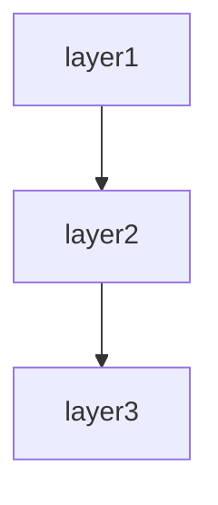

# Batch-system spec template

This template defines the chapter outline for the spec of a scheduled or event-driven background-processing system.

Designed for COBOL + JCL, cron / systemd timers, Spring Batch, Apache Airflow, Celery, Sidekiq, AWS Batch, AWS Lambda scheduled runs, ETL data pipelines, etc.

---

## Chapter outline

### Chapter 1: Overview

<!-- meta: business purpose of the batch system as a whole. -->

#### 1.1 Business purpose
- The business problem this batch system solves
- Position in the business cycle (monthly, weekly, daily, real-time)

#### 1.2 Major job groups
- Major job categories (aggregation, transfer, integrity check, etc.)
- Representative jobs per category

#### 1.3 Related systems
- Sources of input data
- Consumers of output data

---
---

### Chapter 2: Feature specifications

<!-- meta: consolidated feature-level view of the system. Maps features to screens, routes, and data. -->

#### 2.1 Feature catalogue table

| Feature ID | Feature name | Category | Related items (screens/endpoints/jobs/APIs) | Auth required | Summary | Confidence |
|------------|-------------|----------|-------------------------------------------|-------------|---------|-----------|
| F-001 | (feature) | (category) | (related items) | yes/no | 1-line summary | 🟢/🟡/🔴 |
| F-002 | (feature) | (category) | (related items) | yes/no | 1-line summary | 🟢/🟡/🔴 |
| ... | ... | ... | ... | ... | ... | ... |

The catalogue table exhaustively lists every feature. Confidence labels:
- 🟢 **VERIFIED**: Feature purpose confirmed by reading the actual code (screen, controller, or service file).
- 🟡 **INFERRED**: Feature mechanically grouped from endpoint path prefix or class naming convention.
- 🔴 **ASSUMED**: Feature inferred from use-case description; code evidence is indirect.

#### 2.2 Per-feature processing definitions

For each feature listed above, describe the processing flow structured as below. Generate at minimum the top-5 features by complexity or business criticality; list the remainder in the catalogue table only.

##### F-001: {Feature name}

**Overview**
- Business value this feature provides
- Which user / system role uses it

**Priority**
- P1 / P2 / P3 — importance for the product (P1 = core value proposition, P2 = important but not core, P3 = auxiliary). Determined from code evidence (call volume, criticality of the path, blast radius). REF optional.

**Trigger**
- User action / system event / external call that initiates this feature

**Pre-conditions**
- Conditions that must hold before execution

**Main flow**
1. Step 1 <!-- REF: SRC-NNNN -->
2. Step 2 <!-- REF: SRC-NNNN -->
3. ...

**Alternative flows**
- Alt-1: When [condition] → [behaviour] <!-- REF: SRC-NNNN -->

**Error handling**
- Error type → system behaviour <!-- REF: SRC-NNNN -->

**Edge cases**
- Boundary conditions / exceptional inputs (kept separate from Error handling: Error handling = behaviour on failure, Edge cases = boundary values / unusual inputs) <!-- REF: SRC-NNNN -->
- e.g. empty input, max length, duplicate submission, concurrent access

**Acceptance scenarios**
- Write 2–5 scenarios per feature, each with an `<!-- REF: SRC-NNNN -->` citation to the code branch it validates.
- Scenario 1: Given [precondition] When [action] Then [observable result] <!-- REF: SRC-NNNN -->
- Scenario 2: Given [precondition] When [action] Then [observable result] <!-- REF: SRC-NNNN -->

**Independent test**
- How to verify this feature in isolation:
  - Automated: test file reference (e.g. `tests/test_<feature>.py`) <!-- REF: SRC-NNNN -->
  - Manual: [manual verification steps]

**Post-conditions**
- State of the system after successful execution

**Related business rules**
- → Ch? (Domain rules section) cross-reference

**Related chapters**
- → Ch? (Screen details / Routes / Data model) cross-reference

**Confidence**: 🟢/🟡/🔴

---

### Chapter 3: Architecture overview

<!-- meta: structure of the batch execution platform. -->

#### 3.1 Technology stack
- Language / framework
- Scheduler (cron / Airflow / Spring Batch / JCL, etc.)
- Job runtime (on-prem / cloud / container)

#### 3.2 Job execution model
- One-shot / chained / DAG-driven
- Parallelism
- Resource allocation

#### 3.3 Input/output data stores
- Database / file storage / message queue
- Data formats (CSV, JSON, XML, fixed-length, Parquet, etc.)

---

### Chapter 4: Class / Module Design

<!-- meta: internal structure — classes, modules, and their relationships. -->

#### 4.1 Module overview

| Module / package | Responsibility | Key classes | Dependencies |
|:----------------|:-------------|:-----------|:------------|
| ... | ... | ... | ... |

#### 4.2 Class catalogue

| Class | Kind | Module | Responsibility | Depends on | Source |
|:------|:----|:-------|:-------------|:----------|:-------|
| ... | ... | ... | ... | ... | <!-- REF: SRC-NNNN --> |

#### 4.3 Class diagram (Mermaid)
Include a `classDiagram` for key subsystems. Split per module if >15 classes (see SKILL.md Split rule).

#### 4.4 Module dependency diagram (Mermaid)
Show the direction of dependencies between top-level modules using `graph TD` or `flowchart TD`.

---

### Chapter 5: Job catalogue

<!-- meta: inventory of all jobs. The pillar of verification. -->

#### 5.1 Job catalogue
| Job ID | Job name | Kind | Frequency | Expected runtime | Primary data |
|---------|---------|------|---------|------------|------------|
| JOB-001 | Daily sales aggregation | aggregation | daily 02:00 | 30 min | sales |
| JOB-002 | User deactivation | integrity | monthly (1st) | 2 hours | users |
| ... | ... | ... | ... | ... | ... |

#### 5.2 Per-job details
For each job, describe:
- Business purpose
- Input data source
- Processing
- Output destination
- Execution user / privileges
- Execution host / container image
- Resource requirements (CPU / memory / disk)

---

### Chapter 6: Triggers and schedule

<!-- meta: when and on what trigger each job runs. -->

#### 6.1 Schedule definitions
| Job ID | Schedule expression | Timezone | Business days only |
|---------|----------------|-----------|------------|
| JOB-001 | `0 2 * * *` (cron) | Asia/Tokyo | yes |
| ... | ... | ... | ... |

#### 6.2 Event triggers
- File-arrival triggers
- Message-arrival triggers
- Upstream-job completion triggers

#### 6.3 Business-calendar handling
- Business-day / non-business-day handling
- Special handling at month start / end
- Holiday-calendar source

---

### Chapter 7: Data flow

<!-- meta: input → transform → output. Make data movement traceable. -->

#### 7.1 Data-flow diagram
- Data flow across major jobs (Mermaid notation, etc.)
- Path from data sources to final outputs

#### 7.2 Per-job data I/O
For each job:
- Input data
  - Source (table / file / API)
  - Expected count / size
  - Extraction conditions
- Processing
  - Main logic
  - Aggregation unit
  - Exceptional-data handling
- Output data
  - Destination
  - Format
  - Hand-off to downstream jobs

#### 7.3 Intermediate-data management
- Work tables / temporary files
- Retention period / cleanup policy

---

### Chapter 8: Data Model

<!-- meta: persistent data structures referenced by batch jobs. -->

#### 8.1 Referenced database tables

| Table | Database | Purpose | Read/Write | Key columns | REF |
|:------|:---------|:-------|:---------:|:----------|:----|
| orders | Main DB | Order records | Read | id, status, amount | <!-- REF: SRC-NNNN --> |
| users | Main DB | Customer master | Read | id, name, email | <!-- REF: SRC-NNNN --> |
| sales_summary | DW | Aggregated sales | Write | date, total, count | <!-- REF: SRC-NNNN --> |
| ... | ... | ... | ... | ... | ... |

#### 8.2 File specifications

| File ID | File name / pattern | Format | Direction | Trigger | Encoding | Related code |
|:--------|:--------------------|:-------|:--------:|:--------|:---------|:-------------|
| BF-001 | input/sales_*.csv | CSV | Input | Daily batch | UTF-8 | <!-- REF: SRC-NNNN --> |
| BF-002 | output/daily_report.txt | fixed-length | Output | Daily batch | Shift_JIS | <!-- REF: SRC-NNNN --> |
| BF-003 | partner_feed_*.xml | XML | Input | Every 30 min | UTF-8 | <!-- REF: SRC-NNNN --> |
| ... | ... | ... | ... | ... | ... | ... |

##### Per-file field definitions

###### BF-001: input/sales_{YYYYMMDD}.csv

| # | Field name | Column name | Type | Required | Length | Validation |
|:-:|:----------|:-----------|:----|:--------:|:------|:-----------|
| 1 | 日付 | date | date | ✅ | 10 | YYYY-MM-DD |
| 2 | 商品コード | item_code | string | ✅ | 20 | exists in item master |
| 3 | 数量 | quantity | integer | ✅ | 6 | ≥ 1 |
| ... | ... | ... | ... | ... | ... | ... |

###### BF-002: output/daily_report.txt (fixed-length)

| # | Field name | Start | Length | Type | Required | Description |
|:-:|:----------|:----:|:-----:|:----|:--------:|:-----------|
| 1 | date | 1 | 10 | date | ✅ | YYYY-MM-DD |
| 2 | item_code | 11 | 20 | string | ✅ | Item master code |
| 3 | quantity | 31 | 6 | integer | ✅ | Units sold |
| 4 | amount | 37 | 10 | decimal(8,2) | ✅ | Total amount |
| ... | ... | ... | ... | ... | ... | ... |

#### 8.3 COBOL / COPYBOOK record formats (legacy)

For COBOL batch jobs, document COPYBOOK-derived record formats:

| Field | PIC clause | Start | Length | Type | Description |
|:------|:----------|:----:|:-----:|:----|:-----------|
| RECORD-TYPE | PIC X(1) | 1 | 1 | string | Record type (H/D/T) |
| CUSTOMER-ID | PIC 9(10) | 2 | 10 | numeric | Customer identifier |
| CUSTOMER-NAME | PIC X(40) | 12 | 40 | string | Full name |
| ... | ... | ... | ... | ... | ... |

#### 8.4 Message formats (電文)

For batch jobs that exchange data via messages or proprietary protocols:

| Field | Tag / offset | Type | Length | Required | Description |
|:------|:------------|:----|:-----:|:--------:|:-----------|
| ... | ... | ... | ... | ... | ... |

#### 8.5 Domain rules
- Record-level validation rules
- Data integrity constraints
- State transitions for entities tracked across job runs

---

### Chapter 9: Forms and Reports

<!-- meta: printed forms, PDF outputs, Excel reports, and other formatted outputs generated by the system. -->

#### 9.1 Forms / report inventory

| Form ID | Name | Format | Trigger | Output destination | Template / driver |
|:--------|:------|:-------|:--------|:-----------------|:-----------------|
| FRM-001 | 請求書 | PDF | Monthly batch | Print server | Jasper: invoice.jrxml |
| FRM-002 | 納品書 | PDF | Shipment event | Print server | Jasper: delivery.jrxml |
| FRM-003 | 売上集計表 | XLSX | Daily batch | File server | Apache POI |
| FRM-004 | 取引明細CSV | CSV | Monthly batch | SFTP | CSV writer |
| ... | ... | ... | ... | ... | ... |

#### 9.2 Per-form definition

##### FRM-001: 請求書

| Item | Value |
|:-----|:------|
| Output timing | Monthly batch, end-of-month 23:00 |
| Template | templates/invoice.jrxml |
| Data source | Invoice header + invoice details tables |
| Sort order | Customer code ASC, line number ASC |
| Page break | Per customer |

###### Output fields

| # | Field | Section | Type | Length | Data source | Format |
|:-:|:------|:--------|:----|:-----:|:-----------|:-------|
| 1 | 請求日 | Header | date | 10 | sysdate | YYYY/MM/DD |
| 2 | 請求番号 | Header | string | 12 | invoice_header.invoice_no | - |
| 3 | 顧客名 | Header | string | 40 | customer.name | - |
| 4 | 商品コード | Detail | string | 10 | invoice_detail.item_code | - |
| 5 | 数量 | Detail | integer | 6 | invoice_detail.qty | #,### |
| 6 | 単価 | Detail | decimal | 10 | invoice_detail.unit_price | #,###.## |
| 7 | 金額 | Detail | decimal | 10 | qty x unit_price | #,###.## |
| 8 | 小計 | Footer | decimal | 10 | Sum of amounts | #,###.## |
| 9 | 消費税 | Footer | decimal | 10 | Subtotal x 0.1 | #,###.## |
| 10 | 合計 | Footer | decimal | 10 | Subtotal + tax | #,###.## |

##### FRM-003: 売上集計表 (Excel)

| Sheet | Contents | Source query |
|:------|:---------|:------------|
| 日次集計 | Sales by day | `SELECT date, SUM(amount) ... GROUP BY date` |
| 商品別 | Sales by product | `SELECT product, SUM(qty), SUM(amount) ... GROUP BY product` |
| 月次推移 | Monthly trend | `SELECT MONTH(date), SUM(amount) ... GROUP BY MONTH(date)` |

#### 9.3 COBOL / mainframe print layouts (legacy)

For systems using COBOL print outputs (PRINT, WRITE, or REPORT SECTION):

| Line / record | PIC clause | Contents | Page position |
|:-------------|:----------|:---------|:-------------|
| HEADER-01 | PIC X(132) | Company name, date | Line 1, centered |
| HEADER-02 | PIC X(132) | Column headers | Line 3 |
| DETAIL-01 | PIC X(132) | Detail record | Lines 5-54 |
| FOOTER-01 | PIC X(132) | Page total | Line 56 |
| ... | ... | ... | ... |

---

### Chapter 10: Error handling and retry policy

<!-- meta: behaviour on failure, including idempotency. -->

#### 10.1 Error classification
| Error kind | Example | Retryable? | Response |
|----------|----|-----------|------|
| Input-data anomaly | malformed format | not retryable | log anomaly separately, continue downstream |
| Transient system failure | DB connection failure | retry up to 3 times | alert on final failure |
| Data-integrity anomaly | duplicate key | not retryable | fail the entire job |
| ... | ... | ... | ... |

#### 10.2 Retry specification
- Retry interval (fixed / exponential backoff)
- Maximum retry count
- Logic that decides whether an error is retryable

#### 10.3 Idempotency
- Idempotency guarantees per job
- Whether the same input may be processed multiple times
- Presence of a checkpoint mechanism

#### 10.4 Error notifications
- Notification channels (email / Slack / PagerDuty)
- Notification levels (WARN / ERROR / CRITICAL)
- Notification body templates

---

### Chapter 11: Recovery procedures

<!-- meta: incident runbook. Detailed enough that an operator can act on it. -->

#### 11.1 Recovery per failure scenario
| Scenario | Blast radius | Recovery steps | Expected recovery time |
|---------|---------|---------|------------|
| Job-execution failure | single job | check input → manual re-run | 30 min |
| Data corruption | propagates downstream | restore from backup → re-run | 4 hours |
| ... | ... | ... | ... |

#### 11.2 Partial re-run
- Whether the job can resume from the interruption point
- How to use the checkpoint mechanism

#### 11.3 Undo operations
- How to cancel the result of an already-executed job
- Data-correction commands

#### 11.4 RTO / RPO
- Expected Recovery Time Objective
- Expected Recovery Point Objective

---

### Chapter 12: Operations calendar and dependencies

<!-- meta: temporal dependencies between jobs. -->

#### 12.1 Job-dependency graph
- DAG diagram (Mermaid notation, etc.)
- Dependency conditions (on success / on failure / on completion)

#### 12.2 Execution timeline
- One day's job schedule visualised on a timeline
- Identification of peak time windows

#### 12.3 Monthly / yearly cycles
- Day-of-month for monthly batches
- Fiscal-year rollover processing
- End-of-period processing

---

### Chapter 13: Monitoring / alerts

<!-- meta: what the operators look at. -->

#### 13.1 Monitoring items
| Target | Method | Threshold | Action |
|---------|---------|---------|------|
| Job success/failure | log parsing | immediate on failure | alert |
| Job duration | metrics | expected duration + 20% | warning |
| Record count | aggregation query | past mean ± 30% | warning |
| ... | ... | ... | ... |

#### 13.2 Log specification

| Log type | Output | Format | Level | Retention | Source config |
|:---------|:-------|:------|:-----|:---------|:-------------|
| Job execution log | stdout | JSON (structured) | info~error | 90 days | config/logger.rb:15 |
| Job scheduler log | scheduler.log | plain text | info~warn | 30 days | config/scheduler.rb:8 |
| Error log | stderr | JSON (structured) | warn~fatal | 1 year | config/logger.rb:30 |
| Audit trail | audit.log | CSV | info | 3 years | lib/audit.rb:5 |

Log level definitions:
| Level | Meaning | Output |
|:------|:--------|:-------|
| DEBUG | Detailed diagnostic info (dev only) | Dev environment |
| INFO | Normal operation messages | Always |
| WARN | Warning conditions | Always |
| ERROR | Recoverable errors | Always |
| FATAL | Unrecoverable errors | Always |

#### 13.3 Dashboards
- Links to primary dashboards
- Displayed items

---

### Chapter 14: External interfaces

<!-- meta: external systems, file transfers, and databases the batch jobs interact with. -->

#### 14.1 External interface inventory

| IF-ID | Name | Type | Protocol | Direction | Purpose |
|:------|:-----|:----|:---------|:--------:|:--------|
| BIF-001 | Sales DB | Database | PostgreSQL | Read | Source data for aggregation |
| BIF-002 | Report server | File transfer | SFTP | Upload | Deliver output files |
| BIF-003 | Notification API | REST API | HTTPS | Outbound | Alert on job failure |
| ... | ... | ... | ... | ... | ... |

#### 14.2 Details per interface
- Connection / authentication method
- Schedule / trigger
- Data format and volume
- Failure behaviour

---

### Chapter 15: Design decisions

<!-- meta: architectural decisions, cross-cutting concerns, module dependencies, and design trade-offs derived from code. Complements Architecture overview (which describes WHAT) by explaining WHY and HOW cross-cutting concerns are handled. -->

#### 15.1 Architecture Decision Records (ADR)

Code-derived record of design decisions. Confidence is typically low since rationale is rarely written in code; use Question Bank integration for SME confirmation.

| ID | Topic | Decision (as observed in code) | Rationale (inferred) | Alternatives (inferred) | Confidence | Supporting REF |
|----|-------|------------------------------|---------------------|----------------------|-----------|---------------|
| ADR-001 | (topic) | (decision) | (inferred rationale) | (inferred alternatives) | 🟢/🟡/🔴 | <!-- REF: SRC-NNNN --> |
| ... | ... | ... | ... | ... | ... | ... |

Extraction strategy:
- Search for design-related comments (`// Why:`, `# Reason:`, `/* Decision: */`)
- Read README / CONTRIBUTING / design docs for explicit rationale
- When no explicit rationale exists, mark 🔴 ASSUMED and add `<!-- ASK SME -->`

`<!-- CONFIDENCE: LOW — ADR entries are almost always inferred unless explicitly documented -->`

#### 15.2 Module / component dependency

Import/require/include graph extracted from source code. Enumerates dependencies between layers or modules.

**Extraction approach:**

| Language | Pattern | Example | Confidence |
|----------|---------|---------|-----------|
| Python | `rg "^import |^from "` then filter to own project | `import app.models` → depends on `app.models` | 🟢 |
| TypeScript/JS | `rg "^(import |const .* = require\()"` | `import { User } from '../models'` | 🟢 |
| Java/Kotlin | `rg "^import "` | `import com.example.service.UserService` | 🟢 |
| Ruby | `rg "^(require |require_relative )"` | `require_relative 'models/user'` | 🟢 |
| Go | `rg ""github\.com/.*/"` filtered to own module | `"project/internal/service"` | 🟢 |
| PHP | `rg "^(use |require_once )"` | `use App\Service\UserService` | 🟢 |
| C# | `rg "^(using |using static )"` | `using Project.Data.Models` | 🟢 |

Render the result as a Mermaid graph:

Label each edge with the dependency strength (direct / transitive / circular). Flag circular dependencies explicitly.

[🟢 VERIFIED] — import statements are mechanically extractable with near-zero false positives.

#### 15.3 Cross-cutting design patterns

Code-wide patterns that span multiple modules.

| Pattern | Detection method | Example REF | Confidence |
|---------|----------------|-------------|-----------|
| Error handling strategy | Search for `try`/`catch`/`except`/`raise`/`throw` patterns, custom exception classes | <!-- REF: SRC-0001 --> | 🟢 |
| Logging approach | Search for `logger`/`logging`/`console.log`/`print`/`warn` calls | <!-- REF: SRC-0002 --> | 🟢 |
| Validation pattern | Search for decorators (`@validate`/`@assert`), validator classes, assertions | <!-- REF: SRC-0004 --> | 🟢 |
| Dependency injection | Constructor injection / DI container / service provider | <!-- REF: SRC-0003 --> | 🟡 |
| Retry / resilience | Search for `retry`/`backoff`/`timeout`/`circuit_breaker` patterns | <!-- REF: SRC-0005 --> | 🟡 |
| Batch / chunk processing | Search for `batch`/`chunk`/`bulk` in method/class names | <!-- REF: SRC-0006 --> | 🟢 |

For each pattern found, note:
- **Consistency**: Does the whole project use one pattern, or are multiple approaches mixed?
- **Coverage**: Are there modules that SHOULD use this pattern but don't?
- **Exceptions**: Any deliberate deviations from the pattern?

[🟢 VERIFIED for most patterns] — language-level constructs (try/catch, import patterns) are mechanically detectable.

#### 15.4 Security design

Security-related mechanisms observed in code. Detailed auth flows go in the Authentication chapter; this section covers the remaining security posture.

| Aspect | Detection method | Confidence |
|--------|----------------|-----------|
| Input sanitisation | Search for `escape`/`sanitize`/`strip_tags`/parameterised queries | 🟡 |
| Secrets management | Search for `.env`/`secrets`/`vault` references, env-var reads for credentials | 🟢 |
| Encryption at rest | Search for `encrypt`/`decrypt`/`hash`/`bcrypt`/`argon2` calls | 🟢 |
| Transport security | Search for HTTPS/TLS/SSL configuration | 🟡 |
| CORS / CSP | Search for CORS middleware, Content-Security-Policy headers | 🟢 |
| Authorisation guards | Cross-reference with auth chapter; note any unauthorised endpoints | 🟢 |

→ Detailed auth flows → see Chapter ? (Authentication and authorisation)

[🟢 VERIFIED for most — security code is explicit and searchable]

#### 15.5 Performance design

Performance-related patterns and potential bottlenecks detected in code. **Does not include benchmarks** (not extractable from code alone).

| Pattern | Detection method | Confidence |
|---------|----------------|-----------|
| Caching | Search for `cache`/`redis`/`memcache`/`memoize`/`lru_cache` | 🟢 |
| N+1 prevention | Search for `eager_load`/`includes`/`prefetch`/`select_related` | 🟢 |
| Async processing | Search for `async`/`await`/`thread`/`worker`/`queue`/`celery`/`sidekiq` | 🟢 |
| Bulk operations | Search for `bulk_`/`batch_`/`chunk` methods | 🟢 |
| Connection pooling | Search for `pool`/`connection_limit`/`max_connections` | 🟡 |
| Query optimisation | Search for `EXPLAIN`/`index`/`materialized view` hints | 🟡 |
| Concurrency control | Search for `lock`/`mutex`/`transaction`/`optimistic`/`pessimistic` | 🟢 |

For each pattern, list which files/modules use it. Note modules that might need these patterns but don't use them (potential performance debt).

[🟢 VERIFIED for most patterns — code-level keywords are mechanically searchable]

#### 15.6 Integration design

External-system integration patterns. Detailed per-integration specs go in the External-system integration chapter; this section provides the overarching design.

| Aspect | Detection method | Confidence |
|--------|----------------|-----------|
| External HTTP calls | Search for `requests`/`HTTPX`/`axios`/`fetch`/`HttpClient` calls | 🟢 |
| Message queue usage | Search for `publish`/`subscribe`/`produce`/`consume`/`rabbit`/`kafka`/`sqs` | 🟢 |
| File-based integration | Search for file read/write with specific formats (CSV/XML/JSON/Parquet) | 🟢 |
| Protocol distribution | Classify external calls by protocol (REST / GraphQL / gRPC / SOAP) | 🟢 |
| Resiliency | Search for `timeout`/`retry`/`fallback`/`circuit_breaker` around external calls | 🟡 |

→ Detailed per-integration specs → see Chapter ? (External-system integration)

[🟢 VERIFIED — external call code is explicit]

#### 15.7 Known trade-offs and constraints

Technical trade-offs and constraints visible in code comments.

| Marker | Detection method | Meaning | Example |
|--------|----------------|---------|---------|
| `TODO` | `rg "TODO"` (with context) | Planned improvement; may indicate known limitation | `// TODO: paginate this query` |
| `FIXME` | `rg "FIXME"` | Defect or known issue | `# FIXME: race condition on concurrent writes` |
| `HACK` / `WORKAROUND` | `rg "HACK|WORKAROUND"` | Deliberate suboptimal solution | `/* HACK: SDK bug, remove after v2 upgrade */` |
| `XXX` | `rg "XXX"` | Something suspicious that needs review | `// XXX: this silently ignores errors` |
| `OPTIMIZE` | `rg "OPTIMIZE|PERF|SLOW"` | Performance concern | `# OPTIMIZE: N+1 query, eager-load` |
| `@deprecated` / `DEPRECATED` | Search for deprecation markers | Planned removal | `@deprecated use createV2 instead` |

→ Critical items → see Chapter ? (Known constraints and unresolved items)

For each marker, include the surrounding context (next 2 lines) to explain the trade-off. Group by severity (CRITICAL / MAJOR / MINOR).

[🟢 VERIFIED — markers are mechanically extractable; context needs manual review for accurate grouping]

---

### Chapter 16: Known constraints and unresolved items

<!-- meta: spec credibility safeguard. -->

#### 16.1 Known technical constraints
- Maximum concurrency
- Maximum data volume that can be processed
- Known performance issues

#### 16.2 Unresolved items
- Place the `abandoned` entries from the Question Bank here

---

## Customisation guidance

### COBOL + JCL
- Add a "JCL step details" section to Chapter 3.
- Add a "COPYBOOK specification" section to Chapter 5.

### Apache Airflow
- Rewrite Chapter 8 around "DAG definitions".
- Explicitly state the SLA of each DAG in Chapter 9.

### Data pipeline (ETL)
- Restructure Chapter 5 into three sections: Extract / Transform / Load.
- Add a separate chapter for schema-change management.

### Primarily event-driven
- Rewrite Chapter 4 around "event definitions".
- Replace the dependency graph in Chapter 8 with an event-flow diagram.

Customisation is finalised in dialogue with the user after Phase 1 template selection.
