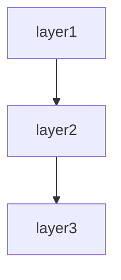

# CLI tool spec template

This template defines the chapter outline for the spec of a command-line tool operated through terminal commands.

Designed for CLI tools in any language: Go (Cobra/Viper), Rust (clap), Python (click/typer/argparse), Node.js (commander/yargs), Ruby (Thor), C/C++, and shell scripts.

---

## Chapter outline

### Chapter 1: Overview

<!-- meta: bird's-eye view of the CLI tool — what it does and who uses it. -->

#### 1.1 Tool purpose
- The problem this CLI tool solves
- Primary users / target audience (developers, operators, end users)
- Position in the broader tooling ecosystem

#### 1.2 Main features
- 3-5 representative capabilities
- Summary of each feature

#### 1.3 Distribution model
- Standalone binary / language-specific package manager
- Supported platforms (Linux, macOS, Windows)
- Distribution channels (npm, pip, Homebrew, GitHub Releases, apt, etc.)

---

---

### Chapter 2: Feature specifications

<!-- meta: consolidated feature-level view of the system. Maps features to screens, routes, and data. -->

#### 2.1 Feature catalogue table

| Feature ID | Feature name | Category | Related items (screens/endpoints/jobs/APIs) | Auth required | Summary | Confidence |
|------------|-------------|----------|-------------------------------------------|-------------|---------|-----------|
| F-001 | (feature) | (category) | (related items) | yes/no | 1-line summary | 🟢/🟡/🔴 |
| F-002 | (feature) | (category) | (related items) | yes/no | 1-line summary | 🟢/🟡/🔴 |
| ... | ... | ... | ... | ... | ... | ... |

The catalogue table exhaustively lists every feature. Confidence labels:
- 🟢 **VERIFIED**: Feature purpose confirmed by reading the actual code (screen, controller, or service file).
- 🟡 **INFERRED**: Feature mechanically grouped from endpoint path prefix or class naming convention.
- 🔴 **ASSUMED**: Feature inferred from use-case description; code evidence is indirect.

#### 2.2 Per-feature processing definitions

For each feature listed above, describe the processing flow structured as below. Generate at minimum the top-5 features by complexity or business criticality; list the remainder in the catalogue table only.

##### F-001: {Feature name}

**Overview**
- Business value this feature provides
- Which user / system role uses it

**Trigger**
- User action / system event / external call that initiates this feature

**Pre-conditions**
- Conditions that must hold before execution

**Main flow**
1. Step 1 <!-- REF: SRC-NNNN -->
2. Step 2 <!-- REF: SRC-NNNN -->
3. ...

**Alternative flows**
- Alt-1: When [condition] → [behaviour] <!-- REF: SRC-NNNN -->

**Error handling**
- Error type → system behaviour <!-- REF: SRC-NNNN -->

**Post-conditions**
- State of the system after successful execution

**Related business rules**
- → Ch? (Domain rules section) cross-reference

**Related chapters**
- → Ch? (Screen details / Routes / Data model) cross-reference

**Confidence**: 🟢/🟡/🔴

---

### Chapter 3: Architecture overview

<!-- meta: technology choices and overall structure of the CLI binary. -->

#### 3.1 Technology stack
- Language / runtime
- CLI framework (Cobra / clap / click / typer / commander / Thor, etc.)
- Build system (go build, cargo, setuptools, esbuild, etc.)

#### 3.2 Execution model
- Entry point (`main()` / `cli.Run()`)
- Command-dispatch mechanism
- How subcommands are resolved and routed to handlers

#### 3.3 Code structure
- Entry-point file
- Command registration pattern
- Shared library vs monolith

#### 3.4 Distribution packaging
- How the binary is built and packaged
- Cross-compilation targets
- Binary signing / notarization (if applicable)

---

### Chapter 4: Class / Module Design

<!-- meta: internal structure — classes, modules, and their relationships. -->

#### 4.1 Module overview

| Module / package | Responsibility | Key classes | Dependencies |
|:----------------|:-------------|:-----------|:------------|
| cmd/ | CLI command definitions | rootCmd, userCmd | internal/ |
| internal/ | Core business logic | UserService, ConfigManager | internal/model |
| internal/model | Domain types | User, Config | - |
| ... | ... | ... | ... |

#### 4.2 Class catalogue

| Class | Kind | Module | Responsibility | Depends on | Source |
|:------|:----|:-------|:-------------|:----------|:-------|
| rootCmd | Command | cmd/ | Root command definition | subcommands | <!-- REF: SRC-NNNN --> |
| UserService | Service | internal/ | User-management logic | Config, HTTP client | <!-- REF: SRC-NNNN --> |
| ... | ... | ... | ... | ... | ... |

#### 4.3 Class diagram (Mermaid)
Include a `classDiagram` for key subsystems. Split per module if >15 classes (see SKILL.md Split rule).

#### 4.4 Module dependency diagram (Mermaid)
Show the direction of dependencies between top-level modules using `graph TD` or `flowchart TD`.

---

### Chapter 5: Installation

<!-- meta: how to acquire and set up the CLI tool. -->

#### 5.1 Quick install

```bash
# Homebrew (macOS / Linux)
brew install <tool-name>

# npm
npm install -g <package-name>

# pip
pip install <package-name>

# Go
go install <module-path>@latest

# Cargo
cargo install <crate-name>

# Direct binary download
curl -sSL https://github.com/.../releases/.../tool-{os}-{arch}.tar.gz | tar xz
```

#### 5.2 Runtime requirements
- Language runtime version (if applicable)
- Required system packages / libraries
- Supported operating systems and architectures

#### 5.3 Shell completion setup
- Command to install completions
- Per-shell setup instructions (bash, zsh, fish, powershell)

---

### Chapter 6: Command-line reference

<!-- meta: inventory of all commands and subcommands. The pillar of verification. -->

#### 6.1 Command tree

```
tool-name
├── command-1     -- (1-line summary)
├── command-2     -- (1-line summary)
│   ├── sub-a     -- (1-line summary)
│   └── sub-b     -- (1-line summary)
└── command-3     -- (1-line summary)
```

#### 6.2 Command catalogue

| Command ID | Path | Summary | Category | Aliases | Source |
|:-----------|:-----|:--------|:---------|:--------|:-------|
| CMD-001 | `tool-name` | Root command | top-level | (none) | <!-- REF: SRC-NNNN --> |
| CMD-002 | `tool-name init` | Initialize config | setup | `i` | <!-- REF: SRC-NNNN --> |
| CMD-003 | `tool-name run` | Run main process | action | `r`, `exec` | <!-- REF: SRC-NNNN --> |
| CMD-004 | `tool-name config get` | Get config value | config | `cg` | <!-- REF: SRC-NNNN --> |
| ... | ... | ... | ... | ... | ... |

#### 6.3 Per-command details

For each command listed above, describe:

##### CMD-002: `tool-name init`

**Purpose**
- What this command does for the user

**Usage**
```
tool-name init [options] [<directory>]
```

**Positional arguments**
| Argument | Required | Description | Default |
|:---------|:--------:|:-----------|:-------|
| `<directory>` | no | Target directory | `.` |

**Flags / options**

| Flag | Type | Required | Description | Default |
|:-----|:----|:--------:|:-----------|:-------|
| `--template` / `-t` | string | no | Template to use | `default` |
| `--force` / `-f` | bool | no | Overwrite existing files | `false` |
| `--verbose` / `-v` | bool | no | Verbose output | `false` |
| ... | ... | ... | ... | ... |

**Behaviour**
- What the command does step by step
- Side effects (files created, network calls, etc.)
- Idempotency guarantees

**Examples**
```bash
tool-name init
tool-name init --template minimal ./my-project
```

**Error cases**
- Missing permissions → error message X
- Existing files without `--force` → prompt or error Y

---

#### 6.4 Arguments and options (combined) — for small CLIs

<!-- meta: consolidated argument/option reference for tools with few global flags.
     For small CLIs (≤3 global flags), use this section INSTEAD of Chapter 7.
     Merge all global flags, precedence rules, and stdin handling here.
     For large CLIs with many global flags, keep Chapter 7 separate. -->

**Global flags**

| Flag | Type | Description | Default | Env var |
|:-----|:----|:-----------|:-------|:--------|
| `--config` / `-c` | string | Path to config file | `~/.tool/config.yaml` | `TOOL_CONFIG` |

**Flag precedence**
- Command-line flags > environment variables > config file > defaults

**File arguments and stdin**
- Whether the tool reads from files, stdin, or both
- Supported file formats
- Stdin detection behaviour (pipelines vs interactive TTY)

---

### Chapter 7: Arguments and options reference

<!-- meta: exhaustive inventory of global flags and their semantics.
     SKIP this chapter for small CLIs (≤3 global flags). Instead, embed
     global flags and precedence rules in Chapter 6, section 6.4. -->

#### 7.1 Global flags

| Flag | Type | Description | Default | Env var |
|:-----|:----|:-----------|:-------|:--------|
| `--config` / `-c` | string | Path to config file | `~/.tool/config.yaml` | `TOOL_CONFIG` |
| `--log-level` | string | Log verbosity (debug/info/warn/error) | `info` | `TOOL_LOG_LEVEL` |
| `--output` / `-o` | string | Output format (text/json/yaml) | `text` | `TOOL_OUTPUT` |
| `--no-color` | bool | Disable colored output | `false` | `NO_COLOR` |
| ... | ... | ... | ... | ... |

#### 7.2 Flag precedence
- Command-line flags > environment variables > config file > defaults

#### 7.3 Repeated / array flags
- How repeated values (`--filter key=val --filter other=val`) are handled

#### 7.4 File arguments and stdin
- Whether the tool reads from files, stdin, or both
- Supported file formats
- Stdin detection behaviour (pipelines vs interactive TTY)

---

### Chapter 8: Configuration

<!-- meta: how the user customises behaviour. -->

#### 8.1 Configuration file

| Field | Type | Required | Description | Default |
|:------|:-----|:--------:|:-----------|:-------|
| `api.url` | string | yes | API endpoint | - |
| `api.timeout` | int | no | Request timeout (s) | `30` |
| `auth.token` | string | depends | Auth token | - |
| ... | ... | ... | ... | ... |

Example:
```yaml
api:
  url: https://api.example.com
  timeout: 30
auth:
  token: "${TOOL_API_TOKEN}"
```

#### 8.2 Config file discovery
- Search order (e.g. `./.tool.yaml` → `~/.tool/config.yaml` → `$XDG_CONFIG_HOME/tool/config.yaml`)
- Multiple config files merging strategy

#### 8.3 Environment variables reference

| Variable | Maps to config field | Description |
|:---------|:--------------------|:-----------|
| `TOOL_API_URL` | `api.url` | API endpoint |
| `TOOL_API_TOKEN` | `auth.token` | Auth token |
| `TOOL_LOG_LEVEL` | (global) | Log verbosity |
| ... | ... | ... |

#### 8.4 Config file generation
- Command to generate default config (`tool-name init` / `tool-name config init`)
- Interactive setup wizard (if any)

---

### Chapter 9: Usage examples

<!-- meta: "read this and start using it" samples. -->

#### 9.1 Minimal example
```bash
tool-name init
tool-name run
```

#### 9.2 Examples per major use case

##### Use case 1: Setting up a new project
```bash
tool-name init --template web-app ./my-app
cd ./my-app
tool-name run --port 8080
```

##### Use case 2: Querying data
```bash
tool-name query "SELECT * FROM users" --format json
```

##### Use case 3: Batch processing
```bash
tool-name process --input data/ --output results/ --parallel 4
```

#### 9.3 Pipeline integration
```bash
# Pipe input
cat data.csv | tool-name transform --format json

# Pipe output
tool-name list --format json | jq '.items | length'
```

#### 9.4 Error handling patterns
```bash
# Dry-run mode
tool-name deploy --dry-run

# Verbose debugging
tool-name sync --verbose --log-level debug 2>&1 | tee debug.log

# Handling non-zero exit codes in scripts
if tool-name validate config.yaml; then
  echo "Valid"
else
  echo "Invalid: exit code $?"
fi
```

---

### Chapter 10: Output formats

<!-- meta: stdout, stderr, and structured output. -->

#### 10.1 Human-readable output (default)
- ANSI color support
- Table / list rendering
- Progress bars and spinners (if applicable)

#### 10.2 Structured output
- `--output json` / `--output yaml` support
- Schema of the JSON/YAML output

Example:
```json
{
  "status": "success",
  "data": {
    "items": [...],
    "total": 42
  },
  "meta": {
    "duration_ms": 123
  }
}
```

#### 10.3 Stderr protocol
- Diagnostic messages → stderr (logs, warnings, progress)
- Results → stdout (structured or plain)
- Error codes and messages → stderr

#### 10.4 Progress indication
- Spinner / progress bar (interactive terminal)
- Progress JSON lines (non-interactive / CI)
- How to disable progress (e.g. `--quiet`, `CI=true`)

#### 10.5 Machine-readable formats
- JSON Lines (NDJSON) for streaming output
- CSV / TSV for tabular data
- Protocol Buffers (if applicable)

---

### Chapter 11: Exit codes and error handling

<!-- meta: contract between the tool and its caller. -->

#### 11.1 Exit code reference

| Code | Meaning | When produced |
|:----:|:--------|:-------------|
| 0 | Success | Command completed without errors |
| 1 | General error | Unexpected failure |
| 2 | Usage error | Invalid arguments / missing required flags |
| 3 | Config error | Invalid or missing configuration |
| 4 | Network error | API / backend unreachable |
| ... | ... | ... |

#### 11.2 Error message format
```
ERROR: <message>
  → <suggestion or hint>
```

- Whether errors include stack traces (controlled by `--verbose`)
- Error formatting for structured output (`{ "error": { "code": "...", "message": "..." } }`)

#### 11.3 Signal handling
- Which signals are caught (SIGINT, SIGTERM, SIGHUP)
- Graceful shutdown behaviour
- Cleanup on interruption (temp files, locks)

---

### Chapter 12: Shell completion and integration

<!-- meta: how the tool integrates with the user's shell environment. -->

#### 12.1 Shell completions
- Supported shells (bash, zsh, fish, powershell)
- Completion generation command
- Completion for dynamic values (file paths, remote resources)

#### 12.2 Man page / help system
- Built-in `--help` output format
- Man page generation (if available)
- `--version` behaviour

#### 12.3 Exit-code integration
- How scripts should check exit codes
- Idiomatic shell patterns for integrating this tool in pipelines

#### 12.4 Environment detection
- TTY vs non-TTY detection behaviour
- CI environment detection (`CI=true` → disable interactivity/colors)
- Terminal width detection for table formatting

---

### Chapter 13: Extension points / plugin system

<!-- meta: how users extend the CLI's behaviour. -->

#### 13.1 Plugin discovery
- Plugin directory convention (`~/.tool/plugins/`)
- Plugin format (executable, WASM, script)
- Version constraints

#### 13.2 Custom commands
- How to register a new subcommand via plugin
- Plugin lifecycle (init, run, cleanup)
- Inter-plugin communication

#### 13.3 Middleware / hooks
- Pre/post command hooks
- Custom flag parsing
- Output transformation

#### 13.4 Built-in extensions
- Official plugins shipped with the tool
- Notable community plugins

---

### Chapter 14: Design decisions

<!-- meta: architectural decisions, cross-cutting concerns, module dependencies, and design trade-offs derived from code. Complements Architecture overview (which describes WHAT) by explaining WHY and HOW cross-cutting concerns are handled. -->

#### 14.1 Architecture Decision Records (ADR)

Code-derived record of design decisions. Confidence is typically low since rationale is rarely written in code; use Question Bank integration for SME confirmation.

| ID | Topic | Decision (as observed in code) | Rationale (inferred) | Alternatives (inferred) | Confidence | Supporting REF |
|----|-------|------------------------------|---------------------|----------------------|-----------|---------------|
| ADR-001 | (topic) | (decision) | (inferred rationale) | (inferred alternatives) | 🟢/🟡/🔴 | <!-- REF: SRC-NNNN --> |
| ... | ... | ... | ... | ... | ... | ... |

Extraction strategy:
- Search for design-related comments (`// Why:`, `# Reason:`, `/* Decision: */`)
- Read README / CONTRIBUTING / design docs for explicit rationale
- When no explicit rationale exists, mark 🔴 ASSUMED and add `<!-- ASK SME -->`

`<!-- CONFIDENCE: LOW — ADR entries are almost always inferred unless explicitly documented -->`

#### 14.2 Module / component dependency

Import/require/include graph extracted from source code. Enumerates dependencies between layers or modules.

**Extraction approach:**

| Language | Pattern | Example | Confidence |
|----------|---------|---------|-----------|
| Python | `rg "^import |^from "` then filter to own project | `import app.models` → depends on `app.models` | 🟢 |
| TypeScript/JS | `rg "^(import |const .* = require\()"` | `import { User } from '../models'` | 🟢 |
| Java/Kotlin | `rg "^import "` | `import com.example.service.UserService` | 🟢 |
| Ruby | `rg "^(require |require_relative )"` | `require_relative 'models/user'` | 🟢 |
| Go | `rg ""github\.com/.*/"` filtered to own module | `"project/internal/service"` | 🟢 |
| PHP | `rg "^(use |require_once )"` | `use App\Service\UserService` | 🟢 |
| C# | `rg "^(using |using static )"` | `using Project.Data.Models` | 🟢 |
| Rust | `rg "^use "` filtered to local crate | `use crate::cli::Command` | 🟢 |

Render the result as a Mermaid graph:



Label each edge with the dependency strength (direct / transitive / circular). Flag circular dependencies explicitly.

[🟢 VERIFIED] — import statements are mechanically extractable with near-zero false positives.

#### 14.3 Cross-cutting design patterns

Code-wide patterns that span multiple modules.

| Pattern | Detection method | Example REF | Confidence |
|---------|----------------|-------------|-----------|
| Error handling strategy | Search for `try`/`catch`/`except`/`raise`/`throw` patterns, custom exception classes | <!-- REF: SRC-0001 --> | 🟢 |
| Logging approach | Search for `logger`/`logging`/`console.log`/`print`/`warn` calls | <!-- REF: SRC-0002 --> | 🟢 |
| Command routing | How subcommands are registered and dispatched | <!-- REF: SRC-NNNN --> | 🟢 |
| Output formatting | Search for `render`/`format`/`print`/`tablewriter`/`json.Marshal` | <!-- REF: SRC-NNNN --> | 🟢 |
| Validation pattern | Search for `validate`/`assert`/`required` flags, validation functions | <!-- REF: SRC-NNNN --> | 🟢 |
| Retry / resilience | Search for `retry`/`backoff`/`timeout` patterns in network calls | <!-- REF: SRC-NNNN --> | 🟡 |
| Batch / chunk processing | Search for `batch`/`chunk`/`bulk` in method/class names | <!-- REF: SRC-NNNN --> | 🟢 |

For each pattern found, note:
- **Consistency**: Does the whole project use one pattern, or are multiple approaches mixed?
- **Coverage**: Are there modules that SHOULD use this pattern but don't?
- **Exceptions**: Any deliberate deviations from the pattern?

[🟢 VERIFIED for most patterns] — language-level constructs (try/catch, import patterns) are mechanically detectable.

#### 14.4 Security design

Security-related mechanisms observed in code.

| Aspect | Detection method | Confidence |
|--------|----------------|-----------|
| Credential handling | Search for API key / token / password input patterns, secure prompt | 🟡 |
| Secrets management | Search for `.env`/`keyring`/`vault` references, env-var reads for credentials | 🟢 |
| Token storage | Search for `keychain`/`keyring`/`secure storage`/`credentials store` | 🟢 |
| Config file permissions | Search for file permission settings (`0600`, `chmod`, `os.FileMode`) | 🟡 |
| Input sanitisation | Search for `escape`/`sanitize`/`shell injection` prevention | 🟡 |
| TLS / transport security | Search for HTTPS/TLS/SSL configuration | 🟡 |
| Home directory/XDG paths | Search for `os.UserHomeDir`/`$HOME`/`$XDG_*` usage | 🟢 |

[🟢 VERIFIED for most — security code is explicit and searchable]

#### 14.5 Performance design

Performance-related patterns and potential bottlenecks detected in code.

| Pattern | Detection method | Confidence |
|---------|----------------|-----------|
| Caching | Search for `cache`/`memoize`/`lru_cache`/`tempfile` | 🟢 |
| Concurrency | Search for `async`/`await`/`goroutine`/`thread`/`concurrent` | 🟢 |
| Parallel processing | Search for `parallel`/`workers`/`pool`/`fan-out`/`fan-in` | 🟢 |
| Streaming / large I/O | Search for `stream`/`chunk`/`bufio.Scanner`/`io.Copy` | 🟢 |
| Lazy loading | Search for `once`/`sync.Once`/`lazy`/`init` deferred loading | 🟡 |
| Progress reporting | Search for `progress`/`spinner`/`bar`/`meter` | 🟢 |

For each pattern, list which files/modules use it. Note modules that might need these patterns but don't use them (potential performance debt).

[🟢 VERIFIED for most patterns — code-level keywords are mechanically searchable]

#### 14.6 Integration design

External-system integration patterns.

| Aspect | Detection method | Confidence |
|--------|----------------|-----------|
| External HTTP calls | Search for `requests`/`HTTPX`/`axios`/`fetch`/`HttpClient`/`net/http` calls | 🟢 |
| File-system access | Search for file read/write, config file loading | 🟢 |
| Subprocess execution | Search for `exec`/`os/exec`/`subprocess`/`child_process`/`system()` | 🟢 |
| Environment variable reads | Search for `os.Getenv`/`process.env`/`os.environ` | 🟢 |
| Socket / IPC | Search for `Unix socket`/`named pipe`/`FIFO`/`gRPC` local | 🟢 |
| Plugin loading | Search for plugin discovery, dynamic loading mechanisms | 🟡 |
| Resiliency | Search for `timeout`/`retry`/`fallback` around external calls | 🟡 |

→ Detailed per-integration specs → see Chapter ? (External-system integration)

[🟢 VERIFIED — external call code is explicit]

#### 14.7 Known trade-offs and constraints

Technical trade-offs and constraints visible in code comments.

| Marker | Detection method | Meaning | Example |
|--------|----------------|---------|---------|
| `TODO` | `rg "TODO"` (with context) | Planned improvement; may indicate known limitation | `// TODO: add pagination for large result sets` |
| `FIXME` | `rg "FIXME"` | Defect or known issue | `# FIXME: race condition in concurrent write` |
| `HACK` / `WORKAROUND` | `rg "HACK|WORKAROUND"` | Deliberate suboptimal solution | `/* HACK: work around upstream CLI parsing bug */` |
| `XXX` | `rg "XXX"` | Something suspicious that needs review | `// XXX: silently ignores unknown flags` |
| `OPTIMIZE` | `rg "OPTIMIZE|PERF|SLOW"` | Performance concern | `# OPTIMIZE: reading entire file into memory` |
| `COMPAT` | `rg "COMPAT|COMPATIBILITY|PORT"` | Platform-specific behaviour | `// COMPAT: Windows doesn't support signal` |
| `@deprecated` / `DEPRECATED` | Search for deprecation markers | Planned removal | `@deprecated use `config set` instead` |

→ Critical items → see Chapter ? (Known constraints and unresolved items)

For each marker, include the surrounding context (next 2 lines) to explain the trade-off. Group by severity (CRITICAL / MAJOR / MINOR).

[🟢 VERIFIED — markers are mechanically extractable; context needs manual review for accurate grouping]

---

### Chapter 15: Known constraints and unresolved items

<!-- meta: spec credibility safeguard. -->

#### 15.1 Known constraints
- Platform limitations (Windows vs POSIX behaviour differences)
- File-size / memory ceilings
- Known bugs / workarounds
- Terminal-width assumptions
- Unicode handling limitations
- API rate limits or backend constraints

#### 15.2 Unresolved items
- Place the `abandoned` entries from the Question Bank here
- Missing features or gaps in the current implementation
- Planned deprecations not yet executed
