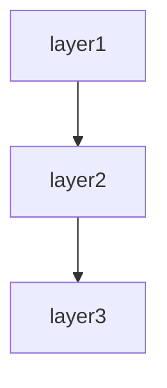

# Desktop application spec template

This template defines the chapter outline for the spec of a desktop application that the user operates through native windows and controls.

Designed for desktop applications: Electron / Tauri / Qt / WPF / WinForms / Cocoa / SwiftUI / Flutter Desktop / JavaFX / GTK, etc.

---

## Chapter outline

### Chapter 1: Overview

<!-- meta: bird's-eye view of the whole application. A 3-minute "what is this" for the reader. -->

#### 1.1 Application purpose
- The business problem this application solves
- Primary users / stakeholders
- Position in the business

#### 1.2 Main use cases
- Use case 1: ...
- Use case 2: ...
- 3 to 5 use cases

#### 1.3 Target platforms
| OS | Supported versions | Minimum requirements | Status |
|----|-------------------|--------------------|--------|
| Windows | (e.g. Windows 10 1809+, Windows 11) | (CPU, RAM, GPU, disk) | active / beta / planned |
| macOS | (e.g. macOS 12 Monterey+) | (CPU, RAM, GPU, disk) | active / beta / planned |
| Linux | (e.g. Ubuntu 22.04+, Fedora 38+) | (CPU, RAM, GPU, disk, DE) | active / beta / planned |

- Architecture support (x64, ARM64, ARM)
- Per-platform package formats

#### 1.4 High-level architecture diagram
- High-level component diagram (process model, renderer, main process)
- Use Mermaid notation when appropriate

---

---

### Chapter 2: Feature specifications

<!-- meta: consolidated feature-level view of the application. Maps features to windows, menus, platform APIs, and data. -->

#### 2.1 Feature catalogue table

| Feature ID | Feature name | Category | Related items (windows/menus/APIs/commands) | Auth required | Summary | Confidence |
|------------|-------------|----------|-------------------------------------------|-------------|---------|-----------|
| F-001 | (feature) | (category) | (related items) | yes/no | 1-line summary | 🟢/🟡/🔴 |
| F-002 | (feature) | (category) | (related items) | yes/no | 1-line summary | 🟢/🟡/🔴 |
| ... | ... | ... | ... | ... | ... | ... |

The catalogue table exhaustively lists every feature. Confidence labels:
- 🟢 **VERIFIED**: Feature purpose confirmed by reading the actual code (window, controller, or service file).
- 🟡 **INFERRED**: Feature mechanically grouped from menu labels, IPC handlers, or class naming convention.
- 🔴 **ASSUMED**: Feature inferred from use-case description; code evidence is indirect.

#### 2.2 Per-feature processing definitions

For each feature listed above, describe the processing flow structured as below. Generate at minimum the top-5 features by complexity or business criticality; list the remainder in the catalogue table only.

##### F-001: {Feature name}

**Overview**
- Business value this feature provides
- Which user / system role uses it

**Trigger**
- User action (menu click / shortcut / button press) / system event / IPC call that initiates this feature

**Pre-conditions**
- Conditions that must hold before execution (e.g. document open, network available)

**Main flow**
1. Step 1 <!-- REF: SRC-NNNN -->
2. Step 2 <!-- REF: SRC-NNNN -->
3. ...

**Alternative flows**
- Alt-1: When [condition] → [behaviour] <!-- REF: SRC-NNNN -->

**Error handling**
- Error type → system behaviour <!-- REF: SRC-NNNN -->

**Post-conditions**
- State of the application after successful execution

**Related business rules**
- → Ch? (Domain rules section) cross-reference

**Related chapters**
- → Ch? (Window management / UI components / Platform integration) cross-reference

**Confidence**: 🟢/🟡/🔴

---

### Chapter 3: Module architecture

<!-- meta: internal structure of the application — process model, inter-process communication, and top-level modules. Designed for multi-process desktop architectures (Electron, Tauri, etc.) but also covers single-process apps. -->

#### 3.1 Process model

| Process type | Role | Number of instances | Lifetime | Source |
|:-------------|:-----|:------------------:|:---------|:-------|
| Main process | (window management, platform APIs, menu bar) | 1 | Application lifetime | <!-- REF: SRC-NNNN --> |
| Renderer process | (UI rendering per window) | 1 per window | Per window lifetime | <!-- REF: SRC-NNNN --> |
| Worker process | (background / compute-heavy tasks) | configurable | Task lifetime | <!-- REF: SRC-NNNN --> |
| ... | ... | ... | ... | ... |

- Process startup order
- Child process crash recovery strategy
- Memory limits per process type

#### 3.2 Inter-process communication (IPC)

| Channel / event | Direction | Payload format | Purpose | Source |
|:----------------|:---------|:--------------|:--------|:-------|
| (channel) | main→renderer | (format) | (purpose) | <!-- REF: SRC-NNNN --> |
| (channel) | renderer→main | (format) | (purpose) | <!-- REF: SRC-NNNN --> |
| ... | ... | ... | ... | ... |

- IPC serialisation format (JSON / MessagePack / FlatBuffers / custom)
- Synchronous vs asynchronous IPC channels
- IPC authentication / origin validation

#### 3.3 Module composition

| Module / package | Responsibility | Key files | Process | Confidence |
|:-----------------|:--------------|:----------|:--------|:-----------|
| (module) | (responsibility) | <!-- REF: SRC-NNNN --> | main / renderer / worker | 🟢/🟡/🔴 |
| ... | ... | ... | ... | ... |

- Entry point (main process `main.js`, renderer `index.html`)
- Module dependency overview (Mermaid `graph TD`)
- Startup sequence (initialisation order)

---

### Chapter 4: Window management and menus

<!-- meta: inventory of all windows, the menu bar structure, context menus, and OS integration. -->

#### 4.1 Window catalogue

| Window ID | Window name | Type | Process | Size (default) | Resizable | Multiple instances | Source |
|:----------|:------------|:-----|:--------|:--------------|:--------:|:-----------------:|:-------|
| W-001 | Main window | primary | renderer | 1200×800 | ✅ | ❌ | <!-- REF: SRC-NNNN --> |
| W-002 | Preferences | modal | renderer | 600×500 | ❌ | ❌ | <!-- REF: SRC-NNNN --> |
| W-003 | About | dialog | renderer | 400×300 | ❌ | ❌ | <!-- REF: SRC-NNNN --> |
| ... | ... | ... | ... | ... | ... | ... | ... |

- Window creation parameters (frameless / traffic-light controls / title bar style)
- Default window positions and restoration behaviour
- Window state persistence (position, size, maximised state)

#### 4.2 Menu bar structure

```
File  Edit  View  Window  Help
├── New          Ctrl+N    ├── Undo    Ctrl+Z    ├── Zoom In    Ctrl+=    ├── Minimize    Ctrl+M    ├── About
├── Open...      Ctrl+O    ├── Redo    Shift+Ctrl+Z  ├── Zoom Out   Ctrl+-   ├── Close Window Ctrl+W    ├── Check for Updates...
├── Save         Ctrl+S    ├─────           ├── Actual Size  Ctrl+0   ├─────           ├── Developer Tools
├── Save As...   Shift+Ctrl+S  ├── Cut     Ctrl+X    ├─────           ├─────           └──...
├─────           ├── Copy    Ctrl+C    ├── Toggle Menu Bar        ├── Full Screen  F11
├── Export...    ├── Paste   Ctrl+V    ├── Toggle Sidebar         └──...
├─────           ├── Delete  Del       ├─────
├── Quit             ├── Select All  Ctrl+A    ├── Reload         Ctrl+R
                     └──...               └── Force Reload  Shift+Ctrl+R
```

Describe the structure per OS (macOS menu bar uses the application menu convention).

#### 4.3 Context menus

| Context | Trigger | Menu items | Source |
|:--------|:--------|:-----------|:-------|
| (e.g. text selection) | right-click / Ctrl+click | Cut, Copy, Paste, Select All | <!-- REF: SRC-NNNN --> |
| (e.g. file list item) | right-click / Ctrl+click | Open, Rename, Delete, Reveal in Finder/Explorer | <!-- REF: SRC-NNNN --> |
| (e.g. tray icon) | left-click / right-click | Show Window, Quit, Settings | <!-- REF: SRC-NNNN --> |
| ... | ... | ... | ... |

#### 4.4 Dock / taskbar / tray integration

| OS | Feature | Behaviour | Source |
|:---|:--------|:---------|:-------|
| macOS | Dock icon | Badge count; bounce on notification; application menu | <!-- REF: SRC-NNNN --> |
| macOS | Menu bar extras | Tray icon with dropdown menu | <!-- REF: SRC-NNNN --> |
| Windows | Taskbar | Jump list; thumbnail toolbar; progress indicator | <!-- REF: SRC-NNNN --> |
| Windows | System tray | Notification area icon with context menu | <!-- REF: SRC-NNNN --> |
| Linux | Dock / panel | Unity Launcher quicklist; GNOME dash integration | <!-- REF: SRC-NNNN --> |
| Linux | Tray / indicator | AppIndicator / StatusNotifierItem | <!-- REF: SRC-NNNN --> |

---

### Chapter 5: UI component catalogue

<!-- meta: full inventory of UI components, custom controls, and the theme system. -->

#### 5.1 Main UI component listing

| Component ID | Component name | Type | Parent window | Custom / native | Source |
|:-------------|:---------------|:-----|:-------------|:---------------:|:-------|
| C-001 | (component) | (button / list / tree / tab / editor / ...) | (window ID) | custom / native | <!-- REF: SRC-NNNN --> |
| C-002 | (component) | (component type) | (window ID) | custom / native | <!-- REF: SRC-NNNN --> |
| ... | ... | ... | ... | ... | ... |

#### 5.2 Custom controls

| Control | Purpose | States | Properties | Source |
|:--------|:--------|:-------|:-----------|:-------|
| (custom control name) | (use) | (normal, hover, active, disabled, error) | (key properties) | <!-- REF: SRC-NNNN --> |

- Custom drawing / canvas-based controls
- Keyboard navigation within custom controls
- Accessibility attributes

#### 5.3 Theme system

| Theme aspect | Mechanism | Source |
|:-------------|:----------|:-------|
| Light theme | (CSS variables / JSON tokens / platform theme) | <!-- REF: SRC-NNNN --> |
| Dark theme | (as above) | <!-- REF: SRC-NNNN --> |
| High-contrast mode | (system preference override) | <!-- REF: SRC-NNNN --> |
| Custom accent colour | (user configurable / OS colour) | <!-- REF: SRC-NNNN --> |

- Theme token catalogue (colours, typography, spacing, radii, shadows)
- Theme switching mechanism (runtime / restart required)
- Per-platform theme differences

#### 5.4 Font / typography

| Role | Font family | Size | Weight | Source |
|:-----|:-----------|:----:|:------:|:-------|
| Heading 1 | (family) | (pt/px) | bold | <!-- REF: SRC-NNNN --> |
| Body | (family) | (pt/px) | regular | <!-- REF: SRC-NNNN --> |
| Code / monospace | (family) | (pt/px) | regular | <!-- REF: SRC-NNNN --> |
| UI labels | (family) | (pt/px) | medium | <!-- REF: SRC-NNNN --> |

- System font stack vs bundled fonts
- CJK / RTL / emoji support
- Font rendering (subpixel AA / grayscale / Core Text / DirectWrite)

---

### Chapter 6: Platform integration

<!-- meta: native platform capabilities the application leverages. Covers all 3 target OS families. -->

#### 6.1 File system access

| Operation | Method | Sandbox restrictions | Source |
|:----------|:-------|:-------------------|:-------|
| Read file | (fs.readFile / File API / NSData) | (sandbox path restrictions) | <!-- REF: SRC-NNNN --> |
| Write file | (fs.writeFile / File API / NSData) | (sandbox path restrictions) | <!-- REF: SRC-NNNN --> |
| Watch directory | (fs.watch / FSEvents / ReadDirectoryChanges) | - | <!-- REF: SRC-NNNN --> |
| File picker (open) | (dialog.showOpenDialog / NSOpenPanel) | - | <!-- REF: SRC-NNNN --> |
| File picker (save) | (dialog.showSaveDialog / NSSavePanel) | - | <!-- REF: SRC-NNNN --> |
| ... | ... | ... | ... |

- Application storage directories (documents, app data, temp, cache)
- Path conventions per OS (POSIX vs Windows)

#### 6.2 Native dialogs

| Dialog type | OS-native / custom | Purpose | Source |
|:------------|:------------------:|:--------|:-------|
| Message box | OS-native | Alerts, confirmations | <!-- REF: SRC-NNNN --> |
| File open | OS-native | File selection | <!-- REF: SRC-NNNN --> |
| File save | OS-native | Save location | <!-- REF: SRC-NNNN --> |
| Colour picker | OS-native | Colour selection | <!-- REF: SRC-NNNN --> |
| Font picker | OS-native / custom | Font selection | <!-- REF: SRC-NNNN --> |
| Print dialog | OS-native | Print configuration | <!-- REF: SRC-NNNN --> |
| ... | ... | ... | ... |

#### 6.3 Clipboard

| Clipboard format | Read | Write | Source |
|:-----------------|:---:|:----:|:-------|
| Plain text | ✅ | ✅ | <!-- REF: SRC-NNNN --> |
| Rich text (HTML/RTF) | ✅ / ❌ | ✅ / ❌ | <!-- REF: SRC-NNNN --> |
| Image (PNG, BMP) | ✅ / ❌ | ✅ / ❌ | <!-- REF: SRC-NNNN --> |
| File list | ✅ / ❌ | ✅ / ❌ | <!-- REF: SRC-NNNN --> |
| Custom format | ... | ... | ... |

- Clipboard write policies (automatic sync, explicit user action only)

#### 6.4 Drag and drop

| Source → Target | Formats | Source |
|:----------------|:--------|:-------|
| OS file manager → application | file paths | <!-- REF: SRC-NNNN --> |
| Within application | custom data types | <!-- REF: SRC-NNNN --> |
| Application → OS file manager | file paths | <!-- REF: SRC-NNNN --> |

- Drag-drop visual feedback
- Accepted drag types and validation

#### 6.5 Dock / task tray (detailed)

| OS | Feature | Implementation | Source |
|:---|:--------|:--------------|:-------|
| macOS | Dock badge (unread count) | app.dock.setBadge / NSApp.dockTile.badgeLabel | <!-- REF: SRC-NNNN --> |
| macOS | Dock bounce (attention request) | app.dock.bounce / NSApplication.requestUserAttention | <!-- REF: SRC-NNNN --> |
| macOS | Dock menu (right-click items) | app.dock.setMenu / NSDockMenu | <!-- REF: SRC-NNNN --> |
| macOS | Recent documents on Dock | app.dock.setRecentFileList | <!-- REF: SRC-NNNN --> |
| Windows | Taskbar progress | thumbnailToolBar / ITaskbarList3.SetProgressValue | <!-- REF: SRC-NNNN --> |
| Windows | Taskbar jump list | JumpList / ICustomDestinationList | <!-- REF: SRC-NNNN --> |
| Windows | Thumbnail toolbar buttons | ThumbnailToolbar / IExplorerCommand | <!-- REF: SRC-NNNN --> |
| Windows | Flash window for attention | FlashWindowEx | <!-- REF: SRC-NNNN --> |
| Linux | Unity launcher quicklist | unity:// launcher entries | <!-- REF: SRC-NNNN --> |
| Linux | Progress on dock icon | unity:// launcher progress / StatusNotifier | <!-- REF: SRC-NNNN --> |
| Linux | GNOME dash notification | GNotification / StatusNotifierItem | <!-- REF: SRC-NNNN --> |

#### 6.6 System integration features

| Feature | macOS | Windows | Linux | Source |
|:--------|:------|:--------|:------|:-------|
| Open with / file association | ✅ (Info.plist UTIs) | ✅ (registry ProgIDs) | ✅ (`.desktop` MIME types) | <!-- REF: SRC-NNNN --> |
| URL scheme handler | ✅ (CFBundleURLTypes) | ✅ (registry) | ✅ (`.desktop` URL handler) | <!-- REF: SRC-NNNN --> |
| Single-instance lock | ✅ / ❌ | ✅ / ❌ | ✅ / ❌ | <!-- REF: SRC-NNNN --> |
| Deep link handling | ✅ | ✅ | ✅ | <!-- REF: SRC-NNNN --> |
| Login / auto-start | ✅ (LSSharedFileList) | ✅ (registry Run key) | ✅ (`.desktop` X-GNOME-Autostart) | <!-- REF: SRC-NNNN --> |
| Spotlight / search index | ✅ (Core Spotlight importers) | ❌ | ❌ | <!-- REF: SRC-NNNN --> |
| File thumbnail / preview | ✅ (Quick Look generator) | ✅ (thumbnail handler) | ✅ (GNOME thumbnailer) | <!-- REF: SRC-NNNN --> |
| Notification centre | ✅ (UserNotifications) | ✅ (Toast / Action Center) | ✅ (D-Bus / GNotification) | <!-- REF: SRC-NNNN --> |

---

### Chapter 7: State management and persistence

<!-- meta: how the application stores and retrieves local state, session data, and cached content. -->

#### 7.1 Local settings / preferences

| Storage mechanism | Scope | Format | OS location | Source |
|:------------------|:------|:-------|:------------|:-------|
| (e.g. electron-store) | user | JSON | %APPDATA%/app/ (Windows) / ~/Library/Application Support/app/ (macOS) | <!-- REF: SRC-NNNN --> |
| (e.g. NSUserDefaults) | user | plist | ~/Library/Preferences/com.example.plist (macOS) | <!-- REF: SRC-NNNN --> |
| (e.g. Registry) | user / machine | registry | HKCU\Software\Company\App (Windows) | <!-- REF: SRC-NNNN --> |
| ... | ... | ... | ... | ... |

- Default settings catalogue
  | Key | Type | Default | Description |
  |:---|:----|:--------|:------------|
  | `window.position` | `{x, y}` | centred | Last window position |
  | `theme` | string | `"system"` | `"light"` / `"dark"` / `"system"` |
  | `autoSave.enabled` | bool | true | Auto-save on focus loss |
  | ... | ... | ... | ... |

- Settings validation and migration between versions
- OS-specific storage distinctions (NSUserDefaults vs registry vs plain files)

#### 7.2 Session management

| Aspect | Mechanism | Source |
|:-------|:----------|:-------|
| Window state restoration | (position, size, maximised) | <!-- REF: SRC-NNNN --> |
| Unsaved document detection | (isDirty flag per document) | <!-- REF: SRC-NNNN --> |
| Crash recovery | (auto-save copy, session snapshot) | <!-- REF: SRC-NNNN --> |
| Graceful shutdown | (beforeunload handler, force-quit guard) | <!-- REF: SRC-NNNN --> |
| Tab / workspace persistence | (open tabs, scroll positions) | <!-- REF: SRC-NNNN --> |

#### 7.3 Cache

| Cache type | Location | Max size | Eviction policy | Source |
|:-----------|:---------|:--------:|:---------------|:-------|
| (e.g. HTTP response cache) | (path) | (MB) | (LRU / TTL) | <!-- REF: SRC-NNNN --> |
| (e.g. thumbnail cache) | (path) | (MB) | (LRU) | <!-- REF: SRC-NNNN --> |
| (e.g. render cache) | (path) | (MB) | (size-based) | <!-- REF: SRC-NNNN --> |
| ... | ... | ... | ... | ... |

- Cache invalidation triggers
- Cache-on-first-idle strategy
- System temp directory usage

#### 7.4 Storage quotas and permissions

| OS | Storage limit per app | Cleanup mechanism |
|:---|:--------------------:|:-----------------|
| macOS | (none / iCloud managed) | System Preferences → Storage Management |
| Windows | (none) | Settings → Apps & features |
| Linux | (none) | Filesystem-level (`du`, `ncdu`) |

---

### Chapter 8: Auto-update and installer

<!-- meta: how the application is installed, updated, and signed on each platform. -->

#### 8.1 Installer methods

| OS | Format | Tooling | Source |
|:---|:-------|:--------|:-------|
| Windows | MSI / EXE / MSIX / Portable | (WiX / NSIS / Inno Setup / Squirrel) | <!-- REF: SRC-NNNN --> |
| macOS | DMG / PKG / App Bundle / .app | (create-dmg / pkgbuild / productbuild) | <!-- REF: SRC-NNNN --> |
| Linux | AppImage / Snap / Flatpak / DEB / RPM | (electron-builder / linuxdeploy) | <!-- REF: SRC-NNNN --> |

- Installation directory conventions
- Per-user vs system-wide installation
- Silent / unattended install support (for enterprise deployment)

#### 8.2 Auto-update mechanism

| OS | Framework | Update channel | Frequency | Rollout | Source |
|:---|:----------|:--------------:|:---------:|:-------:|:-------|
| Windows | (Squirrel.Windows / Sparkle.NET / custom) | stable / beta / nightly | (daily / weekly) | percentage rollout | <!-- REF: SRC-NNNN --> |
| macOS | (Sparkle / Squirrel.Mac / Inno Setup) | stable / beta / nightly | (daily / weekly) | percentage rollout | <!-- REF: SRC-NNNN --> |
| Linux | (package manager / Snap channels / Flatpak remote) | stable / beta / edge | per package | per-remote | <!-- REF: SRC-NNNN --> |

- Update-check interval
- Delta updates (binary diff / full replace)
- Staged rollout (canary → percentage → all)
- Forced-update policy

#### 8.3 Update flow

```
Application start → Background update check
                         ↓
              New version available?
                   /         \
                 YES          NO → idle
                  ↓
            Download (progress notification)
                  ↓
         Extract and verify signature
                  ↓
        Prompt user: Install now / Later
               /          \
         IMMEDIATE        DEFER → next check
              ↓
        Quit application
        Run installer
        Launch new version
```

#### 8.4 Code signing

| OS | Certificate type | Signing tool | Notarisation | Source |
|:---|:----------------|:-------------|:-------------|:-------|
| Windows | Authenticode / EV | signtool | ❌ | <!-- REF: SRC-NNNN --> |
| macOS | Developer ID Application | codesign + notarytool | ✅ (notarisation required) | <!-- REF: SRC-NNNN --> |
| Linux | GPG (for DEB/RPM) | gpg / debsign | ❌ (not applicable) | <!-- REF: SRC-NNNN --> |

- Signing automation in CI
- Key / certificate storage (HSM / keychain / CI secrets)

---

### Chapter 9: Networking

<!-- meta: all network communication the application initiates or serves. -->

#### 9.1 External API communication

| API | Protocol | Base URL | Auth method | Purpose | Source |
|:----|:---------|:---------|:-----------|:--------|:-------|
| (name) | HTTP(S) / REST | https://api.example.com | Bearer token | (purpose) | <!-- REF: SRC-NNNN --> |
| ... | ... | ... | ... | ... | ... |

- HTTP client configuration (timeout, retry, user-agent)
- Proxy support (system proxy, manual proxy config)
- Certificate validation (CA bundle, self-signed trust)
- Offline behaviour (queue requests, show cached data)

#### 9.2 WebSocket / real-time

| Connection | URL | Protocol | Purpose | Reconnect strategy | Source |
|:-----------|:----|:---------|:--------|:------------------|:-------|
| (name) | wss://example.com/ws | (JSON / MessagePack) | (purpose) | (exponential backoff, max retries) | <!-- REF: SRC-NNNN --> |

- Connection lifecycle management
- Heartbeat / ping-pong interval

#### 9.3 Local server

| Server | Port | Bind address | Protocol | Purpose | Auth | Source |
|:-------|:----:|:------------|:---------|:--------|:----:|:-------|
| (e.g. local HTTP) | 8080 | 127.0.0.1 | HTTP | (local IPC with web view) | token / none | <!-- REF: SRC-NNNN --> |
| (e.g. gRPC) | 50051 | Unix socket | gRPC | (inter-process RPC) | mTLS / none | <!-- REF: SRC-NNNN --> |

- Port collision handling
- Auto-bind to random port fallback
- Local server security (loopback-only by default)

#### 9.4 P2P / LAN discovery

| Protocol | Discovery method | Port | Use case | Source |
|:---------|:-----------------|:----:|:---------|:-------|
| mDNS / Bonjour | (dns-sd / Avahi) | (port) | (local device discovery) | <!-- REF: SRC-NNNN --> |
| SSDP | (UPnP) | (port) | (media sharing) | <!-- REF: SRC-NNNN --> |
| TCP broadcast | (subnet broadcast) | (port) | (LAN sync) | <!-- REF: SRC-NNNN --> |
| WebRTC | STUN/TURN | dynamic | (P2P data transfer) | <!-- REF: SRC-NNNN --> |

- Network interface selection
- Firewall / port-forwarding requirements

#### 9.5 Network state management

- Online / offline detection (ping / connectivity API)
- Graceful degradation (cached data when offline)
- Network change events (interface up/down, SSID change)
- Bandwidth metering (throttle background sync on metered networks)

---

### Chapter 10: Keyboard shortcuts and accessibility

<!-- meta: all keyboard interactions and accessibility compliance. -->

#### 10.1 Global shortcuts

| Shortcut | Scope | Action | OS constraints | Source |
|:---------|:------|:-------|:--------------|:-------|
| Ctrl+Shift+X | global (app running) | (action) | (e.g. reserved by macOS) | <!-- REF: SRC-NNNN --> |
| ... | ... | ... | ... | ... |

- Global shortcut registration / unregistration on focus change
- Shortcut conflict resolution with OS

#### 10.2 Application shortcut catalogue

| Shortcut | Context | Action | Source |
|:---------|:--------|:-------|:-------|
| Ctrl+N / Cmd+N | global | New document | <!-- REF: SRC-NNNN --> |
| Ctrl+O / Cmd+O | global | Open file | <!-- REF: SRC-NNNN --> |
| Ctrl+S / Cmd+S | global | Save | <!-- REF: SRC-NNNN --> |
| Ctrl+Z / Cmd+Z | editable | Undo | <!-- REF: SRC-NNNN --> |
| Shift+Ctrl+Z / Shift+Cmd+Z | editable | Redo | <!-- REF: SRC-NNNN --> |
| Ctrl+F / Cmd+F | searchable | Find | <!-- REF: SRC-NNNN --> |
| F11 / Cmd+Ctrl+F | global | Full screen | <!-- REF: SRC-NNNN --> |
| Ctrl+W / Cmd+W | window | Close window | <!-- REF: SRC-NNNN --> |
| Ctrl+Q / Cmd+Q | global | Quit (macOS reserved) | <!-- REF: SRC-NNNN --> |
| ... | ... | ... | ... |

- Shortcut customisability (re-binding, user preferences)
- Shortcut conflict resolution within application

#### 10.3 Accessibility (a11y)

| OS | Screen reader | API framework | Automation tool | Compliance target |
|:---|:--------------|:--------------|:---------------|:-----------------|
| Windows | Narrator | UI Automation (UIA) / MSAA | Accessibility Insights | WCAG 2.1 AA (or Section 508) |
| macOS | VoiceOver | NSAccessibility Protocol | Accessibility Inspector | WCAG 2.1 AA |
| Linux | Orca | AT-SPI2 / D-Bus | Accerciser | WCAG 2.1 AA |

- Keyboard-only navigation (Tab order, arrow keys)
- Accessible names, roles, and values for all UI elements
- Focus indicators (visible focus rectangle, high-contrast mode)
- Dynamic content announcements (live regions, aria-live patterns)

#### 10.4 Focus management

| Behaviour | Mechanism | Source |
|:----------|:----------|:-------|
| Initial focus on window open | (first input / active element) | <!-- REF: SRC-NNNN --> |
| Tab order | (logical document order) | <!-- REF: SRC-NNNN --> |
| Focus on modal open | (trap focus within modal) | <!-- REF: SRC-NNNN --> |
| Focus restoration on dialog close | (return to triggering element) | <!-- REF: SRC-NNNN --> |
| Auto-focus on search / filter | (focus search field) | <!-- REF: SRC-NNNN --> |
| Navigation with arrow keys | (tree view, list, tables) | <!-- REF: SRC-NNNN --> |

---

### Chapter 11: Build and deployment

<!-- meta: how the application is built, signed, and distributed. -->

#### 11.1 Packaging

| OS | Package format | Build tooling | Output path | Source |
|:---|:---------------|:--------------|:------------|:-------|
| Windows | MSI / EXE / Portable | (electron-builder / WiX / NSIS) | dist/win/ | <!-- REF: SRC-NNNN --> |
| macOS | DMG / ZIP / .app | (electron-builder / create-dmg) | dist/mac/ | <!-- REF: SRC-NNNN --> |
| Linux | AppImage / Snap / DEB / RPM | (electron-builder / linuxdeploy) | dist/linux/ | <!-- REF: SRC-NNNN --> |

- Build configuration (build.json / electron-builder.yml)
- Build variants (x64, ARM64, armv7l)
- Resources (icons, localisations, runtime assets)

#### 11.2 Code signing

| OS | Signing step | Tool | Certificate source | Source |
|:---|:-------------|:-----|:------------------|:-------|
| Windows | .exe / .msi signing | signtool | EV code signing cert | <!-- REF: SRC-NNNN --> |
| macOS | .app signature + notarisation | codesign + notarytool | Developer ID Application cert | <!-- REF: SRC-NNNN --> |
| Linux | GPG signature for .deb / .rpm | gpg / debsign | GPG key | <!-- REF: SRC-NNNN --> |

- Sign order (build → sign → package → sign)
- Notarisation (macOS only): stapling ticket to the app bundle

#### 11.3 CI/CD pipeline

| Stage | Tool / platform | Actions | Source |
|:------|:----------------|:--------|:-------|
| Lint / test | (GitHub Actions / Jenkins) | (lint, unit test, integration test) | <!-- REF: SRC-NNNN --> |
| Build | (as above) | (package per platform) | <!-- REF: SRC-NNNN --> |
| Sign | (as above) | (code sign + notarise) | <!-- REF: SRC-NNNN --> |
| Artifact storage | (S3 / GitHub Releases / artifact store) | (store installers) | <!-- REF: SRC-NNNN --> |
| Deploy / publish | (update server / store) | (upload to distribution channel) | <!-- REF: SRC-NNNN --> |

- Matrix build across OS and architecture
- Signing certificate security (secrets manager, HSM, CI secrets)

#### 11.4 Distribution channels

| Channel | Method | Audience | Update enabled | Source |
|:--------|:-------|:---------|:--------------:|:-------|
| Direct download | (website / CDN) | all users | ✅ / ❌ | <!-- REF: SRC-NNNN --> |
| Auto-update server | (S3 + manifest / Sentry / self-hosted) | all users | ✅ | <!-- REF: SRC-NNNN --> |
| Microsoft Store | (MSIX / APPX package) | Windows users | ✅ (Store managed) | <!-- REF: SRC-NNNN --> |
| Mac App Store | (MAS package) | macOS users | ✅ (Store managed) | <!-- REF: SRC-NNNN --> |
| Homebrew Cask | (GitHub tap) | macOS users (brew) | ❌ | <!-- REF: SRC-NNNN --> |
| Snap Store | (snap package) | Linux users | ✅ (Snap managed) | <!-- REF: SRC-NNNN --> |
| Flathub | (Flatpak) | Linux users | ✅ (Flathub managed) | <!-- REF: SRC-NNNN --> |

- Release channels (stable / beta / nightly)
- Release notes / changelog publishing
- Version numbering scheme (semver / date-based / OS convention)

---

### Chapter 12: Design decisions

<!-- meta: architectural decisions, cross-cutting concerns, module dependencies, and design trade-offs derived from code. Complements Module architecture (which describes WHAT) by explaining WHY and HOW cross-cutting concerns are handled. -->

#### 12.1 Architecture Decision Records (ADR)

Code-derived record of design decisions. Confidence is typically low since rationale is rarely written in code; use Question Bank integration for SME confirmation.

| ID | Topic | Decision (as observed in code) | Rationale (inferred) | Alternatives (inferred) | Confidence | Supporting REF |
|----|-------|------------------------------|---------------------|----------------------|-----------|---------------|
| ADR-001 | (topic) | (decision) | (inferred rationale) | (inferred alternatives) | 🟢/🟡/🔴 | <!-- REF: SRC-NNNN --> |
| ... | ... | ... | ... | ... | ... | ... |

Extraction strategy:
- Search for design-related comments (`// Why:`, `# Reason:`, `/* Decision: */`)
- Read README / CONTRIBUTING / design docs for explicit rationale
- When no explicit rationale exists, mark 🔴 ASSUMED and add `<!-- ASK SME -->`

`<!-- CONFIDENCE: LOW — ADR entries are almost always inferred unless explicitly documented -->`

#### 12.2 Framework / toolkit selection rationale

| Aspect | Decision | Rationale | Confidence |
|:-------|:---------|:---------|:-----------|
| Desktop framework | (Electron / Tauri / Qt / WPF / SwiftUI / Flutter) | (cross-platform / native look / performance / ecosystem) | 🟢/🟡/🔴 |
| Rendering approach | (Chromium / WebView / native / OpenGL / Skia) | (performance / consistency / capabilities) | 🟢/🟡/🔴 |
| IPC strategy | (JSON IPC / MessagePack / gRPC / custom) | (latency / payload size / type safety) | 🟢/🟡/🔴 |
| UI toolkit | (React / Vue / Qt Widgets / WinUI / SwiftUI) | (ecosystem / learning curve / performance) | 🟢/🟡/🔴 |
| ... | ... | ... | ... |

#### 12.3 Module / component dependency

Import/require/include graph extracted from source code. Enumerates dependencies between layers or modules.

**Extraction approach:**

| Language | Pattern | Example | Confidence |
|----------|---------|---------|-----------|
| Python | `rg "^import |^from "` then filter to own project | `import app.models` → depends on `app.models` | 🟢 |
| TypeScript/JS | `rg "^(import |const .* = require\()"` | `import { dialog } from 'electron'` | 🟢 |
| Rust | `rg "^use "` | `use crate::window::manager` | 🟢 |
| C++/Qt | `rg "^#include "` | `#include "WindowManager.h"` | 🟢 |
| C# | `rg "^(using |using static )"` | `using Project.Data.Models` | 🟢 |
| Java/Kotlin | `rg "^import "` | `import com.example.window.MainWindow` | 🟢 |
| Swift | `rg "^(import )"` | `import Cocoa` | 🟢 |
| Objective-C | `rg "^#import "` | `#import "AppDelegate.h"` | 🟢 |

Render the result as a Mermaid graph:



Label each edge with the dependency strength (direct / transitive / circular). Flag circular dependencies explicitly.

[🟢 VERIFIED] — import statements are mechanically extractable with near-zero false positives.

#### 12.4 Cross-cutting design patterns

Code-wide patterns that span multiple modules.

| Pattern | Detection method | Example REF | Confidence |
|---------|----------------|-------------|-----------|
| Error handling strategy | Search for `try`/`catch`/`except`/`raise`/`throw` patterns, custom exception classes | <!-- REF: SRC-0001 --> | 🟢 |
| Logging approach | Search for `logger`/`logging`/`console.log`/`print`/`warn` calls | <!-- REF: SRC-0002 --> | 🟢 |
| IPC pattern | Search for `ipcMain`/`ipcRenderer`/`postMessage`/`send` patterns | <!-- REF: SRC-NNNN --> | 🟢 |
| Event bus / pub-sub | Search for `EventEmitter`/`EventBus`/`on`/`emit`/`publish`/`subscribe` | <!-- REF: SRC-NNNN --> | 🟢 |
| State management | Search for `store`/`reducer`/`useState`/`mobX`/`signal`/`bloc` | <!-- REF: SRC-NNNN --> | 🟢 |
| Dependency injection | Constructor injection / DI container / service provider | <!-- REF: SRC-0003 --> | 🟡 |
| Retry / resilience | Search for `retry`/`backoff`/`timeout`/`circuit_breaker` patterns | <!-- REF: SRC-0005 --> | 🟡 |
| Batch / chunk processing | Search for `batch`/`chunk`/`bulk` in method/class names | <!-- REF: SRC-0006 --> | 🟢 |
| Native module bridging | Search for C++/Rust FFI, N-API, `ffi`/`ctypes`/`napi` calls | <!-- REF: SRC-NNNN --> | 🟢 |

For each pattern found, note:
- **Consistency**: Does the whole project use one pattern, or are multiple approaches mixed?
- **Coverage**: Are there modules that SHOULD use this pattern but don't?
- **Exceptions**: Any deliberate deviations from the pattern?

[🟢 VERIFIED for most patterns] — language-level constructs are mechanically detectable.

#### 12.5 Security design

Security-related mechanisms observed in code. Detailed auth flows go in the Authentication chapter; this section covers the remaining security posture.

| Aspect | Detection method | Confidence |
|--------|----------------|-----------|
| Input sanitisation | Search for `escape`/`sanitize`/`strip_tags`/parameterised queries | 🟡 |
| Secrets management | Search for `.env`/`secrets`/`vault` references, env-var reads for credentials | 🟢 |
| Encryption at rest | Search for `encrypt`/`decrypt`/`hash`/`bcrypt`/`argon2` calls | 🟢 |
| Transport security | Search for HTTPS/TLS/SSL configuration | 🟡 |
| Renderer sandbox | Electron renderer sandbox mode, Node.js integration disabled in renderer | 🟢 |
| Context isolation | Electron `contextIsolation: true` setting | 🟢 |
| Web security | CSP headers, disabled `nodeIntegration`, disabled `remote` module | 🟢 |
| Code signing verification | Application-level signature checking on updates | 🟡 |
| Sandbox permissions | macOS sandbox entitlements, Windows AppContainer | 🟢 |

→ Detailed auth flows → see Chapter ? (Authentication and authorisation)

[🟢 VERIFIED for most — security code is explicit and searchable]

#### 12.6 Performance design

Performance-related patterns and potential bottlenecks detected in code. **Does not include benchmarks** (not extractable from code alone).

| Pattern | Detection method | Confidence |
|---------|----------------|-----------|
| Caching | Search for `cache`/`storage`/`memoize`/`lru_cache` | 🟢 |
| Lazy loading | Search for `lazy`/`defer`/`lazy_load` patterns | 🟢 |
| Virtual list / grid | Search for `virtual`/`windowed` in component names | 🟢 |
| Worker threads | Search for `Worker`/`thread`/`webworker`/`child_process` | 🟢 |
| Batch / chunk processing | Search for `bulk_`/`batch_`/`chunk` methods | 🟢 |
| Memory management | Search for `dispose`/`destroy`/`free`/`release`/`weakRef` | 🟡 |
| GPU acceleration | Search for `GPU`/`WebGL`/`Metal`/`DirectX`/`skia` references | 🟢 |
| Async I/O | Search for `async`/`await`/`Promise`/completable future patterns | 🟢 |
| Debounce / throttle | Search for `debounce`/`throttle` for event handlers | 🟢 |

For each pattern, list which files/modules use it. Note modules that might need these patterns but don't use them (potential performance debt).

[🟢 VERIFIED for most patterns — code-level keywords are mechanically searchable]

#### 12.7 Platform abstraction design

How the application handles per-platform differences.

| Abstraction Layer | Mechanism | OS differences handled | Source |
|:-------------------|:----------|:----------------------|:-------|
| File paths | (path platform module / conditional paths) | POSIX vs Windows separators, app data dirs | <!-- REF: SRC-NNNN --> |
| Window chrome | (frameless + custom controls / native chrome) | Traffic lights (macOS) vs system buttons (Win/Linux) | <!-- REF: SRC-NNNN --> |
| Menu bar | (native menu / rendered menu bar) | macOS: app menu on menu bar; Win/Linux: in-window menu bar | <!-- REF: SRC-NNNN --> |
| Shortcuts | (platform-conditional key binding) | Cmd vs Ctrl prefix, macOS reserved shortcuts | <!-- REF: SRC-NNNN --> |
| Font rendering | (system fonts + font fallback) | Core Text (macOS) vs DirectWrite (Windows) vs FreeType (Linux) | <!-- REF: SRC-NNNN --> |
| Notifications | (platform notification API abstraction) | UserNotifications vs Toast vs GNotification | <!-- REF: SRC-NNNN --> |

[🟡 INFERRED — platform abstraction patterns are structurally detectable but the degree of abstraction varies]

#### 12.8 Integration design

External-system integration patterns. Detailed per-integration specs go in the External-system integration chapter; this section provides the overarching design.

| Aspect | Detection method | Confidence |
|--------|----------------|-----------|
| External HTTP calls | Search for `requests`/`HTTPX`/`axios`/`fetch`/`HttpClient` calls | 🟢 |
| WebSocket usage | Search for `WebSocket`/`ws:`/`wss:`/`Socket.IO` references | 🟢 |
| Native bridge calls | Search for FFI / N-API / JNI / P/Invoke calls | 🟢 |
| Shell integration | Search for `exec`/`spawn`/`shell`/`terminal` calls | 🟢 |
| Protocol distribution | Classify external calls by protocol (HTTP / WebSocket / gRPC / native) | 🟢 |
| Resiliency | Search for `timeout`/`retry`/`fallback`/`circuit_breaker` around external calls | 🟡 |

→ Detailed per-integration specs → see Chapter ? (External-system integration)

[🟢 VERIFIED — external call code is explicit]

#### 12.9 Known trade-offs and constraints

Technical trade-offs and constraints visible in code comments.

| Marker | Detection method | Meaning | Example |
|--------|----------------|---------|---------|
| `TODO` | `rg "TODO"` (with context) | Planned improvement; may indicate known limitation | `// TODO: paginate this query` |
| `FIXME` | `rg "FIXME"` | Defect or known issue | `# FIXME: race condition on concurrent writes` |
| `HACK` / `WORKAROUND` | `rg "HACK|WORKAROUND"` | Deliberate suboptimal solution | `/* HACK: SDK bug, remove after v2 upgrade */` |
| `XXX` | `rg "XXX"` | Something suspicious that needs review | `// XXX: this silently ignores errors` |
| `OPTIMIZE` | `rg "OPTIMIZE|PERF|SLOW"` | Performance concern | `# OPTIMIZE: N+1 query, eager-load` |
| `@deprecated` / `DEPRECATED` | Search for deprecation markers | Planned removal | `@deprecated use createV2 instead` |
| `OS_SPECIFIC` | `rg "OS_SPECIFIC|platform|darwin|win32|linux"` with context | Per-platform divergence | `// OS_SPECIFIC: macOS uses different file dialog API` |

→ Critical items → see Chapter ? (Known constraints and unresolved items)

For each marker, include the surrounding context (next 2 lines) to explain the trade-off. Group by severity (CRITICAL / MAJOR / MINOR).

[🟢 VERIFIED — markers are mechanically extractable; context needs manual review for accurate grouping]

---

### Chapter 13: Known constraints and unresolved items

<!-- meta: spec credibility safeguard. -->

#### 13.1 Known OS-specific limitations

| OS | Constraint | Impact | Mitigation / workaround |
|:---|:-----------|:-------|:------------------------|
| Windows | (e.g. path length limit 260 chars) | (long paths fail) | (use `\\?\` prefix, enable long paths in manifest) |
| macOS | (e.g. sandbox restrictions on file access) | (file operations limited to sandbox) | (use Security-scoped bookmarks) |
| Linux | (e.g. Wayland vs X11 differences) | (window positioning, global shortcuts) | (use XWayland, fallback to xdg-desktop-portal) |
| ... | ... | ... | ... |

#### 13.2 Known technical constraints

- Performance ceilings (concurrent file operations, memory per window)
- Known bugs / workarounds (with links to issue tracker)
- Framework-specific limitations (e.g. Electron memory overhead, Tauri plugin availability)

#### 13.3 Unresolved items

- Place the `abandoned` entries from the Question Bank here
- For each item, record "why it could not be resolved", "current inference", "what is needed to resolve it in the future"

---

## Customisation guidance

This template assumes a standard desktop application. Customise as the actual project requires.

### Cross-platform desktop app with Electron / Tauri
- The template is already tailored for cross-platform desktop apps. Focus filling per-platform details where they differ.

### Single-platform native app (e.g. macOS-only with SwiftUI)
- Simplify Chapter 1.3 to a single OS row.
- Remove per-platform abstraction sections where not applicable (e.g. 12.7, 13.1).

### The app also ships with a bundled local API server
- Add a "Local server" section within Chapter 9 (already provided above).
- Add service lifecycle management (auto-start, port selection, health check).

### Many background workers
- Add a "Background workers" chapter covering worker types, lifecycle, crash recovery (see `templates/batch-system.md` for the outline).

### A mobile companion app is also offered
- Generate a separate mobile app spec (future template) with cross-references for shared backend.
- Cross-reference pattern: `REF: mobile-app/specs/02-features.md`

### Data synchronisation between devices
- Add a "Data sync" section to Chapter 9 covering sync protocol, conflict resolution strategy, offline queue.

### The app uses a local database
- Add a "Local data model" chapter between Chapter 6 and Chapter 7 (see `templates/api-service.md` data model section).

Customisation is finalised in dialogue with the user after Phase 1 template selection.
