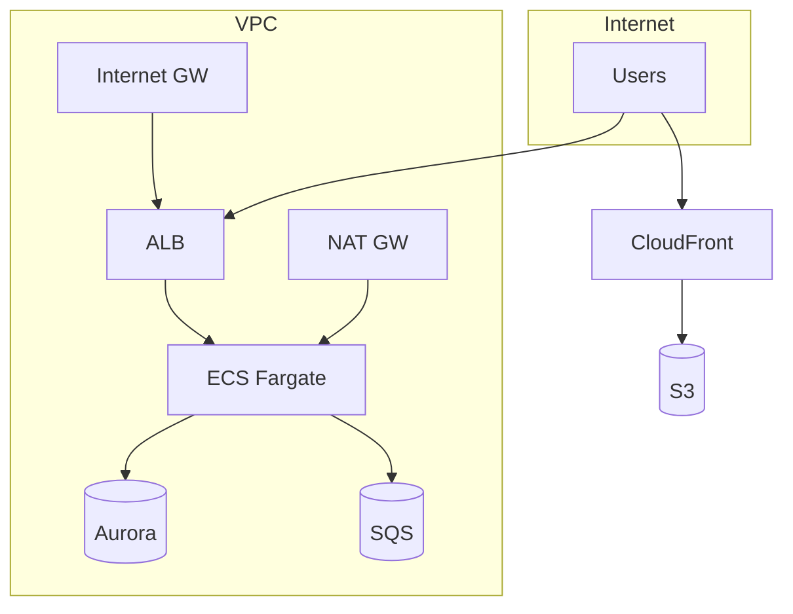
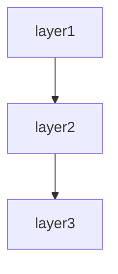

# Infrastructure spec template

This template defines the chapter outline for the spec of a system's cloud infrastructure, including resource inventory, networking, security, deployment pipelines, and environment configuration.

Designed for AWS / Azure / GCP, Terraform / CloudFormation / CDK / Pulumi, Kubernetes, and hybrid on-prem/cloud environments.

---

## Chapter outline

### Chapter 1: Overview

<!-- meta: bird's-eye view of the infrastructure. -->

#### 1.1 System purpose
- What workload this infrastructure supports
- Primary stakeholders (dev team, ops team, compliance)

#### 1.2 Cloud provider and account structure
| Provider | Account / subscription | Purpose | Region(s) |
|----------|----------------------|---------|-----------|
| AWS | production-123456789 | Production workloads | ap-northeast-1 |
| AWS | staging-987654321 | Staging / testing | ap-northeast-1 |
| ... | ... | ... | ... |

#### 1.3 High-level architecture diagram
- Network and service topology overview (Mermaid `graph TD`)
- Use subgraphs for VPC / environment boundaries

---
---

### Chapter 2: Feature specifications

<!-- meta: consolidated feature-level view of the system. Maps features to screens, routes, and data. -->

#### 2.1 Feature catalogue table

| Feature ID | Feature name | Category | Related items (screens/endpoints/jobs/APIs) | Auth required | Summary | Confidence |
|------------|-------------|----------|-------------------------------------------|-------------|---------|-----------|
| F-001 | (feature) | (category) | (related items) | yes/no | 1-line summary | 🟢/🟡/🔴 |
| F-002 | (feature) | (category) | (related items) | yes/no | 1-line summary | 🟢/🟡/🔴 |
| ... | ... | ... | ... | ... | ... | ... |

The catalogue table exhaustively lists every feature. Confidence labels:
- 🟢 **VERIFIED**: Feature purpose confirmed by reading the actual code (screen, controller, or service file).
- 🟡 **INFERRED**: Feature mechanically grouped from endpoint path prefix or class naming convention.
- 🔴 **ASSUMED**: Feature inferred from use-case description; code evidence is indirect.

#### 2.2 Per-feature processing definitions

For each feature listed above, describe the processing flow structured as below. Generate at minimum the top-5 features by complexity or business criticality; list the remainder in the catalogue table only.

##### F-001: {Feature name}

**Overview**
- Business value this feature provides
- Which user / system role uses it

**Trigger**
- User action / system event / external call that initiates this feature

**Pre-conditions**
- Conditions that must hold before execution

**Main flow**
1. Step 1 <!-- REF: SRC-NNNN -->
2. Step 2 <!-- REF: SRC-NNNN -->
3. ...

**Alternative flows**
- Alt-1: When [condition] → [behaviour] <!-- REF: SRC-NNNN -->

**Error handling**
- Error type → system behaviour <!-- REF: SRC-NNNN -->

**Post-conditions**
- State of the system after successful execution

**Related business rules**
- → Ch? (Domain rules section) cross-reference

**Related chapters**
- → Ch? (Screen details / Routes / Data model) cross-reference

**Confidence**: 🟢/🟡/🔴

---

### Chapter 3: Resource inventory

<!-- meta: exhaustive list of all managed cloud resources. -->

#### 3.1 Compute

| Resource ID | Type | Spec / size | Quantity | Runtime | Managed by |
|:------------|:-----|:-----------|:--------:|:--------|:----------|
| web-ecs | ECS Fargate | 2 vCPU, 4GB | 2 × 2 (multi-AZ) | ECS | Terraform: ecs.tf |
| batch-worker | ECS Fargate | 4 vCPU, 8GB | 2 | ECS | Terraform: batch.tf |
| ... | ... | ... | ... | ... | ... |

#### 3.2 Networking

| Resource ID | Type | CIDR / config | Purpose | Managed by |
|:------------|:-----|:-------------|:--------|:----------|
| vpc-main | VPC | 10.0.0.0/16 | Main VPC | Terraform: vpc.tf |
| subnet-public-a | Public subnet | 10.0.1.0/24 | AZ-a public | Terraform: vpc.tf |
| subnet-private-a | Private subnet | 10.0.10.0/24 | AZ-a private | Terraform: vpc.tf |
| alb-web | ALB | internet-facing | Web traffic | Terraform: alb.tf |
| ... | ... | ... | ... | ... |

#### 3.3 Data stores

| Resource ID | Type | Spec | Storage | Multi-AZ | Managed by |
|:------------|:-----|:-----|:-------|:--------:|:----------|
| rds-main | RDS Aurora PostgreSQL | db.r6g.large | 500GB | ✅ | Terraform: rds.tf |
| redis-cache | ElastiCache Redis | cache.r6g.large | 50GB | ✅ | Terraform: cache.tf |
| s3-assets | S3 bucket | Standard | Unlimited | - | Terraform: s3.tf |
| ... | ... | ... | ... | ... | ... |

#### 3.4 Serverless / event-driven

| Resource ID | Type | Trigger | Config | Managed by |
|:------------|:-----|:--------|:-------|:----------|
| process-order | Lambda | SQS queue | 512MB, 30s timeout | Terraform: lambda.tf |
| order-queue | SQS | - | Standard queue | Terraform: sqs.tf |
| ... | ... | ... | ... | ... |

#### 3.5 Security / IAM

| Resource | Type | Policy / trust | Attached to | Managed by |
|:---------|:-----|:--------------|:------------|:----------|
| ecs-task-role | IAM Role | ecs-tasks.amazonaws.com | Web ECS tasks | Terraform: iam.tf |
| db-access-policy | IAM Policy | Allow: rds:Describe* | ecs-task-role | Terraform: iam.tf |
| ... | ... | ... | ... | ... |

---

### Chapter 4: Network topology

<!-- meta: detailed network structure and connectivity. -->

#### 4.1 VPC structure
- VPC CIDR, subnets (public/private), route tables
- NAT Gateway / Internet Gateway configuration
- VPC Endpoints (S3 Gateway, DynamoDB, etc.)

#### 4.2 Network diagram (Mermaid)

#### 4.3 Connectivity
- VPN / Direct Connect / Transit Gateway
- Inter-service communication (service mesh, VPC peering)
- External system access (third-party APIs, partner networks)

#### 4.4 DNS
- Route53 zones
- Certificate management (ACM)

---

### Chapter 5: Deployment pipeline

<!-- meta: CI/CD and release process. -->

#### 5.1 CI/CD pipeline

| Stage | Tool | Trigger | What it does | Approvals |
|:------|:-----|:--------|:------------|:---------|
| Build | GitHub Actions | Push to main | Build + test + container image | - |
| Staging deploy | ArgoCD | Auto after build | Deploy to staging ECS | - |
| Production deploy | ArgoCD | Manual approval | Deploy to prod ECS | Team lead |
| ... | ... | ... | ... | ... |

#### 5.2 Deployment strategy
- Blue/green or rolling update
- Canary releases (if used)
- Rollback procedure

#### 5.3 Container / artifact registry

| Registry | Repository | Format | Retention |
|:---------|:-----------|:-------|:---------|
| ECR | web-app | Docker image | 30 days |
| ECR | batch-worker | Docker image | 30 days |

---

### Chapter 6: Configuration and environment

<!-- meta: environment variables, secrets, and configuration management. -->

#### 6.1 Environment comparison

| Aspect | Development | Staging | Production |
|:-------|:-----------|:--------|:----------|
| AWS account | dev-... | staging-... | prod-... |
| Instance size | t3.medium | t3.large | r6g.large |
| Min/max tasks | 1/2 | 2/4 | 4/10 |
| Backup | None | Daily | Hourly |
| ... | ... | ... | ... |

#### 6.2 Secrets management
- Secrets stored in: AWS Secrets Manager / Parameter Store
- Rotation policy
- Access audit

#### 6.3 Environment variables
| Variable | Value source | Scope | Purpose |
|:---------|:------------|:------|:--------|
| DB_HOST | Secrets Manager | All envs | Database endpoint |
| LOG_LEVEL | Config map | Per env | Log verbosity |
| ... | ... | ... | ... |

---

### Chapter 7: Monitoring and observability

<!-- meta: metrics, alerts, dashboards, and logging infrastructure. -->

#### 7.1 Metrics

| Service | Metrics collected | Retention | Dashboard |
|:--------|:----------------|:---------|:----------|
| ECS | CPU, Memory, Request count | 15 months | CloudWatch / Grafana |
| RDS | Connections, IOPS, Replica lag | 15 months | CloudWatch / Grafana |

#### 7.2 Alerts

| Condition | Severity | Channel | Response time |
|:----------|:--------|:--------|:-------------|
| ECS CPU > 80% for 5 min | WARN | Slack | Next business day |
| RDS connections > 90% | CRITICAL | PagerDuty | 15 min |
| ... | ... | ... | ... |

#### 7.3 Logging infrastructure
- Log aggregation (CloudWatch Logs / Loki / Elasticsearch)
- Log retention per environment
- Audit logging

---

### Chapter 8: Disaster recovery and backup

<!-- meta: RTO/RPO, backup strategy, and recovery procedures. -->

#### 8.1 Backup strategy

| Resource | Backup method | Frequency | Retention | RPO | RTO |
|:---------|:-------------|:---------|:---------|:---|:---|
| RDS | Automated snapshot | Hourly | 30 days | 1 hour | 30 min |
| S3 | Cross-region replication | Continuous | - | 15 min | - |
| ... | ... | ... | ... | ... | ... |

#### 8.2 DR plan
- Multi-AZ vs multi-region
- Failover procedure
- Recovery runbook reference

---

### Chapter 9: Cost and sizing

<!-- meta: cost breakdown, budget, and scaling plan. -->

#### 9.1 Monthly cost estimate

| Service | Estimated cost | Notes |
|:--------|:-------------:|:------|
| ECS Fargate | $1,200 | 4 tasks × 2 vCPU |
| RDS Aurora | $800 | db.r6g.large × 2 AZ |
| ... | ... | ... |
| **Total** | **$2,500** | |

#### 9.2 Auto-scaling policy
- Target tracking: CPU > 70% → scale out
- Schedule: 9-18 JST → max tasks doubled
- Cooldown: 120 seconds

---

### Chapter 10: Design decisions

<!-- meta: architectural decisions, cross-cutting concerns, module dependencies, and design trade-offs derived from code. Complements Architecture overview (which describes WHAT) by explaining WHY and HOW cross-cutting concerns are handled. -->

#### 10.1 Architecture Decision Records (ADR)

Code-derived record of design decisions. Confidence is typically low since rationale is rarely written in code; use Question Bank integration for SME confirmation.

| ID | Topic | Decision (as observed in code) | Rationale (inferred) | Alternatives (inferred) | Confidence | Supporting REF |
|----|-------|------------------------------|---------------------|----------------------|-----------|---------------|
| ADR-001 | (topic) | (decision) | (inferred rationale) | (inferred alternatives) | 🟢/🟡/🔴 | <!-- REF: SRC-NNNN --> |
| ... | ... | ... | ... | ... | ... | ... |

Extraction strategy:
- Search for design-related comments (`// Why:`, `# Reason:`, `/* Decision: */`)
- Read README / CONTRIBUTING / design docs for explicit rationale
- When no explicit rationale exists, mark 🔴 ASSUMED and add `<!-- ASK SME -->`

`<!-- CONFIDENCE: LOW — ADR entries are almost always inferred unless explicitly documented -->`

#### 10.2 Module / component dependency

Import/require/include graph extracted from source code. Enumerates dependencies between layers or modules.

**Extraction approach:**

| Language | Pattern | Example | Confidence |
|----------|---------|---------|-----------|
| Python | `rg "^import |^from "` then filter to own project | `import app.models` → depends on `app.models` | 🟢 |
| TypeScript/JS | `rg "^(import |const .* = require\()"` | `import { User } from '../models'` | 🟢 |
| Java/Kotlin | `rg "^import "` | `import com.example.service.UserService` | 🟢 |
| Ruby | `rg "^(require |require_relative )"` | `require_relative 'models/user'` | 🟢 |
| Go | `rg ""github\.com/.*/"` filtered to own module | `"project/internal/service"` | 🟢 |
| PHP | `rg "^(use |require_once )"` | `use App\Service\UserService` | 🟢 |
| C# | `rg "^(using |using static )"` | `using Project.Data.Models` | 🟢 |

Render the result as a Mermaid graph:

Label each edge with the dependency strength (direct / transitive / circular). Flag circular dependencies explicitly.

[🟢 VERIFIED] — import statements are mechanically extractable with near-zero false positives.

#### 10.3 Cross-cutting design patterns

Code-wide patterns that span multiple modules.

| Pattern | Detection method | Example REF | Confidence |
|---------|----------------|-------------|-----------|
| Error handling strategy | Search for `try`/`catch`/`except`/`raise`/`throw` patterns, custom exception classes | <!-- REF: SRC-0001 --> | 🟢 |
| Logging approach | Search for `logger`/`logging`/`console.log`/`print`/`warn` calls | <!-- REF: SRC-0002 --> | 🟢 |
| Validation pattern | Search for decorators (`@validate`/`@assert`), validator classes, assertions | <!-- REF: SRC-0004 --> | 🟢 |
| Dependency injection | Constructor injection / DI container / service provider | <!-- REF: SRC-0003 --> | 🟡 |
| Retry / resilience | Search for `retry`/`backoff`/`timeout`/`circuit_breaker` patterns | <!-- REF: SRC-0005 --> | 🟡 |
| Batch / chunk processing | Search for `batch`/`chunk`/`bulk` in method/class names | <!-- REF: SRC-0006 --> | 🟢 |

For each pattern found, note:
- **Consistency**: Does the whole project use one pattern, or are multiple approaches mixed?
- **Coverage**: Are there modules that SHOULD use this pattern but don't?
- **Exceptions**: Any deliberate deviations from the pattern?

[🟢 VERIFIED for most patterns] — language-level constructs (try/catch, import patterns) are mechanically detectable.

#### 10.4 Security design

Security-related mechanisms observed in code. Detailed auth flows go in the Authentication chapter; this section covers the remaining security posture.

| Aspect | Detection method | Confidence |
|--------|----------------|-----------|
| Input sanitisation | Search for `escape`/`sanitize`/`strip_tags`/parameterised queries | 🟡 |
| Secrets management | Search for `.env`/`secrets`/`vault` references, env-var reads for credentials | 🟢 |
| Encryption at rest | Search for `encrypt`/`decrypt`/`hash`/`bcrypt`/`argon2` calls | 🟢 |
| Transport security | Search for HTTPS/TLS/SSL configuration | 🟡 |
| CORS / CSP | Search for CORS middleware, Content-Security-Policy headers | 🟢 |
| Authorisation guards | Cross-reference with auth chapter; note any unauthorised endpoints | 🟢 |

→ Detailed auth flows → see Chapter ? (Authentication and authorisation)

[🟢 VERIFIED for most — security code is explicit and searchable]

#### 10.5 Performance design

Performance-related patterns and potential bottlenecks detected in code. **Does not include benchmarks** (not extractable from code alone).

| Pattern | Detection method | Confidence |
|---------|----------------|-----------|
| Caching | Search for `cache`/`redis`/`memcache`/`memoize`/`lru_cache` | 🟢 |
| N+1 prevention | Search for `eager_load`/`includes`/`prefetch`/`select_related` | 🟢 |
| Async processing | Search for `async`/`await`/`thread`/`worker`/`queue`/`celery`/`sidekiq` | 🟢 |
| Bulk operations | Search for `bulk_`/`batch_`/`chunk` methods | 🟢 |
| Connection pooling | Search for `pool`/`connection_limit`/`max_connections` | 🟡 |
| Query optimisation | Search for `EXPLAIN`/`index`/`materialized view` hints | 🟡 |
| Concurrency control | Search for `lock`/`mutex`/`transaction`/`optimistic`/`pessimistic` | 🟢 |

For each pattern, list which files/modules use it. Note modules that might need these patterns but don't use them (potential performance debt).

[🟢 VERIFIED for most patterns — code-level keywords are mechanically searchable]

#### 10.6 Integration design

External-system integration patterns. Detailed per-integration specs go in the External-system integration chapter; this section provides the overarching design.

| Aspect | Detection method | Confidence |
|--------|----------------|-----------|
| External HTTP calls | Search for `requests`/`HTTPX`/`axios`/`fetch`/`HttpClient` calls | 🟢 |
| Message queue usage | Search for `publish`/`subscribe`/`produce`/`consume`/`rabbit`/`kafka`/`sqs` | 🟢 |
| File-based integration | Search for file read/write with specific formats (CSV/XML/JSON/Parquet) | 🟢 |
| Protocol distribution | Classify external calls by protocol (REST / GraphQL / gRPC / SOAP) | 🟢 |
| Resiliency | Search for `timeout`/`retry`/`fallback`/`circuit_breaker` around external calls | 🟡 |

→ Detailed per-integration specs → see Chapter ? (External-system integration)

[🟢 VERIFIED — external call code is explicit]

#### 10.7 Known trade-offs and constraints

Technical trade-offs and constraints visible in code comments.

| Marker | Detection method | Meaning | Example |
|--------|----------------|---------|---------|
| `TODO` | `rg "TODO"` (with context) | Planned improvement; may indicate known limitation | `// TODO: paginate this query` |
| `FIXME` | `rg "FIXME"` | Defect or known issue | `# FIXME: race condition on concurrent writes` |
| `HACK` / `WORKAROUND` | `rg "HACK|WORKAROUND"` | Deliberate suboptimal solution | `/* HACK: SDK bug, remove after v2 upgrade */` |
| `XXX` | `rg "XXX"` | Something suspicious that needs review | `// XXX: this silently ignores errors` |
| `OPTIMIZE` | `rg "OPTIMIZE|PERF|SLOW"` | Performance concern | `# OPTIMIZE: N+1 query, eager-load` |
| `@deprecated` / `DEPRECATED` | Search for deprecation markers | Planned removal | `@deprecated use createV2 instead` |

→ Critical items → see Chapter ? (Known constraints and unresolved items)

For each marker, include the surrounding context (next 2 lines) to explain the trade-off. Group by severity (CRITICAL / MAJOR / MINOR).

[🟢 VERIFIED — markers are mechanically extractable; context needs manual review for accurate grouping]

---

### Chapter 11: Known constraints and unresolved items

<!-- meta: spec credibility safeguard. -->

#### 11.1 Known constraints
- Service limits (e.g. API rate limits, max VPC size)
- Technical debt (e.g. manual steps not yet automated)
- Compliance requirements (e.g. PCI-DSS, SOC2)

#### 11.2 Unresolved items
- Place the `abandoned` entries from the Question Bank here
- Missing IaC coverage (resources managed outside of code)
