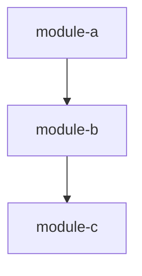
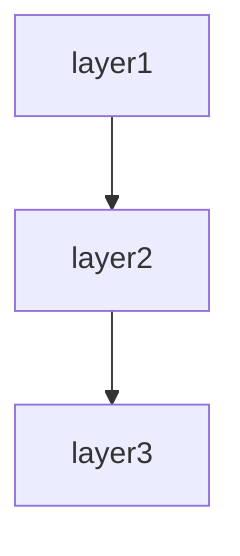

# Library / SDK spec template

This template defines the chapter outline for the spec of a reusable code asset (library / SDK) consumed by other applications.

Designed for packages distributed via npm / pip / composer / gem / NuGet / Maven Central, etc., as well as internal common libraries.

---

## Chapter outline

### Chapter 1: Overview

<!-- meta: purpose and scope of the library. -->

#### 1.1 Library purpose
- The problem this library solves
- Intended consumers
- Differentiation from competing or alternative libraries

#### 1.2 Main features
- 3-5 main features
- Summary of each feature

#### 1.3 License / package information
- License type
- Package name / distribution channel
- Current version

---
---

### Chapter 2: Feature specifications

<!-- meta: consolidated feature-level view of the system. Maps features to screens, routes, and data. -->

#### 2.1 Feature catalogue table

| Feature ID | Feature name | Category | Related items (screens/endpoints/jobs/APIs) | Auth required | Summary | Confidence |
|------------|-------------|----------|-------------------------------------------|-------------|---------|-----------|
| F-001 | (feature) | (category) | (related items) | yes/no | 1-line summary | 🟢/🟡/🔴 |
| F-002 | (feature) | (category) | (related items) | yes/no | 1-line summary | 🟢/🟡/🔴 |
| ... | ... | ... | ... | ... | ... | ... |

The catalogue table exhaustively lists every feature. Confidence labels:
- 🟢 **VERIFIED**: Feature purpose confirmed by reading the actual code (screen, controller, or service file).
- 🟡 **INFERRED**: Feature mechanically grouped from endpoint path prefix or class naming convention.
- 🔴 **ASSUMED**: Feature inferred from use-case description; code evidence is indirect.

#### 2.2 Per-feature processing definitions

For each feature listed above, describe the processing flow structured as below. Generate at minimum the top-5 features by complexity or business criticality; list the remainder in the catalogue table only.

##### F-001: {Feature name}

**Overview**
- Business value this feature provides
- Which user / system role uses it

**Priority**
- P1 / P2 / P3 — importance for the product (P1 = core value proposition, P2 = important but not core, P3 = auxiliary). Determined from code evidence (call volume, criticality of the path, blast radius). REF optional.

**Trigger**
- User action / system event / external call that initiates this feature

**Pre-conditions**
- Conditions that must hold before execution

**Main flow**
1. Step 1 <!-- REF: SRC-NNNN -->
2. Step 2 <!-- REF: SRC-NNNN -->
3. ...

**Alternative flows**
- Alt-1: When [condition] → [behaviour] <!-- REF: SRC-NNNN -->

**Error handling**
- Error type → system behaviour <!-- REF: SRC-NNNN -->

**Edge cases**
- Boundary conditions / exceptional inputs (kept separate from Error handling: Error handling = behaviour on failure, Edge cases = boundary values / unusual inputs) <!-- REF: SRC-NNNN -->
- e.g. empty input, max length, duplicate submission, concurrent access

**Acceptance scenarios**
- Write 2–5 scenarios per feature, each with an `<!-- REF: SRC-NNNN -->` citation to the code branch it validates.
- Scenario 1: Given [precondition] When [action] Then [observable result] <!-- REF: SRC-NNNN -->
- Scenario 2: Given [precondition] When [action] Then [observable result] <!-- REF: SRC-NNNN -->

**Independent test**
- How to verify this feature in isolation:
  - Automated: test file reference (e.g. `tests/test_<feature>.py`) <!-- REF: SRC-NNNN -->
  - Manual: [manual verification steps]

**Post-conditions**
- State of the system after successful execution

**Related business rules**
- → Ch? (Domain rules section) cross-reference

**Related chapters**
- → Ch? (Screen details / Routes / Data model) cross-reference

**Confidence**: 🟢/🟡/🔴

---


### Chapter 3: Module architecture (overview)

<!-- meta: top-level structure of the library, for reader orientation. Overview-level only: WHAT the modules are and how they relate at a glance. Detailed internals go to the Internal structure chapter (contributor detail), design rationale to Design decisions (WHY/HOW). -->

#### 3.1 Module composition

Top-level modules / packages and their responsibilities, extracted from the directory structure.

| Module / package | Responsibility | Key files | Confidence |
|------------------|----------------|-----------|-----------|
| (module) | (responsibility) | <!-- REF: SRC-NNNN --> | 🟢/🟡/🔴 |
| ... | ... | ... | ... |

- Package entry point (`main` / `module` field of the manifest), if any
- Distribution layout vs source layout, if they differ (`dist/`, `lib/`, `src/`, ...)

#### 3.2 Module dependency overview

Top-level dependency graph between modules, extracted from import analysis. Use the per-language `rg` patterns in `references/outline-tables.md` → Design decisions extraction patterns.



- Overview level only: group at package / top-level-directory granularity
- Flag circular dependencies explicitly here; detailed dependency analysis → Chapter ? (Design decisions)

#### 3.3 Tech stack

Language / runtime / major dependency packages, extracted from the package manifest.

| Item | Value | Source | Confidence |
|------|-------|--------|-----------|
| Language / runtime | (value) | <!-- REF: SRC-NNNN --> | 🟢 |
| Major dependencies | (value) | <!-- REF: SRC-NNNN --> | 🟢 |

- Build tooling (bundler / compiler / transpiler) and distribution targets (npm / pip / composer / gem / NuGet)
- → Detailed dependency policy → Chapter ? (Design decisions)

---

### Chapter 4: Installation

<!-- meta: steps to start using the library. -->

#### 4.1 Per-package-manager commands
```bash
# npm
npm install <package-name>

# yarn
yarn add <package-name>

# pip
pip install <package-name>

# composer
composer require <vendor/package-name>

# gem
gem install <package-name>

# NuGet
dotnet add package <PackageName>
```

#### 4.2 Runtime requirements
- Supported language versions
- Supported operating systems
- Required surrounding tools

#### 4.3 Optional dependencies
- Anything extra needed at install time
- Per-feature additional dependencies

---

### Chapter 5: Public API catalogue

<!-- meta: inventory of all public APIs. The pillar of verification. -->

#### 5.1 API catalogue
| API name | Kind | Signature | Summary | Stability |
|------|-----|----------|------|-------|
| `connect()` | function | `connect(config: Config) → Client` | Create a client | stable |
| `Client.query()` | method | `query(sql: string) → Result` | Run a query | stable |
| `parse()` | function | `parse(input: string) → AST` | Parse input | beta |
| ... | ... | ... | ... | ... |

#### 5.2 Module structure
- Module structure inside the package
- Main exports

#### 5.3 Stability levels
- stable: backward compatibility is guaranteed
- beta: may have breaking changes within a major version
- experimental: may change in any version
- deprecated: scheduled for removal

---

### Chapter 6: Usage examples (quick start)

<!-- meta: "read this and start using it" samples. -->

#### 6.1 Minimal example
```javascript
import { connect } from 'mylib';

const client = connect({ host: 'localhost' });
const result = client.query('SELECT 1');
console.log(result);
```

#### 6.2 Examples per major use case
- Use case 1: ...
  ```javascript
  // sample code
  ```
- Use case 2: ...
  ```javascript
  // sample code
  ```

#### 6.3 Advanced usage
- Using custom options
- Error handling
- Asynchronous-processing patterns

---

### Chapter 7: Configuration options

<!-- meta: exhaustive list of all options. -->

#### 7.1 Global configuration
| Option | Type | Default | Description |
|----------|----|----------|------|
| `host` | string | `localhost` | Target host |
| `timeout` | number | `5000` | Timeout (ms) |
| `retries` | number | `3` | Retry count |
| ... | ... | ... | ... |

#### 7.2 Per-feature options
- Detailed options per feature
- Combinability

#### 7.3 Configuration via environment variables
- List of available environment variables
- Precedence order (code > env vars > defaults)

---

### Chapter 8: Compatibility

<!-- meta: supported runtimes and dependencies. -->

#### 8.1 Supported language versions
| Language / runtime | Supported versions | Support status |
|----------------|--------------|------------|
| Node.js | 18 LTS, 20 LTS | active |
| Node.js | 16 | maintenance only |
| ... | ... | ... |

#### 8.2 Dependencies
| Library | Version | Purpose | Required / optional |
|----------|----------|------|----------|
| lodash | ^4.17.0 | utility | required |
| ... | ... | ... | ... |

#### 8.3 Peer dependencies
- Peer-dependency libraries
- Version ranges required of the consuming project

#### 8.4 Compatibility matrix
- Verified status for major combinations
- Known incompatible combinations

---

### Chapter 9: Extension points / plugin system

<!-- meta: how consumers extend the library. -->

#### 9.1 List of extension points
- Hooks / callbacks
- Middleware
- Custom providers

#### 9.2 Plugin API
- Plugin-definition interface
- Plugin lifecycle
- Inter-plugin dependencies

#### 9.3 Existing plugins
- Official plugins
- Notable third-party plugins

---

### Chapter 10: Migration guide

<!-- meta: migration steps from past versions. -->

#### 10.1 Migration from v1.x to v2.x

##### Breaking changes
- Removed APIs
- Signature changes
- Default-value changes

##### Migration steps
- Step-by-step procedure
- Automated migration tool (if any)

##### Code examples
```javascript
// Before (v1.x)
client.connect({ url: 'localhost' });

// After (v2.x)
client.connect({ host: 'localhost' });
```

#### 10.2 Migration from v0.x to v1.x
- (Same shape as above)

---

### Chapter 11: Internal structure (optional)

<!-- meta: internal architecture of the library. For contributors. -->

#### 11.1 Directory structure
- Main directories and their responsibilities

#### 11.2 Major classes / modules

| Class | Kind | Module | Responsibility | Depends on | Source |
|:------|:----|:-------|:-------------|:----------|:-------|
| ... | ... | ... | ... | ... | <!-- REF: SRC-NNNN --> |

- Class diagram (Mermaid `classDiagram`) for key subsystems. Split per module if >15 classes (see SKILL.md Split rule).
- Module dependency diagram (`graph TD`) for top-level module relationships.

#### 11.3 Build and test
- Build commands
- Test commands
- Release process

---

### Chapter 12: Design decisions

<!-- meta: architectural decisions, cross-cutting concerns, module dependencies, and design trade-offs derived from code. Complements Architecture overview (which describes WHAT) by explaining WHY and HOW cross-cutting concerns are handled. -->

#### 12.1 Architecture Decision Records (ADR)

Code-derived record of design decisions. Confidence is typically low since rationale is rarely written in code; use Question Bank integration for SME confirmation.

| ID | Topic | Decision (as observed in code) | Rationale (inferred) | Alternatives (inferred) | Confidence | Supporting REF |
|----|-------|------------------------------|---------------------|----------------------|-----------|---------------|
| ADR-001 | (topic) | (decision) | (inferred rationale) | (inferred alternatives) | 🟢/🟡/🔴 | <!-- REF: SRC-NNNN --> |
| ... | ... | ... | ... | ... | ... | ... |

Extraction strategy:
- Search for design-related comments (`// Why:`, `# Reason:`, `/* Decision: */`)
- Read README / CONTRIBUTING / design docs for explicit rationale
- When no explicit rationale exists, mark 🔴 ASSUMED and add `<!-- ASK SME -->`

`<!-- CONFIDENCE: LOW — ADR entries are almost always inferred unless explicitly documented -->`

#### 12.2 Module / component dependency

Import/require/include graph extracted from source code. Enumerates dependencies between layers or modules.

**Extraction approach:**

| Language | Pattern | Example | Confidence |
|----------|---------|---------|-----------|
| Python | `rg "^import |^from "` then filter to own project | `import app.models` → depends on `app.models` | 🟢 |
| TypeScript/JS | `rg "^(import |const .* = require\()"` | `import { User } from '../models'` | 🟢 |
| Java/Kotlin | `rg "^import "` | `import com.example.service.UserService` | 🟢 |
| Ruby | `rg "^(require |require_relative )"` | `require_relative 'models/user'` | 🟢 |
| Go | `rg ""github\.com/.*/"` filtered to own module | `"project/internal/service"` | 🟢 |
| PHP | `rg "^(use |require_once )"` | `use App\Service\UserService` | 🟢 |
| C# | `rg "^(using |using static )"` | `using Project.Data.Models` | 🟢 |

Render the result as a Mermaid graph:



Label each edge with the dependency strength (direct / transitive / circular). Flag circular dependencies explicitly.

[🟢 VERIFIED] — import statements are mechanically extractable with near-zero false positives.

#### 12.3 Cross-cutting design patterns

Code-wide patterns that span multiple modules.

| Pattern | Detection method | Example REF | Confidence |
|---------|----------------|-------------|-----------|
| Error handling strategy | Search for `try`/`catch`/`except`/`raise`/`throw` patterns, custom exception classes | <!-- REF: SRC-0001 --> | 🟢 |
| Logging approach | Search for `logger`/`logging`/`console.log`/`print`/`warn` calls | <!-- REF: SRC-0002 --> | 🟢 |
| Validation pattern | Search for decorators (`@validate`/`@assert`), validator classes, assertions | <!-- REF: SRC-0004 --> | 🟢 |
| Dependency injection | Constructor injection / DI container / service provider | <!-- REF: SRC-0003 --> | 🟡 |
| Retry / resilience | Search for `retry`/`backoff`/`timeout`/`circuit_breaker` patterns | <!-- REF: SRC-0005 --> | 🟡 |
| Batch / chunk processing | Search for `batch`/`chunk`/`bulk` in method/class names | <!-- REF: SRC-0006 --> | 🟢 |

For each pattern found, note:
- **Consistency**: Does the whole project use one pattern, or are multiple approaches mixed?
- **Coverage**: Are there modules that SHOULD use this pattern but don't?
- **Exceptions**: Any deliberate deviations from the pattern?

[🟢 VERIFIED for most patterns] — language-level constructs (try/catch, import patterns) are mechanically detectable.

#### 12.4 Security design

Security-related mechanisms observed in code. Detailed auth flows go in the Authentication chapter; this section covers the remaining security posture.

| Aspect | Detection method | Confidence |
|--------|----------------|-----------|
| Input sanitisation | Search for `escape`/`sanitize`/`strip_tags`/parameterised queries | 🟡 |
| Secrets management | Search for `.env`/`secrets`/`vault` references, env-var reads for credentials | 🟢 |
| Encryption at rest | Search for `encrypt`/`decrypt`/`hash`/`bcrypt`/`argon2` calls | 🟢 |
| Transport security | Search for HTTPS/TLS/SSL configuration | 🟡 |
| CORS / CSP | Search for CORS middleware, Content-Security-Policy headers | 🟢 |
| Authorisation guards | Cross-reference with auth chapter; note any unauthorised endpoints | 🟢 |

→ Detailed auth flows → see Chapter ? (Authentication and authorisation)

[🟢 VERIFIED for most — security code is explicit and searchable]

#### 12.5 Performance design

Performance-related patterns and potential bottlenecks detected in code. **Does not include benchmarks** (not extractable from code alone).

| Pattern | Detection method | Confidence |
|---------|----------------|-----------|
| Caching | Search for `cache`/`redis`/`memcache`/`memoize`/`lru_cache` | 🟢 |
| N+1 prevention | Search for `eager_load`/`includes`/`prefetch`/`select_related` | 🟢 |
| Async processing | Search for `async`/`await`/`thread`/`worker`/`queue`/`celery`/`sidekiq` | 🟢 |
| Bulk operations | Search for `bulk_`/`batch_`/`chunk` methods | 🟢 |
| Connection pooling | Search for `pool`/`connection_limit`/`max_connections` | 🟡 |
| Query optimisation | Search for `EXPLAIN`/`index`/`materialized view` hints | 🟡 |
| Concurrency control | Search for `lock`/`mutex`/`transaction`/`optimistic`/`pessimistic` | 🟢 |

For each pattern, list which files/modules use it. Note modules that might need these patterns but don't use them (potential performance debt).

[🟢 VERIFIED for most patterns — code-level keywords are mechanically searchable]

#### 12.6 Integration design

External-system integration patterns. Detailed per-integration specs go in the External-system integration chapter; this section provides the overarching design.

| Aspect | Detection method | Confidence |
|--------|----------------|-----------|
| External HTTP calls | Search for `requests`/`HTTPX`/`axios`/`fetch`/`HttpClient` calls | 🟢 |
| Message queue usage | Search for `publish`/`subscribe`/`produce`/`consume`/`rabbit`/`kafka`/`sqs` | 🟢 |
| File-based integration | Search for file read/write with specific formats (CSV/XML/JSON/Parquet) | 🟢 |
| Protocol distribution | Classify external calls by protocol (REST / GraphQL / gRPC / SOAP) | 🟢 |
| Resiliency | Search for `timeout`/`retry`/`fallback`/`circuit_breaker` around external calls | 🟡 |

→ Detailed per-integration specs → see Chapter ? (External-system integration)

[🟢 VERIFIED — external call code is explicit]

#### 12.7 Known trade-offs and constraints

Technical trade-offs and constraints visible in code comments.

| Marker | Detection method | Meaning | Example |
|--------|----------------|---------|---------|
| `TODO` | `rg "TODO"` (with context) | Planned improvement; may indicate known limitation | `// TODO: paginate this query` |
| `FIXME` | `rg "FIXME"` | Defect or known issue | `# FIXME: race condition on concurrent writes` |
| `HACK` / `WORKAROUND` | `rg "HACK|WORKAROUND"` | Deliberate suboptimal solution | `/* HACK: SDK bug, remove after v2 upgrade */` |
| `XXX` | `rg "XXX"` | Something suspicious that needs review | `// XXX: this silently ignores errors` |
| `OPTIMIZE` | `rg "OPTIMIZE|PERF|SLOW"` | Performance concern | `# OPTIMIZE: N+1 query, eager-load` |
| `@deprecated` / `DEPRECATED` | Search for deprecation markers | Planned removal | `@deprecated use createV2 instead` |

→ Critical items → see Chapter ? (Known constraints and unresolved items)

For each marker, include the surrounding context (next 2 lines) to explain the trade-off. Group by severity (CRITICAL / MAJOR / MINOR).

[🟢 VERIFIED — markers are mechanically extractable; context needs manual review for accurate grouping]

---


### Chapter 13: Known constraints and unresolved items

<!-- meta: spec credibility safeguard. -->

#### 13.1 Known constraints
- Performance ceilings
- Known bugs / workarounds
- Per-platform differences

#### 13.2 Unresolved items
- Place the `abandoned` entries from the Question Bank here

---

## Customisation guidance

### Library also ships a CLI tool
- Add a "CLI command list" section to Chapter 4.
- Add a "CLI usage example" section to Chapter 5.

### TypeScript type definitions matter
- Add a "TypeScript type definitions" section to Chapter 4.
- Document generics and conditional types.

### Multi-package (monorepo)
- Split Chapter 4 per package.
- Describe inter-package dependencies in a separate chapter.

### Brand-new library (no migration guide needed)
- Omit Chapter 9, or use it to describe "future migration policy" only.

Customisation is finalised in dialogue with the user after Phase 1 template selection.
