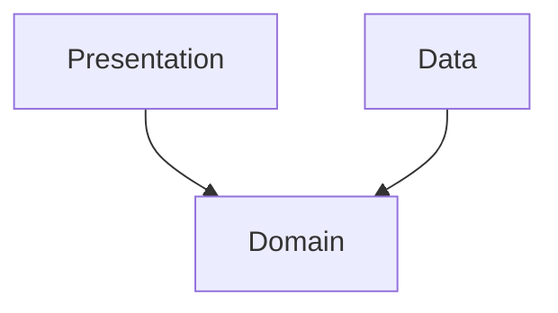
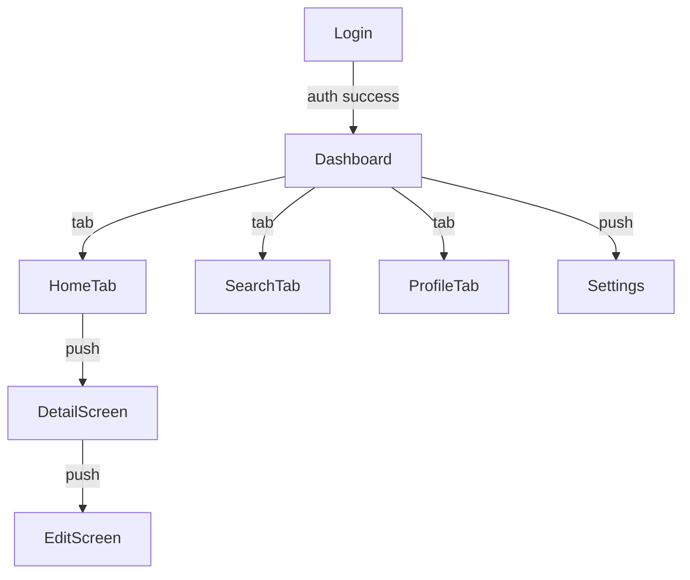
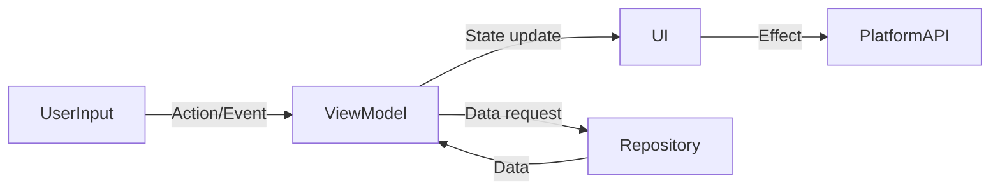
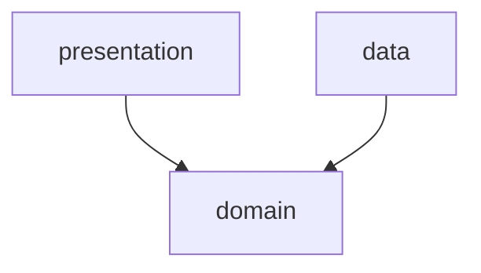

# Mobile app spec template

This template defines the chapter outline for the spec of a mobile application that the user operates through native or cross-platform screens.

Designed for native iOS (Swift/SwiftUI/UIKit), native Android (Kotlin/Jetpack Compose/XML layouts), and cross-platform frameworks (React Native, Flutter, Xamarin, Kotlin Multiplatform).

---

## Chapter outline

### Chapter 1: Overview

<!-- meta: bird's-eye view of the app. A 3-minute "what is this" for the reader. -->

#### 1.1 App purpose
- The business problem this app solves
- Primary users / stakeholders
- Position in the business (standalone app / companion to web service / etc.)

#### 1.2 Target platforms and minimum OS version

| Platform | Minimum OS version | Target devices | Status |
|----------|-------------------|----------------|--------|
| iOS | (e.g. iOS 16.0) | iPhone / iPad | active |
| Android | (e.g. Android 13 / API 33) | Phone / Tablet | active |
| ... | ... | ... | ... |

#### 1.3 Main use cases
- Use case 1: ...
- Use case 2: ...
- 3 to 5 use cases

#### 1.4 High-level architecture diagram
- Client-server relationship diagram
- Use Mermaid notation when appropriate

---

### Chapter 2: Feature specifications

<!-- meta: consolidated feature-level view of the app. Maps features to screens, platform APIs, and data. -->

#### 2.1 Feature catalogue table

| Feature ID | Feature name | Category | Related items (screens/APIs/jobs) | Auth required | Summary | Confidence |
|------------|-------------|----------|----------------------------------|-------------|---------|-----------|
| F-001 | (feature) | (category) | (related items) | yes/no | 1-line summary | 🟢/🟡/🔴 |
| F-002 | (feature) | (category) | (related items) | yes/no | 1-line summary | 🟢/🟡/🔴 |
| ... | ... | ... | ... | ... | ... | ... |

The catalogue table exhaustively lists every feature. Confidence labels:
- 🟢 **VERIFIED**: Feature purpose confirmed by reading the actual code (screen, view model, or service file).
- 🟡 **INFERRED**: Feature mechanically grouped from screen name, route path, or class naming convention.
- 🔴 **ASSUMED**: Feature inferred from use-case description; code evidence is indirect.

#### 2.2 Per-feature processing definitions

For each feature listed above, describe the processing flow structured as below. Generate at minimum the top-5 features by complexity or business criticality; list the remainder in the catalogue table only.

##### F-001: {Feature name}

**Overview**
- Business value this feature provides
- Which user / system role uses it

**Priority**
- P1 / P2 / P3 — importance for the product (P1 = core value proposition, P3 = auxiliary). Determined from code evidence. <!-- REF: SRC-NNNN -->

**Trigger**
- User action / system event / push notification / deep link that initiates this feature

**Pre-conditions**
- Conditions that must hold before execution (network connectivity, auth state, permissions granted)

**Main flow**
1. Step 1 <!-- REF: SRC-NNNN -->
2. Step 2 <!-- REF: SRC-NNNN -->
3. ...

**Alternative flows**
- Alt-1: When [condition] → [behaviour] <!-- REF: SRC-NNNN -->

**Error handling**
- Error type → system behaviour <!-- REF: SRC-NNNN -->

**Edge cases**
- Boundary conditions / exceptional inputs (kept separate from Error handling: Error handling = behaviour on failure, Edge cases = boundary values / unusual inputs) <!-- REF: SRC-NNNN -->
- e.g. empty input, max length, duplicate submission, concurrent access

**Acceptance scenarios**
- Scenario 1: Given [precondition] When [action] Then [observable result] <!-- REF: SRC-NNNN -->
- Scenario 2: Given [precondition] When [action] Then [observable result] <!-- REF: SRC-NNNN -->

**Independent test**
- How to verify this feature in isolation:
  - Automated: test file reference (e.g. `tests/test_<feature>.py`) <!-- REF: SRC-NNNN -->
  - Manual: [manual verification steps]

**Post-conditions**
- State of the app after successful execution (local DB state, UI state, server state)

**Related business rules**
- → Ch? (Domain rules section) cross-reference

**Related chapters**
- → Ch? (Screen details / State management / Data persistence) cross-reference

**Confidence**: 🟢/🟡/🔴

---

### Chapter 3: Module architecture

<!-- meta: internal layering and module composition of the mobile app. -->

#### 3.1 Architecture pattern
- Clean Architecture / MVVM / MVI / Redux / MVP / MVC
- Reason for adoption (to the extent it can be inferred)
- Layer diagram (Presentation / Domain / Data)

#### 3.2 Layer structure

| Layer | Responsibility | Key modules | Dependencies |
|:------|:--------------|:-----------|:------------|
| Presentation | UI rendering, user input, navigation | Views, ViewModels, Screens, Navigation | Domain |
| Domain | Business logic, use cases, entities | UseCases, Repositories (interfaces), Models | (none) |
| Data | Network, persistence, external sources | RepositoryImpl, DataSources (API/DB), DTOs | Domain |

#### 3.3 Module composition

| Module / package | Responsibility | Key classes | Dependencies |
|:----------------|:-------------|:-----------|:------------|
| (module) | (responsibility) | (classes) | (dependencies) |
| ... | ... | ... | ... |

#### 3.4 Dependency graph (Mermaid)



#### 3.5 Tech stack

| Item | Value | Source | Confidence |
|------|-------|--------|-----------|
| Language / runtime | (e.g. Kotlin 2.0, Swift 5.9) | <!-- REF: SRC-NNNN --> | 🟢 |
| UI framework | (e.g. Jetpack Compose, SwiftUI) | <!-- REF: SRC-NNNN --> | 🟢 |
| DI framework | (e.g. Hilt, Dagger, Koin, Swinject) | <!-- REF: SRC-NNNN --> | 🟢 |
| Networking | (e.g. Retrofit + OkHttp, URLSession, Apollo GraphQL) | <!-- REF: SRC-NNNN --> | 🟢 |
| Local DB | (e.g. Room, CoreData, SQLDelight, Realm) | <!-- REF: SRC-NNNN --> | 🟢 |
| Navigation | (e.g. Jetpack Navigation, SwiftUI NavigationStack, React Navigation) | <!-- REF: SRC-NNNN --> | 🟢 |
| State management | (e.g. Riverpod, Redux, BLoC, ViewModel + StateFlow) | <!-- REF: SRC-NNNN --> | 🟢 |
| Image loading | (e.g. Coil, Glide, SDWebImage, Kingfisher) | <!-- REF: SRC-NNNN --> | 🟢 |

---

### Chapter 4: Screen list and transitions

<!-- meta: UI navigation structure from the user's perspective. -->

#### 4.1 Screen list

| Screen ID | Screen name | Navigation type | URL / Route | Auth required | Access restrictions |
|-----------|-------------|----------------|-------------|:------------:|:------------------|
| SC-001 | Login | Modal / Push | /login | no | - |
| SC-002 | Dashboard | Tab / Push | /dashboard | yes | authenticated |
| SC-003 | Settings | Push / Modal | /settings | yes | authenticated |
| ... | ... | ... | ... | ... | ... |

Navigation type:
- **Navigation Stack**: Push/pop within a navigation stack
- **Tab**: Tab-bar-based transition (bottom tab / top tab)
- **Modal**: Full-screen or bottom-sheet modal presentation
- **Sheet**: Presented as a sheet (iOS .sheet / Android BottomSheet)
- **Deep link**: Entry via external URL or universal link

#### 4.2 Navigation diagram (Mermaid)



Describe navigation stacks (root + push), tab bars, modal presentations, and bottom sheets separately.

#### 4.3 Deep links

| Deep link URI | Target screen | Parameters | Example |
|:--------------|:-------------|:-----------|:--------|
| `myapp://items/{id}` | DetailScreen | `id: String` | `myapp://items/abc123` |
| `https://myapp.com/items/{id}` | DetailScreen | `id: String` | `https://myapp.com/items/abc123` |
| ... | ... | ... | ... |

- Universal Link / App Link configuration
- Fallback behaviour when the app is not installed
- Path verification (apple-app-site-association / assetlinks.json)

---

### Chapter 5: State management

<!-- meta: how the app manages its UI state and application state. -->

#### 5.1 State management architecture

Describe the chosen state management pattern and how it is implemented in the codebase.

**Pattern**: (e.g. Riverpod, BLoC, Redux, ViewModel + StateFlow, SwiftUI @State/@ObservableObject)

**Key components**:

| Component | Responsibility | Source |
|:----------|:--------------|:-------|
| (Store / ViewModel) | (e.g. Holds screen state, exposes state streams) | <!-- REF: SRC-NNNN --> |
| (Action / Event) | (e.g. Represents user intent or system event) | <!-- REF: SRC-NNNN --> |
| (Reducer / Updater) | (e.g. Pure function updating state from actions) | <!-- REF: SRC-NNNN --> |
| ... | ... | ... |

#### 5.2 Global state

State that is shared across multiple screens:

| State slice | Scope | Persistence | Provider / Store | Source |
|:-----------|:------|:-----------|:----------------|:-------|
| Auth token | App-wide | Keychain / EncryptedSharedPreferences | AuthProvider | <!-- REF: SRC-NNNN --> |
| User profile | App-wide | Local DB cache | UserProvider | <!-- REF: SRC-NNNN --> |
| Theme preference | App-wide | SharedPreferences / UserDefaults | ThemeProvider | <!-- REF: SRC-NNNN --> |
| ... | ... | ... | ... | ... |

#### 5.3 Screen-local state

State that is scoped to a single screen or composable:

| Screen | Local state | Type | Lifecycle | Source |
|:-------|:-----------|:----|:---------|:-------|
| Login | form data, validation errors, loading state | ephemeral | dismissed on screen exit | <!-- REF: SRC-NNNN --> |
| Search | query text, results list, pagination cursor | ephemeral | cleared on search reset | <!-- REF: SRC-NNNN --> |
| ... | ... | ... | ... | ... |

#### 5.4 State flow diagram (Mermaid)



---

### Chapter 6: Data persistence and offline-first

<!-- meta: local storage, caching, and offline-sync strategy. -->

#### 6.1 Local database

| Database | Type | ORM / wrapper | Purpose | Source |
|:---------|:-----|:-------------|:--------|:-------|
| (e.g. Room, CoreData, SQLDelight) | SQL / NoSQL | (ORM) | Primary local persistence | <!-- REF: SRC-NNNN --> |
| ... | ... | ... | ... | ... |

Entity definitions per local table (same format as data-model entity list in `templates/web-app.md`).

#### 6.2 Cache strategy

| Cache layer | Purpose | Storage | TTL / eviction | Invalidations |
|:------------|:-------|:-------|:--------------|:-------------|
| API response cache | Offline access, reduce network calls | Local DB / Disk cache | 30 min / LRU | On mutation, on pull-to-refresh |
| Image cache | Reduce image downloads | Disk + Memory LRU | Disk: 7 days / Memory: LRU | Cache flush on settings change |
| ... | ... | ... | ... | ... |

#### 6.3 Offline sync

| Entity | Sync direction | Conflict resolution | Strategy | Source |
|:-------|:--------------|:------------------|:---------|:-------|
| User profile | Bidirectional | Last-write-wins | Sync on network available | <!-- REF: SRC-NNNN --> |
| Favorites | Client → Server | Server wins | Queue mutations, flush online | <!-- REF: SRC-NNNN --> |
| Draft data | Client → Server | Merge (field-level) | Auto-sync on save + periodic | <!-- REF: SRC-NNNN --> |
| ... | ... | ... | ... | ... |

Sync strategies:
- **Online-only**: No local write; data fetched on each screen load
- **Cache-first**: Load from cache, refresh from network in background
- **Offline-first**: Write locally immediately, sync when online
- **Write-through**: Write to both local and remote synchronously

#### 6.4 Conflict resolution

| Conflict type | Strategy | Implementation | Source |
|:-------------|:--------|:--------------|:-------|
| Concurrent edits | Last-write-wins | Timestamp-based comparison | <!-- REF: SRC-NNNN --> |
| Deleted vs edited | Server wins / Client wins | Version vector | <!-- REF: SRC-NNNN --> |
| Schema migration | Sequential version upgrades | Migration scripts (Room migration / CoreData mapping model) | <!-- REF: SRC-NNNN --> |

---

### Chapter 7: Platform API integration

<!-- meta: inventory of platform-specific APIs consumed by the app. -->

#### 7.1 Platform API inventory

| API / Feature | Platform | Framework / API | Permission required | Usage | Source |
|:-------------|:---------|:--------------|:------------------|:------|:-------|
| Camera | iOS | AVCaptureSession / PHPicker | NSCameraUsageDescription | Photo capture, QR scan | <!-- REF: SRC-NNNN --> |
| Camera | Android | CameraX / Camera2 | CAMERA | Photo capture, QR scan | <!-- REF: SRC-NNNN --> |
| GPS / Location | iOS | CoreLocation | NSLocationWhenInUseUsageDescription | Map display, nearby search | <!-- REF: SRC-NNNN --> |
| GPS / Location | Android | FusedLocationProviderClient | ACCESS_FINE_LOCATION | Map display, nearby search | <!-- REF: SRC-NNNN --> |
| Biometrics | iOS | LocalAuthentication (Face ID / Touch ID) | - (system-managed) | App lock, payment auth | <!-- REF: SRC-NNNN --> |
| Biometrics | Android | BiometricPrompt | USE_BIOMETRIC | App lock, payment auth | <!-- REF: SRC-NNNN --> |
| Push notifications | iOS | UserNotifications | (system prompt) | New-content alerts | <!-- REF: SRC-NNNN --> |
| Push notifications | Android | Firebase Cloud Messaging | POST_NOTIFICATIONS (API 33+) | New-content alerts | <!-- REF: SRC-NNNN --> |
| File access | iOS | FileManager / UIDocumentPicker | (entitlements / sandbox) | Document upload | <!-- REF: SRC-NNNN --> |
| File access | Android | Storage Access Framework | READ_EXTERNAL_STORAGE (legacy) | Document upload | <!-- REF: SRC-NNNN --> |
| ... | ... | ... | ... | ... | ... |

#### 7.2 Permission model

| Permission | Declared in | Request timing | Rationale display | Fallback when denied |
|:-----------|:----------|:--------------|:----------------|:--------------------|
| CAMERA | Info.plist / AndroidManifest.xml | On first camera use | "Camera needed to scan QR codes" | Show error, disable feature |
| LOCATION | Info.plist / AndroidManifest.xml | On first location use | "Location needed to show nearby results" | Show manual input field |
| ... | ... | ... | ... | ... |

#### 7.3 Platform API details per feature

For each significant platform API (see inventory above), describe:

##### 7.3.1 {API name}

**Purpose**
- Why the app uses this API

**Implementation**
- API / class used
- Call site <!-- REF: SRC-NNNN -->
- Delegate / callback flow

**Error handling**
- Permission denied → behaviour
- API failure → behaviour
- Platform-specific constraints (background restrictions, rate limits)

---

### Chapter 8: Push notifications

<!-- meta: push notification configuration, types, and handling. -->

#### 8.1 Push notification service configuration

| Platform | Service | Key / certificate | Delivery priority | Source config |
|:---------|:-------|:-----------------|:----------------|:-------------|
| iOS | APNs (Apple Push Notification service) | APNs key (.p8) / certificate (.p12) | 5 (immediate) / 10 (power-efficient) | <!-- REF: SRC-NNNN --> |
| Android | FCM (Firebase Cloud Messaging) | Server key / Sender ID | normal / high | <!-- REF: SRC-NNNN --> |

- APNs environment (sandbox / production)
- FCM sender ID and server key location
- VoIP / critical alert entitlements (iOS)

#### 8.2 Notification types

| Type | Trigger | Platform | Display style | Sound | Priority |
|:-----|:-------|:---------|:-------------|:------|:--------|
| New message | Server event | Both | Alert | Default | high |
| Content update | Server event | Both | Banner | Silent | normal |
| Promotional | Scheduled campaign | Both | Banner | Silent | low |
| Critical alert | Emergency | iOS | Alert (bypasses mute) | Custom | critical |
| ... | ... | ... | ... | ... | ... |

#### 8.3 Payload structure

**APNs payload**

```json
{
  "aps": {
    "alert": {
      "title": "New message",
      "body": "You have a new message from {sender}",
      "title-loc-key": null,
      "loc-key": null
    },
    "badge": 5,
    "sound": "default",
    "category": "message",
    "thread-id": "thread_123",
    "mutable-content": 1
  },
  "data": {
    "type": "new_message",
    "sender_id": "user_456",
    "thread_id": "thread_123",
    "message_id": "msg_789",
    "deep_link": "myapp://messages/thread_123"
  }
}
```

**FCM payload**

```json
{
  "message": {
    "notification": {
      "title": "New message",
      "body": "You have a new message from {sender}"
    },
    "data": {
      "type": "new_message",
      "sender_id": "user_456",
      "thread_id": "thread_123",
      "message_id": "msg_789",
      "deep_link": "myapp://messages/thread_123"
    },
    "android": {
      "priority": "high",
      "notification": {
        "channel_id": "messages",
        "click_action": "OPEN_THREAD"
      }
    },
    "apns": {
      "headers": {
        "apns-priority": "10",
        "apns-push-type": "alert"
      }
    }
  }
}
```

#### 8.4 Tap behaviour

| Notification type | App foreground → behaviour | App background → behaviour | App killed → behaviour |
|:-----------------|:--------------------------|:--------------------------|:----------------------|
| New message | Show in-app banner, update badge | Open thread screen | Open thread screen (via deep link) |
| Content update | Update UI silently | Open relevant screen | Launch app, show relevant screen |
| ... | ... | ... | ... |

#### 8.5 Notification channel configuration (Android)

| Channel ID | Name | Importance | Description | Sound | Vibration |
|:-----------|:-----|:----------|:------------|:------|:----------|
| messages | Messages | HIGH | New message alerts | Default | Default |
| updates | Updates | DEFAULT | Content update alerts | Silent | Default |
| promotions | Promotions | LOW | Promotional alerts | None | None |

---

### Chapter 9: Networking and sync

<!-- meta: how the app communicates with servers and handles network state. -->

#### 9.1 API communication layer

| Component | Technology | Responsibility | Source |
|:----------|:----------|:--------------|:-------|
| HTTP client | (e.g. OkHttp, URLSession, Alamofire, Ktor) | Connection management, interceptors | <!-- REF: SRC-NNNN --> |
| Serialization | (e.g. Kotlinx Serialization, Codable, Moshi) | JSON / Protobuf serialization | <!-- REF: SRC-NNNN --> |
| API layer | (e.g. Retrofit interfaces, API protocol/contract) | Endpoint definitions | <!-- REF: SRC-NNNN --> |
| Auth interceptor | (custom interceptor) | Attach tokens, refresh on 401 | <!-- REF: SRC-NNNN --> |
| Network monitor | (e.g. ConnectivityManager, NWPathMonitor) | Network availability tracking | <!-- REF: SRC-NNNN --> |

#### 9.2 API endpoint catalogue

| Endpoint | Method | Path | Auth | Offline fallback | Source |
|:---------|:------|:-----|:----|:----------------|:-------|
| Login | POST | /api/v1/auth/login | none | N/A | <!-- REF: SRC-NNNN --> |
| Get items | GET | /api/v1/items | Bearer token | Return cached items | <!-- REF: SRC-NNNN --> |
| Create item | POST | /api/v1/items | Bearer token | Queue and sync later | <!-- REF: SRC-NNNN --> |
| ... | ... | ... | ... | ... | ... |

#### 9.3 Cache interceptors

| Layer | Cache policy | Stale-while-revalidate | Max age | Source |
|:------|:-----------|:----------------------|:--------|:-------|
| HTTP cache (OkHttp / URLCache) | Disk-based, LRU | 5 min | 30 min | <!-- REF: SRC-NNNN --> |
| Repository cache (local DB) | Read-through, write-through | N/A (DB source of truth) | N/A | <!-- REF: SRC-NNNN --> |
| In-memory cache | LRU | - | Session lifetime | <!-- REF: SRC-NNNN --> |

#### 9.4 Background sync

| Sync task | Trigger | Operation | Constraints | Source |
|:----------|:-------|:---------|:-----------|:-------|
| Mutation queue flush | Network becomes available | POST queued mutations | Batch size: 20 | <!-- REF: SRC-NNNN --> |
| Data refresh | Periodic (WorkManager / BGTaskScheduler) | GET latest data | Interval: 15 min | <!-- REF: SRC-NNNN --> |
| Push notification sync | Push received | FETCH data for notification | - | <!-- REF: SRC-NNNN --> |

#### 9.5 WebSocket / real-time communication

| Connection | Protocol | Purpose | Reconnect strategy | Source |
|:-----------|:---------|:-------|:-----------------|:-------|
| (e.g. Chat socket) | WebSocket / SSE | Real-time messaging | Exponential backoff, max 5 retries | <!-- REF: SRC-NNNN --> |
| ... | ... | ... | ... | ... |

---

### Chapter 10: Build and deployment

<!-- meta: how the app is built, signed, and published to stores. -->

#### 10.1 Build configuration

| Platform | Build system | Target SDK / Deployment target | Min SDK / iOS version | Source |
|:---------|:------------|:------------------------------|:---------------------|:-------|
| iOS | Xcode / xcodebuild | iOS 17.0 deployment target | iOS 16.0 | <!-- REF: SRC-NNNN --> |
| Android | Gradle / AGP | compileSdk 35 | minSdk 26 | <!-- REF: SRC-NNNN --> |

- Build flavours / build types (debug, release, staging)
- Product flavours (free / paid, dev / prod)
- Version numbering strategy

#### 10.2 Code signing and provisioning

| Platform | Signing identity | Provisioning profile | Distribution method | Source |
|:---------|:---------------|:-------------------|:------------------|:-------|
| iOS | Apple Distribution certificate | App Store profile / Ad Hoc | App Store / TestFlight / Enterprise | <!-- REF: SRC-NNNN --> |
| Android | Upload keystore / signing key | Google Play App Signing | Google Play / Internal testing / sideload | <!-- REF: SRC-NNNN --> |

#### 10.3 Store publishing steps

##### iOS (App Store)
1. Archive build in Xcode
2. Upload to App Store Connect via Xcode / Transporter / Fastlane
3. Complete app metadata (name, description, keywords, screenshots)
4. Submit for review
5. Release manually or automatically

##### Android (Google Play)
1. Generate signed AAB
2. Upload to Google Play Console via console / Fastlane
3. Complete store listing (title, description, screenshots, category)
4. Roll out to Internal testing → Closed track → Open track → Production

#### 10.4 CI/CD pipeline

| Stage | Tool / service | Steps | Source config |
|:------|:--------------|:------|:-------------|
| Lint | (e.g. Detekt / SwiftLint / ESLint) | Run static analysis | <!-- REF: SRC-NNNN --> |
| Test | (e.g. Gradlew test / xcodebuild test) | Unit tests + UI tests | <!-- REF: SRC-NNNN --> |
| Build | (e.g. Gradlew assembleRelease / xcodebuild archive) | Build signed artifact | <!-- REF: SRC-NNNN --> |
| Deploy | (e.g. Fastlane, GitHub Actions, Bitrise) | Distribute to test track | <!-- REF: SRC-NNNN --> |

#### 10.5 Pre-release distribution

| Channel | Platform | Method | Audience | Invitation |
|:--------|:---------|:-------|:---------|:-----------|
| TestFlight | iOS | Apple TestFlight | Internal testers (up to 100) | Email / public link |
| Internal test | Android | Google Play Internal Testing | Internal testers (up to 100) | Email |
| Closed track | Android | Google Play Closed Testing | External testers | Email / link |
| Open track | Android | Google Play Open Testing | Public testers (without review) | Public link |

---

### Chapter 11: Design decisions

<!-- meta: architectural decisions, cross-cutting concerns, module dependencies, and design trade-offs derived from code. Complements Module architecture (which describes WHAT) by explaining WHY and HOW cross-cutting concerns are handled. -->

#### 11.1 Architecture Decision Records (ADR)

Code-derived record of design decisions. Confidence is typically low since rationale is rarely written in code; use Question Bank integration for SME confirmation.

| ID | Topic | Decision (as observed in code) | Rationale (inferred) | Alternatives (inferred) | Confidence | Supporting REF |
|----|-------|------------------------------|---------------------|----------------------|-----------|---------------|
| ADR-001 | (topic) | (decision) | (inferred rationale) | (inferred alternatives) | 🟢/🟡/🔴 | <!-- REF: SRC-NNNN --> |
| ... | ... | ... | ... | ... | ... | ... |

Extraction strategy:
- Search for design-related comments (`// Why:`, `# Reason:`, `/* Decision: */`)
- Read README / CONTRIBUTING / design docs for explicit rationale
- When no explicit rationale exists, mark 🔴 ASSUMED and add `<!-- ASK SME -->`

`<!-- CONFIDENCE: LOW — ADR entries are almost always inferred unless explicitly documented -->`

Typical mobile ADR topics:

| Topic area | Example decision |
|:-----------|:----------------|
| Architecture pattern | Clean Architecture + MVVM vs MVI vs Redux |
| UI framework | Jetpack Compose vs XML layouts / SwiftUI vs UIKit |
| DI framework | Hilt vs Koin vs manual DI / Swinject vs manual |
| Navigation | Jetpack Navigation vs Compose Navigation / SwiftUI NavigationStack vs UIKit UINavigationController |
| Networing layer | Retrofit + OkHttp vs Ktor / URLSession vs Alamofire |
| Local persistence | Room vs SQLDelight vs Realm / CoreData vs SwiftData vs GRDB |
| Image loading | Coil vs Glide / Kingfisher vs SDWebImage |
| Cross-platform | Flutter vs React Native vs Kotlin Multiplatform (KMP) |
| State management | Riverpod vs BLoC / Redux vs ViewModel + StateFlow |
| Min OS version | Why iOS 16+ / Android 13+ was chosen |

#### 11.2 Module / component dependency

Import/require/include graph extracted from source code. Enumerates dependencies between layers or modules.

**Extraction approach:**

| Language | Pattern | Example | Confidence |
|----------|---------|---------|-----------|
| Kotlin | `rg "^import "` | `import com.example.data.repository.UserRepositoryImpl` | 🟢 |
| Swift | `rg "^import "` | `import DataLayer` | 🟢 |
| TypeScript/JS | `rg "^(import |const .* = require\\()"` | `import { UserService } from '../services'` | 🟢 |
| Dart | `rg "^import "` | `import 'package:data/repository/user_repository.dart'` | 🟢 |

Render the result as a Mermaid graph:



Label each edge with the dependency strength (direct / transitive / circular). Flag circular dependencies explicitly.

[🟢 VERIFIED] — import statements are mechanically extractable with near-zero false positives.

#### 11.3 Cross-cutting design patterns

Code-wide patterns that span multiple modules.

| Pattern | Detection method | Example REF | Confidence |
|---------|----------------|-------------|-----------|
| Error handling | Search for `try`/`catch`/`Result`/`sealed class`/`enum Result` patterns | <!-- REF: SRC-NNNN --> | 🟢 |
| Logging | Search for `Log`/`logger`/`Timber`/`os_log`/`NSLog`/`console.log` calls | <!-- REF: SRC-NNNN --> | 🟢 |
| Validation | Search for validator classes, annotation-based validation | <!-- REF: SRC-NNNN --> | 🟢 |
| Dependency injection | Search for `@Inject`/`@HiltViewModel`/`@Provide`/`@Module`/`container.register` | <!-- REF: SRC-NNNN --> | 🟢 |
| Coroutines / async | Search for `suspend`/`async`/`await`/`Combine`/`RxSwift`/`RxJava` | <!-- REF: SRC-NNNN --> | 🟢 |
| Retry / resilience | Search for `retry`/`backoff`/`timeout`/`circuit_breaker` | <!-- REF: SRC-NNNN --> | 🟡 |
| Image loading | Search for `Coil`/`Glide`/`Kingfisher`/`SDWebImage`/`ImageLoader` | <!-- REF: SRC-NNNN --> | 🟢 |
| Serialization | Search for `@Serializable`/`Codable`/`Moshi`/`Gson`/`JSONDecoder` | <!-- REF: SRC-NNNN --> | 🟢 |

For each pattern found, note:
- **Consistency**: Does the whole project use one pattern, or are multiple approaches mixed?
- **Coverage**: Are there modules that SHOULD use this pattern but don't?
- **Exceptions**: Any deliberate deviations from the pattern?

[🟢 VERIFIED for most patterns] — language-level constructs (try/catch, import patterns) are mechanically detectable.

#### 11.4 Security design

Security-related mechanisms observed in code.

| Aspect | Detection method | Confidence |
|--------|----------------|-----------|
| Secure storage (Keychain / Keystore / EncryptedSharedPreferences) | Search for `Keychain`/`Keystore`/`EncryptedSharedPreferences`/`KeyStore` | 🟢 |
| SSL pinning | Search for `certificatePinner`/`sslPinning`/`challenge`/`URLAuthenticationChallenge` | 🟢 |
| Input sanitisation | Search for `sanitize`/`escape`/`stripTags`/parameterised queries | 🟡 |
| Secrets management | Search for `.env`/`BuildConfig`/`Configuration`/env-var reads | 🟢 |
| Biometric auth | Search for `BiometricPrompt`/`LocalAuthentication`/`biometric` | 🟢 |
| App transport security (ATS) | Search Info.plist for NSAppTransportSecurity settings | 🟢 |
| Root / jailbreak detection | Search for `rootBeer`/`jailbreak`/`amIProtected`/`detect` | 🟢 |
| ProGuard / R8 obfuscation | Search for `proguard-rules.pro`/`consumer-rules.pro` | 🟢 |

→ Detailed auth flows → see Chapter ? (Authentication and authorisation) — usually covered in Chapter 9 (Networking and sync) for token management.

[🟢 VERIFIED for most — security code is explicit and searchable]

#### 11.5 Performance design

Performance-related patterns and potential bottlenecks detected in code.

| Pattern | Detection method | Confidence |
|---------|----------------|-----------|
| Image caching | Search for `Coil`/`Glide`/`Kingfisher`/`imageCache`/`diskCache` | 🟢 |
| Lazy loading / pagination | Search for `PagingData`/`PagingSource`/`LazyList`/`infinite scroll`/`onReachedEnd` | 🟢 |
| List diffing | Search for `DiffUtil`/`AsyncListDiffer`/`@State`/`diff` | 🟢 |
| Background processing | Search for `WorkManager`/`BGTaskScheduler`/`Service`/`coroutineScope`/`DispatchQueue` | 🟢 |
| Memory management | Search for `WeakReference`/`weak self`/`[weak self]`/`onCleared`/`dispose` | 🟢 |
| Lazy initialisation | Search for `lazy`/`by lazy`/`Lazy` singleton patterns | 🟢 |
| Thread safety | Search for `@MainThread`/`@WorkerThread`/`MainActor`/`@MainActor`/`runOnUiThread`/`DispatchQueue.main` | 🟢 |
| Startup optimisation | Search for `App Startup`/`ContentProvider`/`initializationProvider`/`didFinishLaunching` | 🟡 |

For each pattern, list which files/modules use it. Note modules that might need these patterns but don't use them (potential performance debt).

[🟢 VERIFIED for most patterns — code-level keywords are mechanically searchable]

#### 11.6 Integration design

External-system integration patterns.

| Aspect | Detection method | Confidence |
|--------|----------------|-----------|
| External API calls | Search for `Retrofit`/`OkHttp`/`Ktor`/`URLSession`/`Alamofire`/`axios` calls | 🟢 |
| Push notification service | Search for `FirebaseMessaging`/`UNUserNotificationCenter`/`registerForRemoteNotifications` | 🟢 |
| Platform SDK integration | Search for platform-specific SDKs (Google Maps, ML Kit, CoreML, HealthKit, etc.) | 🟢 |
| Third-party analytics | Search for `FirebaseAnalytics`/`Amplitude`/`Mixpanel`/`Segment` | 🟢 |
| Crash reporting | Search for `Crashlytics`/`Sentry`/`Bugsnag` | 🟢 |
| WebView / in-app browser | Search for `WebView`/`WKWebView`/`SFSafariViewController`/`ASWebAuthenticationSession` | 🟢 |
| Resiliency | Search for `timeout`/`retry`/`fallback`/`circuit_breaker` around external calls | 🟡 |

→ Detailed per-integration specs → see Chapter ? (External-system integration)

[🟢 VERIFIED — external call code is explicit]

#### 11.7 Known trade-offs and constraints

Technical trade-offs and constraints visible in code comments.

| Marker | Detection method | Meaning | Example |
|--------|----------------|---------|---------|
| `TODO` | `rg "TODO"` (with context) | Planned improvement; may indicate known limitation | `// TODO: paginate this query` |
| `FIXME` | `rg "FIXME"` | Defect or known issue | `# FIXME: race condition on concurrent writes` |
| `HACK` / `WORKAROUND` | `rg "HACK|WORKAROUND"` | Deliberate suboptimal solution | `/* HACK: SDK bug, remove after v2 upgrade */` |
| `XXX` | `rg "XXX"` | Something suspicious that needs review | `// XXX: this silently ignores errors` |
| `OPTIMIZE` | `rg "OPTIMIZE|PERF|SLOW"` | Performance concern | `# OPTIMIZE: N+1 query, eager-load` |
| `@deprecated` / `DEPRECATED` | Search for deprecation markers | Planned removal | `@deprecated use createV2 instead` |

→ Critical items → see Chapter 12 (Known constraints and unresolved items)

For each marker, include the surrounding context (next 2 lines) to explain the trade-off. Group by severity (CRITICAL / MAJOR / MINOR).

[🟢 VERIFIED — markers are mechanically extractable; context needs manual review for accurate grouping]

---

### Chapter 12: Known constraints and unresolved items

<!-- meta: spec credibility safeguard. -->

#### 12.1 Known technical constraints

- Platform-specific known issues:
  - iOS: [e.g. Background fetch window limited to ~30 seconds]
  - Android: [e.g. Manufacturer-specific behaviour for background restrictions]
- Performance ceilings: [e.g. images > 4096px cause OOM on low-end devices]
- Offline limitations: [e.g. offline queue capped at 100 pending mutations]
- Network dependency: [e.g. onboarding flow requires network connectivity]
- Screen size / orientation constraints: [e.g. tablet layout not yet implemented]
- Accessibility limitations: [e.g. VoiceOver / TalkBack support incomplete in certain screens]
- Known bugs / workarounds: [e.g. iOS 17.4 bug: keyboard overlaps input field on login screen]
- App store restrictions: [e.g. App Store review guidelines for health data; Play Store policy for SMS permission]

#### 12.2 Unresolved items

- Place the `abandoned` entries from the Question Bank here
- For each item, record "why it could not be resolved", "current inference", "what is needed to resolve it in the future"

---

## Customisation guidance

This template assumes a standard mobile application with both iOS and Android platforms. Customise as the actual project requires.

### Single platform (iOS-only or Android-only)
- Remove per-platform split tables; keep a single column.
- Omit the platform-specific section for the absent platform.

### Cross-platform framework
- Replace per-platform API tables with framework-level abstractions (Flutter plugins, React Native modules, KMP expect/actual).
- Add a "Shared code vs platform-specific code" breakdown to Chapter 3.

### Companion app (mobile app paired with a web backend)
- For the backend portion, cross-reference or merge with `templates/api-service.md`.
- Add an "API contract" chapter from the composite-chapter reference (see `references/composite-chapters/02-api-contract.md`).
- See `references/template-catalog.md` → Pattern 1: Client-Server for unified spec chapter ordering.

### Wearable / watch app
- Add a "Wearable companion app" section to Chapter 4 (Screen list and transitions) and Chapter 7 (Platform API integration).

### Widgets
- Add a "Widgets" section to Chapter 4 describing lock-screen / home-screen widgets.

### App Clips / Instant Apps
- Add a section to Chapter 10 (Build and deployment) describing App Clip / Instant App packaging and size limits.

Customisation is finalised in dialogue with the user after Phase 1 template selection.
