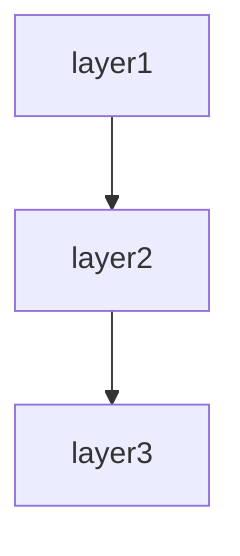

|---
template_name: web-app
template_version: 0.1.1
last_updated: 2026-08-03
description: Web application spec template. For interactive systems that render HTML.
reader_order:
  maintenance_developer: null
  sme: null
  delivery_customer:
    - 01-overview
    - 02-feature-specifications
    - 03-architecture-overview
    - 04-screens-transitions
    - 05-routes-endpoints
    - 06-authentication-authorisation
    - 07-external-interfaces
    - 08-operations-settings
    - 09-class-module-design
    - 10-data-model
    - 11-design-decisions
    - 12-known-constraints
  regulator:
    - 01-overview
    - 02-feature-specifications
    - 03-architecture-overview
    - 04-authentication-authorisation
    - 05-known-constraints
    - 06-design-decisions
    - 07-external-interfaces
    - 08-operations-settings
    - 09-class-module-design
    - 10-routes-endpoints
    - 11-data-model
    - 12-screens-transitions
detection_rules:
  always_include:
    - ch-overview
    - ch-feature-specs
    - ch-architecture
    - ch-design-decisions
    - ch-known-constraints
  chapters:
    - id: ch-screens
      title: Screens and screen transitions
      slug: 05-screens-transitions
      detection:
        dirs: ["views", "templates", "pages", "app/views"]
        note_missing: "画面テンプレート（views/templates/pages）が見つかりませんでした"
    - id: ch-routes
      title: Routes / endpoints
      slug: 06-routes-endpoints
      detection:
        files: ["routes/**", "config/routes*", "urls.py", "app/**/urls.py", "router/**", "routes.rb"]
        note_missing: "ルーティング定義ファイルが見つかりませんでした"
    - id: ch-data-model
      title: Data model
      slug: 10-data-model
      detection:
        dirs: ["migrations", "db/migrate", "database/migrations", "prisma", "schema", "models", "app/models", "Entities"]
        note_missing: "データモデル定義（migration/model/schema）が見つかりませんでした"
        optional: true
    - id: ch-auth
      title: Authentication and authorisation
      slug: 08-authentication-authorisation
      detection:
        patterns:
          - rgs: ["session", "auth", "login", "logout", "password_reset"]
          - deps: ["devise", "passport", "authlogic", "omniauth", "spring-security", "flask-login", "django.contrib.auth"]
          - files: ["**/middleware/**auth*", "**/Auth/**", "**/auth/**"]
        note_missing: "認証フレームワーク・認証関連コードが見つかりませんでした"
    - id: ch-external-interfaces
      title: External interfaces
      slug: 09-external-interfaces
      detection:
        patterns:
          - rgs: ["requests\\.(get|post|put|delete)", "axios\\.(get|post|put|delete)", "HttpClient", "RestTemplate", "WebClient\\."]
          - deps: ["guzzlehttp", "httparty", "faraday", "okhttp", "retrofit", "unirest"]
          - files: ["config/**/external*", "config/**/integration*"]
        note_missing: "HTTPクライアントライブラリの使用や外部連携設定が見つかりませんでした"
    - id: ch-operations
      title: Operations settings
      slug: 11-operations-settings
      detection:
        files: ["Dockerfile", "docker-compose*", "deploy/**", "ci/**", ".github/workflows/**", "Jenkinsfile", "k8s/**", "helm/**"]
        note_missing: "DockerfileやCI/CD設定が見つかりませんでした"
  extra_chapters:
    - id: ch-background-jobs
      title: Background jobs
      slug: 13-background-jobs
      detection:
        dirs: ["app/jobs", "app/workers", "jobs", "workers"]
        deps: ["sidekiq", "resque", "delayed_job", "active_job", "good_job", "celery", "dramatiq", "huey", "rq", "apscheduler"]
      insert_after: ch-external-interfaces
      note_detected: "バックグラウンドジョブフレームワークを検出しました → 自動追加"
    - id: ch-caching
      title: Caching strategy
      slug: 14-caching
      detection:
        deps: ["redis", "memcache", "dalli", "redis-store"]
        files: ["config/**/cache*"]
      insert_after: ch-data-model
      note_detected: "キャッシュ関連の設定やライブラリを検出しました → 追加候補"
  granularity:
    merge:
      - key: screens_routes
        when: { screens_max: 3, routes_max: 10 }
        chapters: [ch-screens, ch-routes]
        into_title: "Web interface (screens & routes)"
        note: "画面数が少ないためScreensとRoutesを統合します"
      - key: auth_into_ops
        when: { auth_files_max: 3 }
        chapters: [ch-auth]
        into: "absorb_by: ch-operations"
        note: "認証ロジックが単純なためOperationsに内包します"
      - key: extif_into_ops
        when: { external_ifs_max: 1 }
        chapters: [ch-external-interfaces]
        into: "absorb_by: ch-operations"
        note: "外部連携が少ないためOperationsに内包します"
    split:
      - key: data_model_large
        when: { entities_min: 20 }
        chapter: ch-data-model
        into:
          - { id: ch-data-model-core, title: "Data model (core entities)" }
          - { id: ch-data-model-analytics, title: "Data model (analytics/reporting)" }
        note: "Entity数が多いため2章に分割します"
      - key: endpoints_large
        when: { endpoints_min: 50 }
        chapter: ch-routes
        into:
          - { id: ch-routes-public, title: "Routes / endpoints (public API)" }
          - { id: ch-routes-internal, title: "Routes / endpoints (internal API)" }
        note: "エンドポイント数が多いためPublic/Internalに分割します"
      - key: external_ifs_large
        when: { external_ifs_min: 5 }
        chapter: ch-external-interfaces
        into:
          - { id: ch-extif-api, title: "External interfaces (REST API integrations)" }
          - { id: ch-extif-queue, title: "External interfaces (DB / message queues)" }
        note: "外部連携が多いため2章に分割します"
---

# Web application spec template

This template defines the chapter outline for the spec of a web system that the user operates through screens.

Designed for typical web applications: PHP (Laravel/Symfony/CakePHP), Python (Django/Flask), Ruby (Rails), Node.js (Next.js/Nuxt/Express), Java (Spring MVC), ASP.NET MVC, etc.

---

## Chapter outline

### Chapter 1: Overview

<!-- meta: bird's-eye view of the whole system. A 3-minute "what is this" for the reader. -->

#### 1.1 System purpose
- The business problem this system solves
- Primary users / stakeholders
- Position in the business

#### 1.2 Main use cases
- Use case 1: ...
- Use case 2: ...
- 3 to 5 use cases

#### 1.3 High-level architecture diagram
- High-level component diagram of the system
- Use Mermaid notation when appropriate

---
---

### Chapter 2: Feature specifications

<!-- meta: consolidated feature-level view of the system. Maps features to screens, routes, and data. -->

#### 2.1 Feature catalogue table

| Feature ID | Feature name | Category | Related items (screens/endpoints/jobs/APIs) | Auth required | Summary | Confidence |
|------------|-------------|----------|-------------------------------------------|-------------|---------|-----------|
| F-001 | (feature) | (category) | (related items) | yes/no | 1-line summary | 🟢/🟡/🔴 |
| F-002 | (feature) | (category) | (related items) | yes/no | 1-line summary | 🟢/🟡/🔴 |
| ... | ... | ... | ... | ... | ... | ... |

The catalogue table exhaustively lists every feature. Confidence labels:
- 🟢 **VERIFIED**: Feature purpose confirmed by reading the actual code (screen, controller, or service file).
- 🟡 **INFERRED**: Feature mechanically grouped from endpoint path prefix or class naming convention.
- 🔴 **ASSUMED**: Feature inferred from use-case description; code evidence is indirect.

#### 2.2 Per-feature processing definitions

For each feature listed above, describe the processing flow structured as below. Generate at minimum the top-5 features by complexity or business criticality; list the remainder in the catalogue table only.

##### F-001: {Feature name}

**Overview**
- Business value this feature provides
- Which user / system role uses it

**Trigger**
- User action / system event / external call that initiates this feature

**Pre-conditions**
- Conditions that must hold before execution

**Main flow**
1. Step 1 <!-- REF: SRC-NNNN -->
2. Step 2 <!-- REF: SRC-NNNN -->
3. ...

**Alternative flows**
- Alt-1: When [condition] → [behaviour] <!-- REF: SRC-NNNN -->

**Error handling**
- Error type → system behaviour <!-- REF: SRC-NNNN -->

**Post-conditions**
- State of the system after successful execution

**Related business rules**
- → Ch? (Domain rules section) cross-reference

**Related chapters**
- → Ch? (Screen details / Routes / Data model) cross-reference

**Confidence**: 🟢/🟡/🔴

---

### Chapter 3: Architecture overview

<!-- meta: design decisions and overall structure. Capture WHY this shape. -->

#### 3.1 Adopted framework / libraries
- Language, framework, and major libraries
- Version information

#### 3.2 Architecture pattern
- MVC / Clean architecture / Hexagonal, etc.
- Reason for adoption (to the extent it can be inferred)

#### 3.3 Directory structure
- Responsibility of each major directory
- Conventions (naming rules, placement rules)

#### 3.4 Dependencies
- External systems / APIs
- Database / cache / message queue

---

### Chapter 4: Class / Module Design

<!-- meta: internal structure of the codebase — classes, modules, and their relationships. -->

#### 4.1 Module overview

| Module / package | Responsibility | Key classes | Dependencies |
|:----------------|:-------------|:-----------|:------------|
| app/controllers | HTTP request handling | IssuesController, UsersController | app/services |
| app/models | Domain entities & persistence | Issue, User, Project | app/validators |
| app/services | Business logic | IssueService, NotificationService | app/models |
| ... | ... | ... | ... |

#### 4.2 Class catalogue

| Class | Kind | Module | Responsibility | Depends on | Source |
|:------|:----|:-------|:-------------|:----------|:-------|
| IssuesController | Controller | app/controllers | CRUD for Issues | IssueService | <!-- REF: SRC-NNNN --> |
| IssueService | Service | app/services | Issue business logic | Issue, NotificationService | <!-- REF: SRC-NNNN --> |
| Issue | Model | app/models | Issue entity & persistence | User, Project | <!-- REF: SRC-NNNN --> |
| ... | ... | ... | ... | ... | ... |

#### 4.3 Class diagram (Mermaid)

For key subsystems, include a `classDiagram` showing inheritance, interfaces, and associations. Split per module if >15 classes (see SKILL.md Split rule).

#### 4.4 Module dependency diagram (Mermaid)

Show the direction of dependencies between top-level modules using `graph TD` or `flowchart TD`.

---

### Chapter 5: Screens and screen transitions

<!-- meta: UI structure from the user's perspective. -->

#### 5.1 Screen list
| Screen ID | Screen name | URL | Auth required | Required role |
|-------|-------|-----|---------|---------|
| SC-001 | Login | /login | no | - |
| SC-002 | Dashboard | /dashboard | yes | regular user or higher |
| ... | ... | ... | ... | ... |

#### 5.2 Screen-transition diagram
- Major transition paths (Mermaid notation, etc.)
- Exceptional transitions (errors, session timeout)

#### 5.3 Details of each screen

For each screen, describe using structured tables:

###### Input fields

| # | Field name | Type | Required | Validation / Constraints | Default | Source |
|:-:|:----------|:----|:--------:|:----------------------|:------|:-------|
| 1 | email | email | ✅ | format: email, maxlength: 255 | - | User.email |
| 2 | password | password | ✅ | minlength: 8 | - | User.password |
| ... | ... | ... | ... | ... | ... | ... |

###### Actions

| Button / Trigger | HTTP method | Endpoint | Destination | Auth required | Side effects |
|:---------------|:----------:|:--------|:-----------|:------------:|:------------|
| Login | POST | /login | Dashboard | no | Session created |
| Cancel | GET | / | Login page | no | - |
| ... | ... | ... | ... | ... | ... |

###### Display conditions

| Element | Visibility condition | Role restriction | Data state |
|:--------|:-------------------|:---------------|:----------|
| Admin panel link | User is admin | admin | - |
| Edit button | Own record or admin | user, admin | status != deleted |
| ... | ... | ... | ... |

---

### Chapter 6: Routes / endpoints

<!-- meta: full list of HTTP routes. The pillar of inventory-based verification. -->

#### 6.1 Web screen routes
| Method | Path | Controller::Action | Auth | Summary |
|---------|------|-----------------------|------|------|
| GET | / | HomeController::index | optional | Top page |
| GET | /users/{id} | UserController::show | required | User details |
| ... | ... | ... | ... | ... |

#### 6.2 Internal API / Ajax endpoints
- Ajax / Fetch APIs called from the screens
- Response format

#### 6.3 Per-route middleware
- Applied middleware and the order of processing

---

### Chapter 7: Data model

<!-- meta: structure and semantics of persisted data. -->

#### 7.1 ER diagram
- Relations between key entities
- Use Mermaid notation, etc.

#### 7.2 Entity list
Per entity:
- Table / class name
- Field list (type, nullability, default, business meaning)
- Indexes
- Foreign keys
- Relations (1:1, 1:N, N:N)

#### 7.3 Key domain rules
- Invariants
- State transitions (state machines)
- Business rules (e.g. "withdrawn users are excluded from search results")

---

### Chapter 8: Authentication and authorisation

<!-- meta: security core. Omissions here are critical. -->

#### 8.1 Authentication method
- Session / token / OAuth / SSO
- Password-hash algorithm
- Session timeout

#### 8.2 Authorisation model
- Roles and permissions
- Role hierarchy
- Where authorisation checks are implemented

#### 8.3 Authorisation flow
- Request → authorisation decision → execute / deny flow
- Behaviour on authorisation failure

#### 8.4 Session management
- Session store
- Conditions for session invalidation
- Concurrent-login control

---

### Chapter 9: External interfaces

<!-- meta: all system boundaries — APIs, databases, queues, file transfers, hardware. -->

#### 9.1 External interface inventory

| IF-ID | Name | Type | Protocol | Direction | Consumer / provider | Failure behaviour |
|:------|:-----|:----|:---------|:--------:|:------------------|:-----------------|
| IF-001 | Payment gateway | REST API | HTTPS | Outbound | Payment service | Retry 3x, notify |
| IF-002 | User database | Database | PostgreSQL | Bidirectional | Main DB | Connection pool |
| IF-003 | Order events | Message queue | AMQP | Publish | RabbitMQ | Reconnect, DLQ |
| IF-004 | Daily reports | File transfer | SFTP | Upload | Report server | Alert on failure |
| ... | ... | ... | ... | ... | ... | ... |

#### 9.2 External API integrations

##### 9.2.1 Integration partners

| Partner | Protocol | Purpose | Authentication | Timeout | Behaviour on failure |
|---------|----------|------|--------------|:-------|-------------------|
| Payment gateway | HTTPS REST | Payment processing | API Key (X-API-Key) | 10s | Retry 3 times; notify on failure |
| ... | ... | ... | ... | ... | ... |

##### 9.2.2 Details per integration
- Authentication method (API key, OAuth, etc.)
- Request / response example
- Timeout / retry policy
- Idempotency (or lack thereof)
- Fallback behaviour on failure

#### 9.3 Database connections

| Database | Type | Host / connection | Auth | Pool | TLS | Usage |
|:---------|:-----|:-----------------|:----|:----:|:---|:------|
| Main DB | PostgreSQL | db.example.com:5432 | SCRAM-SHA-256 | max: 10 | required | Primary persistence |
| Cache | Redis | cache.example.com:6379 | password | - | optional | Session store |
| Analytics | BigQuery | - | Service account | - | built-in | Reporting queries |

#### 9.4 Message queues / event streams

| Queue / topic | Type | Broker | Direction | Routing | Retry / DLQ | Consumers |
|:-------------|:----|:------|:--------:|:--------|:-----------|:----------|
| order.created | topic | RabbitMQ | Publish | exchange: order | DLQ after 3 retries | NotificationService |
| email.send | queue | SQS | Consume | - | redrive after 5 failures | EmailWorker |

#### 9.5 File transfers

| Transfer | Source | Destination | Protocol | Schedule | File pattern | Encryption |
|:---------|:-------|:-----------|:---------|:--------|:------------|:----------|
| Daily sales | Main DB export | sftp://report.example.com/incoming | SFTP | 03:00 daily | sales_YYYYMMDD.csv | AES-256 |
| Partner feed | sftp://partner.example.com/outgoing | Import worker | SFTP | Poll every 30min | feed_*.xml | PGP |

#### 9.6 Other interfaces

| Interface | Type | Protocol | Details |
|:----------|:-----|:---------|:--------|
| Barcode scanner | Hardware | RS-232C | /dev/ttyUSB0, 9600 baud |
| SMS gateway | API | SMPP | provider.example.com:2775 |

---

### Chapter 10: Operations settings

<!-- meta: deployment, environment variables, monitoring. -->

#### 10.1 Environment composition
- Environment list (dev, staging, prod)
- Differences between environments

#### 10.2 Environment variables / configuration values
| Variable | Required | Default | Purpose |
|-------|------|----------|------|
| DB_HOST | required | - | Database connection target |
| ... | ... | ... | ... |

#### 10.3 Deployment procedure
- Build procedure
- Deploy command
- Rollback procedure

#### 10.4 Logging

| Log type | Output | Format | Level | Retention | Source config |
|:---------|:-------|:------|:-----|:---------|:-------------|
| Access log | stdout | JSON (structured) | info | 90 days | config/logging.rb:10 |
| Application log | stdout | JSON (structured) | debug~error | 90 days | config/logging.rb:25 |
| Error log | stderr | JSON (structured) | warn~fatal | 1 year | config/logging.rb:40 |
| Audit log | audit.log | CSV | info | 3 years | lib/audit.rb:8 |
| Slow query log | slow-query.log | plain text | - | 30 days | config/database.yml:15 |

Log level definitions:
| Level | Meaning | Output |
|:------|:--------|:-------|
| DEBUG | Detailed diagnostic info (dev only) | Dev environment |
| INFO | Normal operation messages | Always |
| WARN | Warning conditions | Always |
| ERROR | Recoverable errors | Always |
| FATAL | Unrecoverable errors | Always |

#### 10.5 Monitoring
- Monitoring targets (liveness, performance, errors)
- Alert conditions and notification channels

#### 10.6 Backup / restore
- Backup target
- Frequency and generation management
- Restore procedure

---

### Chapter 11: Design decisions

<!-- meta: architectural decisions, cross-cutting concerns, module dependencies, and design trade-offs derived from code. Complements Architecture overview (which describes WHAT) by explaining WHY and HOW cross-cutting concerns are handled. -->

#### 11.1 Architecture Decision Records (ADR)

Code-derived record of design decisions. Confidence is typically low since rationale is rarely written in code; use Question Bank integration for SME confirmation.

| ID | Topic | Decision (as observed in code) | Rationale (inferred) | Alternatives (inferred) | Confidence | Supporting REF |
|----|-------|------------------------------|---------------------|----------------------|-----------|---------------|
| ADR-001 | (topic) | (decision) | (inferred rationale) | (inferred alternatives) | 🟢/🟡/🔴 | <!-- REF: SRC-NNNN --> |
| ... | ... | ... | ... | ... | ... | ... |

Extraction strategy:
- Search for design-related comments (`// Why:`, `# Reason:`, `/* Decision: */`)
- Read README / CONTRIBUTING / design docs for explicit rationale
- When no explicit rationale exists, mark 🔴 ASSUMED and add `<!-- ASK SME -->`

`<!-- CONFIDENCE: LOW — ADR entries are almost always inferred unless explicitly documented -->`

#### 11.2 Module / component dependency

Import/require/include graph extracted from source code. Enumerates dependencies between layers or modules.

**Extraction approach:**

| Language | Pattern | Example | Confidence |
|----------|---------|---------|-----------|
| Python | `rg "^import |^from "` then filter to own project | `import app.models` → depends on `app.models` | 🟢 |
| TypeScript/JS | `rg "^(import |const .* = require\()"` | `import { User } from '../models'` | 🟢 |
| Java/Kotlin | `rg "^import "` | `import com.example.service.UserService` | 🟢 |
| Ruby | `rg "^(require |require_relative )"` | `require_relative 'models/user'` | 🟢 |
| Go | `rg ""github\.com/.*/"` filtered to own module | `"project/internal/service"` | 🟢 |
| PHP | `rg "^(use |require_once )"` | `use App\Service\UserService` | 🟢 |
| C# | `rg "^(using |using static )"` | `using Project.Data.Models` | 🟢 |

Render the result as a Mermaid graph:

Label each edge with the dependency strength (direct / transitive / circular). Flag circular dependencies explicitly.

[🟢 VERIFIED] — import statements are mechanically extractable with near-zero false positives.

#### 11.3 Cross-cutting design patterns

Code-wide patterns that span multiple modules.

| Pattern | Detection method | Example REF | Confidence |
|---------|----------------|-------------|-----------|
| Error handling strategy | Search for `try`/`catch`/`except`/`raise`/`throw` patterns, custom exception classes | <!-- REF: SRC-0001 --> | 🟢 |
| Logging approach | Search for `logger`/`logging`/`console.log`/`print`/`warn` calls | <!-- REF: SRC-0002 --> | 🟢 |
| Validation pattern | Search for decorators (`@validate`/`@assert`), validator classes, assertions | <!-- REF: SRC-0004 --> | 🟢 |
| Dependency injection | Constructor injection / DI container / service provider | <!-- REF: SRC-0003 --> | 🟡 |
| Retry / resilience | Search for `retry`/`backoff`/`timeout`/`circuit_breaker` patterns | <!-- REF: SRC-0005 --> | 🟡 |
| Batch / chunk processing | Search for `batch`/`chunk`/`bulk` in method/class names | <!-- REF: SRC-0006 --> | 🟢 |

For each pattern found, note:
- **Consistency**: Does the whole project use one pattern, or are multiple approaches mixed?
- **Coverage**: Are there modules that SHOULD use this pattern but don't?
- **Exceptions**: Any deliberate deviations from the pattern?

[🟢 VERIFIED for most patterns] — language-level constructs (try/catch, import patterns) are mechanically detectable.

#### 11.4 Security design

Security-related mechanisms observed in code. Detailed auth flows go in the Authentication chapter; this section covers the remaining security posture.

| Aspect | Detection method | Confidence |
|--------|----------------|-----------|
| Input sanitisation | Search for `escape`/`sanitize`/`strip_tags`/parameterised queries | 🟡 |
| Secrets management | Search for `.env`/`secrets`/`vault` references, env-var reads for credentials | 🟢 |
| Encryption at rest | Search for `encrypt`/`decrypt`/`hash`/`bcrypt`/`argon2` calls | 🟢 |
| Transport security | Search for HTTPS/TLS/SSL configuration | 🟡 |
| CORS / CSP | Search for CORS middleware, Content-Security-Policy headers | 🟢 |
| Authorisation guards | Cross-reference with auth chapter; note any unauthorised endpoints | 🟢 |

→ Detailed auth flows → see Chapter ? (Authentication and authorisation)

[🟢 VERIFIED for most — security code is explicit and searchable]

#### 11.5 Performance design

Performance-related patterns and potential bottlenecks detected in code. **Does not include benchmarks** (not extractable from code alone).

| Pattern | Detection method | Confidence |
|---------|----------------|-----------|
| Caching | Search for `cache`/`redis`/`memcache`/`memoize`/`lru_cache` | 🟢 |
| N+1 prevention | Search for `eager_load`/`includes`/`prefetch`/`select_related` | 🟢 |
| Async processing | Search for `async`/`await`/`thread`/`worker`/`queue`/`celery`/`sidekiq` | 🟢 |
| Bulk operations | Search for `bulk_`/`batch_`/`chunk` methods | 🟢 |
| Connection pooling | Search for `pool`/`connection_limit`/`max_connections` | 🟡 |
| Query optimisation | Search for `EXPLAIN`/`index`/`materialized view` hints | 🟡 |
| Concurrency control | Search for `lock`/`mutex`/`transaction`/`optimistic`/`pessimistic` | 🟢 |

For each pattern, list which files/modules use it. Note modules that might need these patterns but don't use them (potential performance debt).

[🟢 VERIFIED for most patterns — code-level keywords are mechanically searchable]

#### 11.6 Integration design

External-system integration patterns. Detailed per-integration specs go in the External-system integration chapter; this section provides the overarching design.

| Aspect | Detection method | Confidence |
|--------|----------------|-----------|
| External HTTP calls | Search for `requests`/`HTTPX`/`axios`/`fetch`/`HttpClient` calls | 🟢 |
| Message queue usage | Search for `publish`/`subscribe`/`produce`/`consume`/`rabbit`/`kafka`/`sqs` | 🟢 |
| File-based integration | Search for file read/write with specific formats (CSV/XML/JSON/Parquet) | 🟢 |
| Protocol distribution | Classify external calls by protocol (REST / GraphQL / gRPC / SOAP) | 🟢 |
| Resiliency | Search for `timeout`/`retry`/`fallback`/`circuit_breaker` around external calls | 🟡 |

→ Detailed per-integration specs → see Chapter ? (External-system integration)

[🟢 VERIFIED — external call code is explicit]

#### 11.7 Known trade-offs and constraints

Technical trade-offs and constraints visible in code comments.

| Marker | Detection method | Meaning | Example |
|--------|----------------|---------|---------|
| `TODO` | `rg "TODO"` (with context) | Planned improvement; may indicate known limitation | `// TODO: paginate this query` |
| `FIXME` | `rg "FIXME"` | Defect or known issue | `# FIXME: race condition on concurrent writes` |
| `HACK` / `WORKAROUND` | `rg "HACK|WORKAROUND"` | Deliberate suboptimal solution | `/* HACK: SDK bug, remove after v2 upgrade */` |
| `XXX` | `rg "XXX"` | Something suspicious that needs review | `// XXX: this silently ignores errors` |
| `OPTIMIZE` | `rg "OPTIMIZE|PERF|SLOW"` | Performance concern | `# OPTIMIZE: N+1 query, eager-load` |
| `@deprecated` / `DEPRECATED` | Search for deprecation markers | Planned removal | `@deprecated use createV2 instead` |

→ Critical items → see Chapter ? (Known constraints and unresolved items)

For each marker, include the surrounding context (next 2 lines) to explain the trade-off. Group by severity (CRITICAL / MAJOR / MINOR).

[🟢 VERIFIED — markers are mechanically extractable; context needs manual review for accurate grouping]

---

### Chapter 12: Known constraints and unresolved items

<!-- meta: spec credibility safeguard. -->

#### 12.1 Known technical constraints
- Performance ceilings (concurrent connections, response time)
- Known bugs / workarounds

#### 12.2 Unresolved items
- Place the `abandoned` entries from the Question Bank here
- For each item, record "why it could not be resolved", "current inference", "what is needed to resolve it in the future"

---

## Customisation guidance

This template assumes a standard web application. Customise as the actual project requires.

### Multi-tenant / SaaS
- Add a "tenant isolation" section to Chapter 6.

### Many background jobs
- Insert a "background jobs" chapter between Chapter 7 and Chapter 8 (see `templates/batch-system.md` for the outline).

### Multi-language support
- Add an "internationalisation (i18n)" section to Chapter 3.

### A mobile app is also offered
- Split Chapter 4 into "Web routes" and "Mobile API".

Customisation is finalised in dialogue with the user after Phase 1 template selection.
